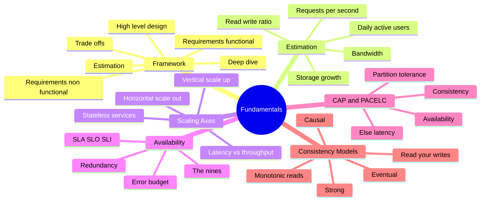
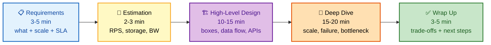
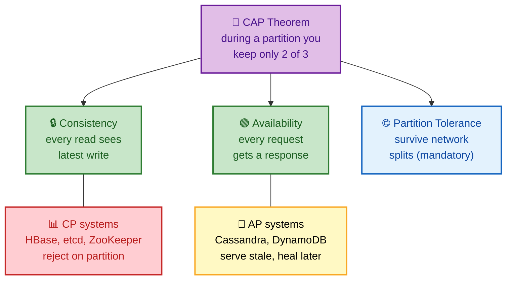
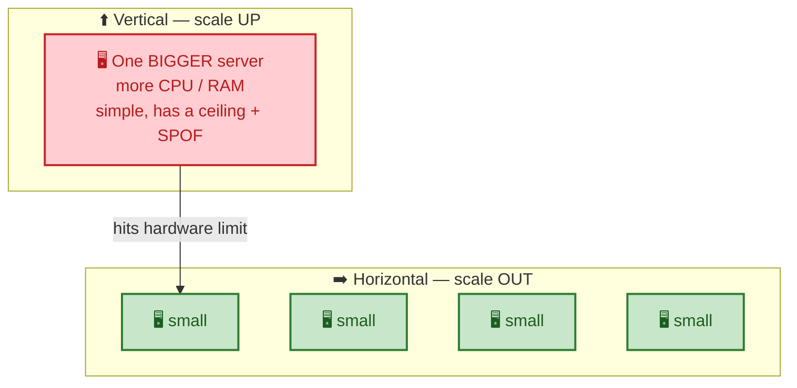
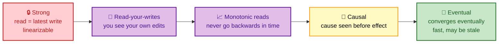

# SECTION 1: SYSTEM DESIGN FUNDAMENTALS

> **Scope:** The interview framework, back-of-the-envelope estimation, the latency ladder, scalability (vertical vs horizontal), latency vs throughput, availability math (the nines), CAP and PACELC, and consistency models. This is the vocabulary you use in **every** design interview — master it before touching building blocks.

---

## 🗺️ Visual Overview

**In one line:** Before you draw a single box, you state scale (users, RPS, read/write ratio), pick a point on the consistency/availability spectrum, and ground every estimate in the latency ladder — that discipline is what interviewers actually score.



**The five interview phases — a timed flow** (drive top-down, requirements first):



**CAP theorem — pick two of three under a network partition** (the classic trade-off triangle):



> 🧠 **Memory hooks (mnemonics):**
> - **Framework — "REBHW":** *"Real Engineers Build High Walls"* → **R**equirements → **E**stimation → **B**ase design → **H**andle deep-dive → **W**rap-up.
> - **CAP — "you can't have your CAP and eat it":** Partition tolerance is mandatory, so you choose **C or A**. CP rejects; AP serves stale.
> - **PACELC — "if Partition, choose A/C; Else, choose L/C":** even with no partition, you trade **latency vs consistency**.
> - **The nines — "each nine cuts downtime ~10×":** three nines ≈ 8.8 h/yr, four nines ≈ 53 min/yr, five nines ≈ 5 min/yr.
> - **Latency ladder — "memory beats disk beats network beats region":** ns → µs → ms, roughly ×100 per rung.

---

## 1. The System Design Interview Framework

> 🎯 **Interview weight: CRITICAL** — this structure *is* the interview. Every rubric rewards driving requirements → estimation → design → deep-dive → trade-offs.

**In one line:** Spend the first ~5 minutes nailing requirements and scale, then work top-down — high-level boxes first, deep-dive and failure handling second, trade-offs last.

| Phase | Time | What you produce | Common mistake |
|---|---|---|---|
| **1. Requirements** | 3–5 min | Functional features + non-functional scale/SLA/latency/consistency | Jumping to boxes before scoping |
| **2. Estimation** | 2–3 min | DAU, RPS, storage, bandwidth, server count | Skipping the numbers entirely |
| **3. High-level design** | 10–15 min | Component boxes, data flow, APIs, storage choice | Adding components with no reason |
| **4. Deep dive** | 15–20 min | Scale each part, failures, bottlenecks, security | Staying shallow / hand-waving |
| **5. Wrap up** | 3–5 min | Summary, trade-offs, future work | Forgetting to state trade-offs |

**Requirements — split functional vs non-functional explicitly:**

- **Functional:** *what* the system does — "shorten a URL", "post a tweet", "deliver a message". Enumerate the core use cases; defer nice-to-haves.
- **Non-functional:** *how well* — scale (users, RPS), availability SLA, latency target (p99), consistency (strong vs eventual), durability, data retention.

> 💡 **Interview tip:** Always ask "what's the read/write ratio?" early. A 100:1 read-heavy system (news feed) leads you toward caching and read replicas; a write-heavy system (metrics ingestion) leads you toward queues, batching, and sharded writes. The ratio shapes the entire design.

---

## 2. Back-of-the-Envelope Estimation

> 🎯 **Interview weight: HIGH** — a 2-minute estimate justifies every later decision (why a cache, why sharding, how many servers).

**In one line:** Convert DAU → RPS → storage/bandwidth with round powers of ten; you want the right *order of magnitude*, not precision.

**The numbers worth memorizing:**

| Quantity | Handy value |
|---|---|
| Seconds in a day | ~86,400 ≈ **10⁵** |
| 1 million users × 1 KB | **1 GB** |
| 1 billion events × 100 B | **100 GB/day** |
| Char/UUID | 1 byte / 16 bytes |
| Timestamp / long | 8 bytes |

**Worked example — "design Twitter, 300M MAU":**

```
Assume 50% DAU        → 150M DAU
Each posts 2 tweets/day → 300M writes/day
Writes/sec            = 300M / 86,400 ≈ 3,500 WPS (avg)
Peak (×3)            ≈ 10,000 WPS
Read:write = 100:1   → ~350,000 RPS reads (avg), ~1M peak
Tweet size ≈ 300 B   → 300M × 300 B ≈ 90 GB/day of new tweets
5-year storage       ≈ 90 GB × 365 × 5 ≈ 160 TB
```

> 🔍 **What this buys you:** 1M peak read RPS instantly says "single DB can't serve reads → cache + read replicas + fan-out." 160 TB says "must shard." You've justified the whole architecture in 90 seconds.

**⚠️ Rounding discipline:** Use 10⁵ for a day, treat peak as 2–3× average, and keep read:write ratios as round numbers (10:1, 100:1). Don't get lost computing 86,400 by hand — interviewers want the reasoning, not arithmetic.

---

## 3. The Latency Ladder — Numbers Every Engineer Should Know

> 🎯 **Interview weight: HIGH** — grounds every estimate and bottleneck argument.

**In one line:** Each rung is roughly ×100 slower than the one above — cache < memory < SSD < same-DC network < disk seek < cross-region — and that gap is the entire justification for caching and data locality.

| Operation | Latency | Relative |
|---|---|---|
| L1 cache reference | 0.5 ns | 1× |
| L2 cache reference | 7 ns | ~14× |
| Main memory reference | 100 ns | ~200× |
| SSD random read | 150 µs | ~300,000× |
| Same-datacenter round trip | 500 µs | ~1M× |
| HDD seek | 10 ms | ~20M× |
| Cross-region round trip | 150 ms | ~300M× |

**Throughput rules of thumb:**

- Single app server: ~10–50K req/s (workload-dependent)
- Relational DB: ~10–30K queries/s with good indexing
- Redis: 100K+ ops/s
- Kafka: millions of messages/s per cluster

> 💡 **Interview tip:** You don't need exact nanoseconds — you need the *ratios*. Memory is ~200× faster than SSD; a cross-region hop is ~300× slower than same-DC. That single fact justifies edge caching, read replicas near users, and keeping data close to compute.

---

## 4. Scalability — Vertical vs Horizontal

> 🎯 **Interview weight: HIGH**

**In one line:** Vertical scaling buys one bigger box (simple, but has a hard ceiling and a single point of failure); horizontal scaling adds many boxes behind a load balancer (near-infinite, but requires statelessness).



| Axis | Vertical (scale up) | Horizontal (scale out) |
|---|---|---|
| How | Bigger CPU/RAM/disk | More machines |
| Ceiling | Hardware limit | Near-infinite |
| Failure | Single point of failure | Fault-tolerant |
| Complexity | Low | Higher (LB, consistency) |
| State | Fine with local state | Needs stateless services |

**Statelessness is the enabler.** Push session/state into a shared store (Redis, DB, JWT in the client). Once app servers hold no local state, any request can hit any server, and you can add/remove replicas freely.

> ⚠️ **Gotcha:** "Just add servers" fails if the app keeps sessions in local memory or writes to local disk. The interviewer is testing whether you know that **horizontal scaling requires statelessness first**. Fix it by externalizing state before adding replicas.

**Order of scaling levers (walk them in order):** Load balancer → stateless app replicas → cache → read replicas → shard the database. Reaching for sharding first is a red flag — it's the last resort because cross-shard joins and transactions are painful.

---

## 5. Latency vs Throughput

> 🎯 **Interview weight: MEDIUM**

**In one line:** Latency is how long *one* request takes; throughput is how *many* requests you handle per second — they're related but optimized differently, and you should always quote **percentiles**, not averages.

- **Latency:** time for a single operation (quote **p50/p95/p99**, never just the mean — tail latency is what users feel).
- **Throughput:** operations per second the system sustains.
- **Batching and parallelism raise throughput but often raise latency** (a request waits to be batched). Caches lower latency and raise throughput simultaneously — that's why they're so common.

> 💡 **Interview tip:** When asked "is the system fast?", answer with a percentile and a load: "p99 < 100 ms at 50K RPS." Averages hide the tail — if p50 is 10 ms but p99 is 2 s, 1% of users have a broken experience, and at 1M requests that's 10,000 angry users.

---

## 6. Availability Math — The Nines, SLA/SLO/SLI, Error Budgets

> 🎯 **Interview weight: HIGH** — SRE/senior interviews probe this directly.

**In one line:** Availability is measured in "nines"; each extra nine cuts allowed downtime ~10×, and the gap between your SLO and 100% is the **error budget** you spend on releases and risk.

| Availability | Downtime / year | Downtime / month | Typical use |
|---|---|---|---|
| 99% (two nines) | 3.65 days | 7.2 h | Internal tools |
| 99.9% (three nines) | 8.76 h | 43.8 min | Standard SaaS |
| 99.95% | 4.38 h | 21.9 min | Paid services |
| 99.99% (four nines) | 52.6 min | 4.38 min | Critical services |
| 99.999% (five nines) | 5.26 min | 26 s | Telecom / payments |

**Terminology:**

- **SLI (Indicator):** the measured metric — e.g., *fraction of requests served < 200 ms*.
- **SLO (Objective):** the internal target — e.g., *99.9% of requests < 200 ms*.
- **SLA (Agreement):** the customer-facing contract with penalties — always **looser** than the SLO.
- **Error budget:** `1 − SLO`. At 99.9%, you're allowed 43.8 min/month of failure; burn it on risky deploys, save it when reliability is shaky.

**Serial vs parallel availability:**

- **Dependencies in series** multiply: two 99.9% services in a chain → 0.999 × 0.999 ≈ **99.8%** (worse).
- **Redundant replicas in parallel** improve it: two 99% replicas → `1 − (0.01 × 0.01)` = **99.99%** (much better).

> 🔍 **Insight:** More moving parts in a *request path* lowers availability; more *redundant copies* of the same part raises it. This is why you minimize synchronous dependencies and add redundancy to the ones you keep.

---

## 7. CAP and PACELC

> 🎯 **Interview weight: HIGH**

**In one line:** During a network **partition**, a distributed store can be either **consistent** (reject/stale-block) or **available** (answer, possibly stale) — not both; PACELC adds that **even without a partition**, you still trade **latency vs consistency**.

**CAP in practice:**

- **CP systems** (etcd, ZooKeeper, HBase, Spanner): on partition, refuse writes on the minority side to stay consistent. Choose for config, locks, leader election, money.
- **AP systems** (Cassandra, DynamoDB, Riak): on partition, keep serving and reconcile later (eventual consistency). Choose for shopping carts, feeds, telemetry.

**PACELC** = "if **P**artition then **A** or **C**, **E**lse **L** or **C**":

| System | Partition behavior | Normal behavior |
|---|---|---|
| DynamoDB / Cassandra | PA (stay available) | EL (favor low latency) |
| Spanner | PC (stay consistent) | EC (favor consistency, pays latency via TrueTime) |
| MongoDB (default) | PC | EC |

> ⚠️ **Gotcha:** CAP is often misquoted as "pick 2 of 3 always." It only forces a choice **during a partition**. The rest of the time you have both C and A — which is why PACELC's "Else Latency vs Consistency" is the more useful framing for day-to-day design.

---

## 8. Consistency Models

> 🎯 **Interview weight: MEDIUM–HIGH**

**In one line:** Consistency models define *what a read is allowed to return*; they form a spectrum from **strong** (always latest, costly) to **eventual** (fast, may be stale), with useful middle grounds.



| Model | Guarantee | Example use |
|---|---|---|
| **Strong / linearizable** | Every read sees the latest committed write | Bank balance, inventory count |
| **Read-your-writes** | A user always sees their own updates | Profile edit, posting a comment |
| **Monotonic reads** | Successive reads never move backward in time | Timeline pagination |
| **Causal** | Causally related ops seen in order | Chat: reply never before its message |
| **Eventual** | Replicas converge given no new writes | Feeds, view counts, DNS |

> 💡 **Interview tip:** "Eventual consistency" alone sounds hand-wavy. Name the *specific* guarantee you need: a user editing their profile needs **read-your-writes** (they'll be confused if their own edit vanishes), while a global like-counter is fine with **eventual**. Precision here signals seniority.

---

## Interview Questions & Answers

### Q1. Walk me through how you'd approach designing any large-scale system.

**Answer:** Requirements → estimation → high-level design → deep dive → trade-offs. First nail functional features and non-functional targets (scale, SLA, latency, consistency, read/write ratio). Then do a back-of-envelope estimate (DAU → RPS → storage → bandwidth) to justify decisions. Draw the high-level boxes and data flow, choose storage, define APIs. Deep-dive the bottleneck component — scale it, handle failures, address the top risk. Close with trade-offs and what I'd do next.

**Reasoning:** Interviewers score *structure and communication* as much as the answer. Driving top-down from requirements shows you won't over-engineer and prevents the classic failure of drawing boxes before knowing the scale.

**Follow-up — "The interviewer stays silent. What do you do?"** Keep narrating and asking clarifying questions ("Should I assume read-heavy? What's the availability target?"). Silence is often a test of whether you can drive the conversation yourself.

### Q2. A service must handle 1M read RPS and 10K write RPS. What does that tell you before you design anything?

**Answer:** A 100:1 read:write ratio screams read-heavy, so I'll lean on caching (Redis/CDN) and read replicas, and I can tolerate eventual consistency on reads to scale them cheaply. 1M reads won't come from one DB, so cache-first with a high hit rate is essential. 10K writes is modest but still points to a single primary (or sharded writes if it grows), with the cache invalidated/updated on write.

**Reasoning:** The ratio dictates where you spend complexity. Read-heavy → optimize the read path aggressively; write-heavy would instead push you toward queues, batching, and write sharding.

**Follow-up — "How do you keep the cache from serving stale data after a write?"** Write-through or explicit invalidation on write, plus short TTLs as a safety net; accept a small staleness window if the product allows it.

### Q3. Explain CAP to me as if deciding between Cassandra and Spanner for a payments ledger.

**Answer:** A payments ledger needs **consistency** — a double-spend from a stale read is unacceptable — so I'd pick a **CP** system like Spanner that stays consistent and refuses/serializes writes during a partition, accepting reduced availability. Cassandra is **AP**: it stays available during partitions but may serve stale balances and reconcile later, which is wrong for money. PACELC also matters: Spanner pays extra latency (TrueTime) for consistency even with no partition, and for a ledger that's an acceptable trade.

**Reasoning:** Matching the CAP/PACELC choice to the data's correctness requirements is the core skill. Money = consistency; feeds/carts = availability.

**Follow-up — "Where in the payments product could you use an AP store?"** Non-critical paths: notification delivery, analytics, recently-viewed items — anywhere staleness is invisible or self-healing.

### Q4. Your design has five microservices called synchronously in a request. What's the availability, and how do you improve it?

**Answer:** Serial dependencies multiply: five services at 99.9% each → 0.999⁵ ≈ **99.5%**, or ~3.6 h/month downtime — worse than any single one. To improve it I'd (1) remove services from the synchronous path (make them async via a queue), (2) add redundancy/retries with timeouts and circuit breakers so one slow dependency doesn't fail the request, and (3) add caching/fallbacks so a down dependency degrades gracefully instead of failing hard.

**Reasoning:** This tests whether you understand that request-path length hurts availability while redundancy helps it. Senior candidates instinctively shorten the synchronous critical path.

**Follow-up — "What's an error budget and how does it relate here?"** `1 − SLO`. At a 99.9% SLO you have 43.8 min/month to spend; a chain burning 3.6 h/month has already blown the budget, so reliability work must precede new features.

---

**[← Back to Index](README.md)** | **[Next: Building Blocks →](02-BUILDING-BLOCKS.md)**
