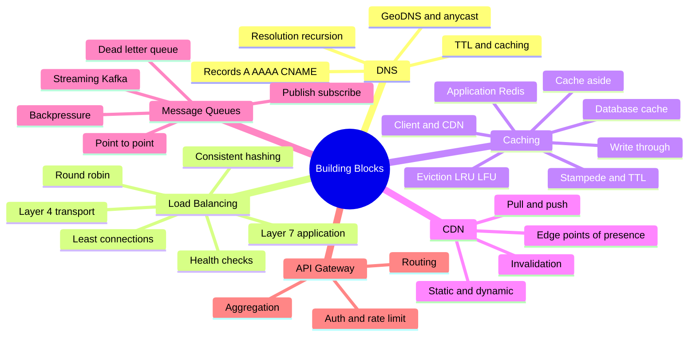
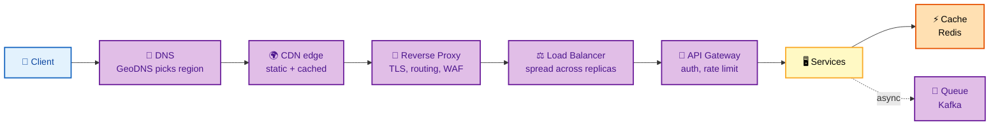
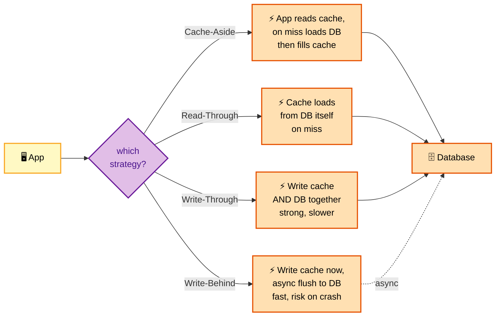
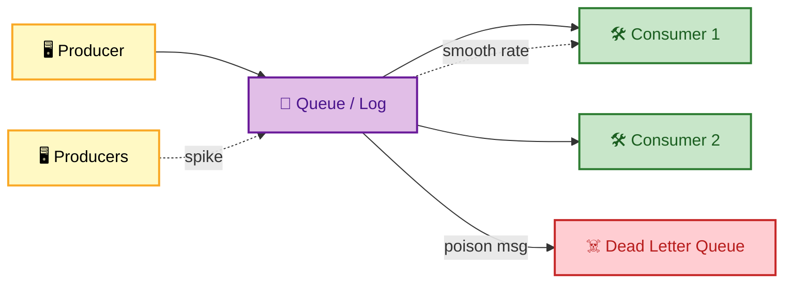

# SECTION 2: BUILDING BLOCKS

> **Scope:** The reusable components every design is assembled from — DNS, reverse proxies, load balancers (L4 vs L7, algorithms, health checks), caching (layers, strategies, eviction, invalidation, stampede), CDNs, message queues (and pub/sub vs streaming), and API gateways. Know these cold and any design becomes a composition of known pieces.

---

## 🗺️ Visual Overview

**In one line:** A request is routed by DNS to the nearest edge, served static from a CDN, balanced across stateless app servers, accelerated by a cache, and decoupled from slow work by a queue — these six blocks answer 80% of design questions.



**Where a request flows and what each block does** (the reference path, annotated):



**Caching write strategies — where the write lands** (compare the four patterns):



> 🧠 **Memory hooks (mnemonics):**
> - **L4 vs L7 — "4 = fast, 7 = smart":** L4 balances on IP/port (fast, opaque); L7 reads the HTTP request (smart, can route by path/header).
> - **LB algorithms — "RWLIG":** **R**ound-robin, **W**eighted, **L**east-connections, **I**P-hash, **G**eographic.
> - **Cache patterns — "Aside, Through, Through, Behind":** *Aside* = app does the work; *Read/Write-Through* = cache does it synchronously; *Write-Behind* = cache does it later (fast, risky).
> - **Eviction — "LRU forgets the oldest, LFU forgets the loneliest":** LRU evicts least-recently-used; LFU evicts least-frequently-used.
> - **Queue vs stream — "queue deletes, log replays":** a queue removes a message once consumed; a log (Kafka) keeps it so many consumers can replay.

---

## 1. DNS & Reverse Proxies

> 🎯 **Interview weight: MEDIUM** — the entry point of every request path.

**In one line:** DNS turns a name into an IP (and can steer users to the nearest/healthiest region via GeoDNS + anycast), while a reverse proxy terminates TLS and fronts your services with routing, caching, and security.

- **DNS resolution:** recursive resolver → root → TLD → authoritative. **TTL** controls how long answers are cached (low TTL = faster failover, more query load).
- **GeoDNS / latency-based routing** (Route 53, Cloudflare): return different IPs by client location for locality and regional failover.
- **Anycast:** the same IP is announced from many locations; BGP routes each client to the nearest — used by CDNs and DNS itself.
- **Reverse proxy** (Nginx, Envoy, HAProxy): TLS termination, request routing, compression, response caching, WAF, and a single choke point for observability.

> ⚠️ **Gotcha:** DNS-based failover is only as fast as the **TTL** plus resolver caching. A 300 s TTL means clients may hit a dead region for 5 minutes after you flip the record. For fast failover, keep TTLs low (30–60 s) or fail over at the load-balancer/anycast layer instead.

---

## 2. Load Balancers

> 🎯 **Interview weight: HIGH** — nearly every design has one; know L4 vs L7 and the algorithms.

**In one line:** A load balancer spreads traffic across healthy backends; **L4** balances on IP/port (fast, protocol-agnostic), **L7** understands HTTP so it can route by path/header/cookie and do smart things like sticky sessions and canaries.

| | **L4 (transport)** | **L7 (application)** |
|---|---|---|
| Operates on | TCP/UDP, IP + port | HTTP/gRPC, headers, path, cookies |
| Speed | Very fast, low overhead | Slower (parses request) |
| Routing | By connection | By URL, host, header, method |
| Features | NAT, low latency | Path routing, TLS termination, WAF, canary |
| Example | AWS NLB, IPVS | AWS ALB, Nginx, Envoy |

**Algorithms:**

| Algorithm | How it routes | Best for |
|---|---|---|
| **Round robin** | Evenly, one after another | Homogeneous, stateless backends |
| **Weighted** | Proportional to capacity | Mixed instance sizes |
| **Least connections** | To the least-busy backend | Long-lived / uneven requests |
| **IP hash / sticky** | Same client → same backend | Session affinity |
| **Consistent hashing** | Key → ring position | Caches/shards; minimizes remap on scale |

**Health checks** (active probes + passive ejection) remove unhealthy backends automatically. Without them, the LB happily routes to dead servers.

> 💡 **Interview tip:** Prefer **stateless services + shared session store** over sticky sessions. Sticky sessions pin users to a server, so scaling in or a node failure drops their session. If you must use affinity, back it with a shared store so failover is graceful.

---

## 3. Caching

> 🎯 **Interview weight: CRITICAL** — the single highest-leverage lever for read-heavy systems.

**In one line:** A cache trades a little staleness for a huge latency/throughput win by keeping hot data close; the game is maximizing hit rate while controlling staleness, eviction, and the thundering-herd failure mode.

**Cache layers (client → server):**

```
Client/Browser ──▶ CDN (edge) ──▶ App cache (Redis/Memcached) ──▶ DB query cache ──▶ Database
```

**Write/read strategies** (see diagram above):

| Strategy | Who loads/writes | Trade-off |
|---|---|---|
| **Cache-aside (lazy)** | App checks cache, loads DB on miss, fills cache | Most common; first read is slow, possible staleness |
| **Read-through** | Cache loads from DB on miss | Cleaner app code; needs cache library support |
| **Write-through** | Write cache + DB synchronously | Cache always fresh; slower writes |
| **Write-behind (write-back)** | Write cache now, flush to DB async | Fast writes; **data loss risk** on crash |

**Eviction policies:** **LRU** (evict least-recently-used — default, good general choice), **LFU** (evict least-frequently-used — better for skewed popularity), **TTL** (time-based expiry), **FIFO**.

**Failure modes to name in interviews:**

- **Cache stampede / thundering herd:** a hot key expires and thousands of requests hit the DB at once. *Fix:* request coalescing (single-flight), stale-while-revalidate, jittered TTLs, or a lock on recompute.
- **Cache penetration:** requests for keys that don't exist bypass the cache to the DB. *Fix:* cache negative results / Bloom filter.
- **Hot key:** one key gets disproportionate traffic. *Fix:* replicate the key across nodes, or add a local (near) cache.

> ⚠️ **Gotcha:** Cache invalidation is famously one of the "two hard things." Write-through keeps the cache correct but couples every write to two systems; cache-aside is simpler but risks serving stale data between the DB write and the cache update. State your staleness tolerance explicitly and pick accordingly.

---

## 4. Content Delivery Networks (CDN)

> 🎯 **Interview weight: MEDIUM–HIGH**

**In one line:** A CDN caches content at edge POPs physically near users, cutting latency and offloading your origin — essential for static assets and increasingly for dynamic content and API acceleration.

- **Pull CDN:** origin is the source of truth; edge fetches and caches on first request (lazy). Simple, good for large catalogs.
- **Push CDN:** you upload content to the CDN proactively. Good for a small, high-traffic set.
- **Invalidation:** purge by URL, tag, or wildcard; or use **cache-busting** (versioned filenames like `app.4f2a.js`) to sidestep invalidation entirely.
- **Dynamic acceleration:** even uncacheable responses benefit from the CDN's optimized backbone (persistent origin connections, TLS at edge, route optimization).

> 💡 **Interview tip:** For a global product, put **static assets on a CDN first** — it's the cheapest, fastest win and offloads a large fraction of origin traffic. Then discuss edge caching of *cacheable* API responses (with short TTLs) before scaling the origin further.

---

## 5. Message Queues & Streaming

> 🎯 **Interview weight: HIGH** — the key to decoupling, async work, and absorbing spikes.

**In one line:** A queue decouples producers from consumers so slow or spiky work happens asynchronously, smoothing load and improving resilience; the big split is **traditional queue** (message deleted on consume) vs **log/stream** (message retained, replayable by many consumers).



| | **Queue** (SQS, RabbitMQ) | **Log / Stream** (Kafka, Kinesis) |
|---|---|---|
| Delivery | Message removed once consumed | Retained; consumers track offset |
| Consumers | Competing (one gets each msg) | Many independent readers, replayable |
| Ordering | Per-queue (limited) | Per-partition ordering |
| Use case | Task/job dispatch | Event sourcing, analytics, fan-out |

**Why you use them:**

- **Decoupling:** producer doesn't wait for the consumer; either can scale/restart independently.
- **Load leveling:** absorb a traffic spike in the queue, drain at a steady rate (backpressure).
- **Resilience:** if a consumer dies, messages wait; on restart, work resumes.

**Delivery semantics:** *at-most-once* (may lose), *at-least-once* (may duplicate → consumers must be **idempotent**), *exactly-once* (hard; usually at-least-once + idempotency/dedup). **Dead-letter queues** capture messages that repeatedly fail so they don't block the queue.

> ⚠️ **Gotcha:** "Exactly-once" is mostly a myth end-to-end. Real systems use **at-least-once delivery + idempotent consumers** (dedupe on a message ID). If an interviewer asks for exactly-once, describe idempotency keys rather than claiming the broker guarantees it.

---

## 6. API Gateway

> 🎯 **Interview weight: MEDIUM**

**In one line:** An API gateway is the single front door for clients — it handles routing, authentication, rate limiting, TLS, and request aggregation, so individual services don't each reimplement cross-cutting concerns.

**Responsibilities it centralizes:** routing to services, authentication/authorization, rate limiting & throttling, TLS termination, request/response transformation, aggregation (fan-out to several services, combine responses), observability (logging/metrics/tracing).

**Gateway vs load balancer:** a load balancer spreads traffic across replicas of *one* service; a gateway routes across *many* services and adds L7 app logic (auth, rate limits, API composition). They often sit together — gateway in front, LB behind per service.

> 💡 **Interview tip:** Put **auth and rate limiting at the gateway** so every backend inherits them for free and can trust an internal identity header. But don't turn the gateway into a monolith of business logic — keep it to cross-cutting concerns, or it becomes a bottleneck and a deployment chokepoint.

---

## Interview Questions & Answers

### Q1. When would you choose an L7 load balancer over L4, and what does it cost you?

**Answer:** Choose **L7** when you need request-aware routing — path-based routing (`/api` vs `/static`), host routing for multi-tenant, header/cookie routing for canaries and A/B, TLS termination, or a WAF. It costs more CPU/latency because it parses every HTTP request, and it terminates TLS so it sees plaintext. Choose **L4** when you just need to spread raw TCP/UDP fast (e.g., a database proxy, gRPC at massive scale, or when you want end-to-end TLS passthrough).

**Reasoning:** The trade is *intelligence vs speed*. L7's request awareness enables modern deployment patterns; L4's simplicity gives lowest latency and protocol independence.

**Follow-up — "How do canary deployments use the L7 LB?"** The L7 LB routes a small weighted percentage (say 5%) of traffic to the new version by adjusting target-group weights, watches error/latency metrics, then ramps up or rolls back.

### Q2. Your read latency is fine at p50 but terrible at p99, and the DB is the bottleneck. How does caching help, and how does it hurt?

**Answer:** A cache in front of the DB serves hot reads from memory, cutting both p99 latency and DB load dramatically — a 90% hit rate means the DB sees only 10% of reads. It hurts by adding a **consistency problem** (stale data between DB write and cache update) and new failure modes: **stampede** when a hot key expires (thousands of requests hit the DB at once) and **hot keys** overloading one cache node. I'd use cache-aside with short TTLs, add request coalescing / stale-while-revalidate to prevent stampede, and jitter TTLs.

**Reasoning:** This tests whether you know caching isn't free — you're trading staleness and operational complexity for latency and throughput, and you must handle its specific failure modes.

**Follow-up — "A single celebrity key gets 50% of traffic. Fix?"** Replicate that key across cache nodes or add a per-app-server local cache in front of Redis so the hot key is absorbed locally.

### Q3. Why put a message queue between a web service and its work, and what new problems does it introduce?

**Answer:** A queue decouples the fast request path from slow work (sending email, encoding video, updating a search index), so the user gets an immediate response and the work happens asynchronously. It also levels load — a traffic spike fills the queue and consumers drain at a steady rate — and adds resilience since work survives a consumer crash. New problems: **at-least-once delivery means duplicates**, so consumers must be idempotent; you need a **dead-letter queue** for poison messages; and you've added **eventual consistency** (the work isn't done when the response returns) plus queue monitoring (depth, age, consumer lag).

**Reasoning:** Queues are the canonical decoupling tool, but interviewers want you to acknowledge the async trade-offs — duplicates, ordering, and the shift to eventual consistency — not just the benefits.

**Follow-up — "How do you make a payment-charging consumer idempotent?"** Use an idempotency key (e.g., the order ID); before charging, check whether that key was already processed in a dedupe store, and make the whole operation a single atomic upsert.

### Q4. Design the caching strategy for a product-detail page read 100M times/day that changes a few times a week.

**Answer:** It's extremely read-heavy and rarely changes, so cache aggressively at multiple layers: **CDN** for the fully-rendered page/fragments and images (longest win), **Redis** for the product JSON (cache-aside, TTL of minutes-to-hours), and rely on the DB only for cache misses and writes. On the rare update, **invalidate/update** the Redis key and purge the CDN entry (or use versioned URLs). With a high hit rate the origin sees a tiny fraction of the 100M reads.

**Reasoning:** Matching strategy to the read/write profile is the skill — near-static + massive reads = push caching as close to the user as possible and invalidate on the infrequent write.

**Follow-up — "How do you avoid a stampede when a popular product's cache entry expires?"** Stale-while-revalidate (serve the old value while one request refreshes), single-flight locking on recompute, and jittered TTLs so keys don't all expire together.

---

**[← Previous: Fundamentals](01-FUNDAMENTALS.md)** | **[Back to Index](README.md)** | **[Next: Data & Storage →](03-DATA-STORAGE.md)**
