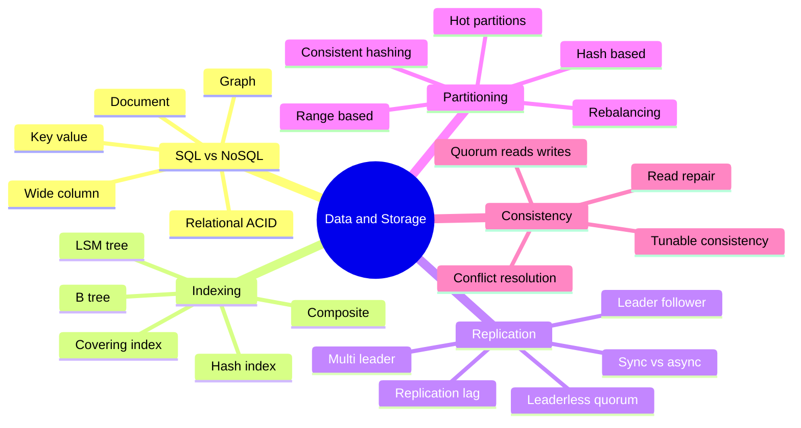
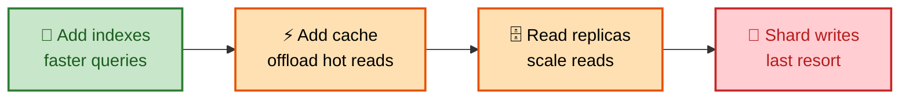
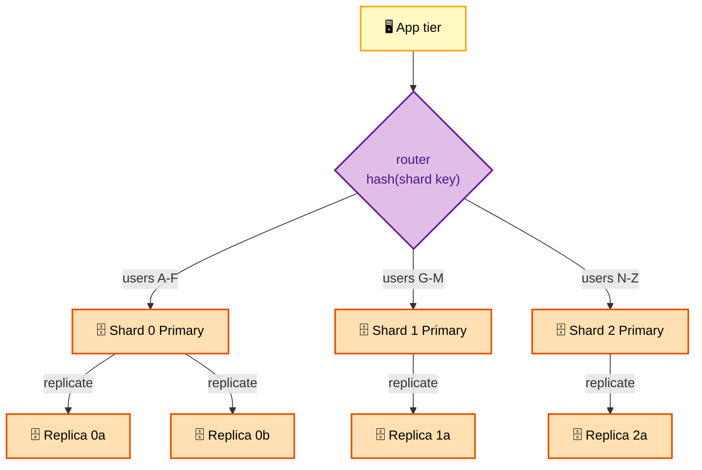
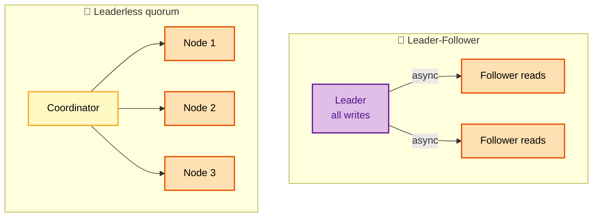

# SECTION 3: DATA & STORAGE

> **Scope:** The database — where almost every system bottlenecks. SQL vs NoSQL (and the NoSQL families), indexing, replication (leader-follower, multi-leader, leaderless), partitioning/sharding strategies and their pitfalls, quorums and tunable consistency, and how CAP actually plays out in real datastores. This is the highest-value depth topic for scaling.

---

## 🗺️ Visual Overview

**In one line:** You scale a database by relieving reads first (indexing → caching → read replicas) and only then splitting writes (sharding); the hard parts are choosing a shard key, keeping replicas consistent, and surviving the leader failing.

**Scaling a database — the staircase of levers** (each rung before sharding):

**Sharded + replicated topology — writes to a primary per shard, reads from replicas:**

> 🧠 **Memory hooks (mnemonics):**
> - **ACID vs BASE — "SQL is ACID, NoSQL is BASE":** ACID = Atomic/Consistent/Isolated/Durable (strict); BASE = Basically Available, Soft state, Eventual consistency (relaxed).
> - **Scale reads before writes — "ICRS":** **I**ndex → **C**ache → **R**eplicas → **S**hard. Sharding is always last.
> - **Quorum rule — "W + R > N = strong":** if writes acked by W and reads from R nodes overlap (W+R > N), a read always sees the latest write.
> - **Shard key golden rule — "high cardinality, even spread, query-aligned":** pick a key with many values, uniform distribution, and that matches your query pattern.
> - **NoSQL families — "KDWG":** **K**ey-value, **D**ocument, **W**ide-column, **G**raph.

---

## 1. SQL vs NoSQL

> 🎯 **Interview weight: HIGH** — you must justify the choice, not just name one.

**In one line:** SQL gives you relations, joins, and ACID transactions with a fixed schema (great for structured, consistency-critical data); NoSQL trades those for horizontal scale, flexible schema, and a data model tuned to one access pattern.

| | **SQL (relational)** | **NoSQL** |
|---|---|---|
| Schema | Fixed, enforced | Flexible / schema-less |
| Scaling | Vertical + read replicas; sharding is manual | Horizontal by design |
| Transactions | Strong ACID, multi-row | Often limited / single-item |
| Joins | Rich | Usually none (denormalize) |
| Best for | Structured data, complex queries, money | Huge scale, evolving schema, one access pattern |
| Examples | PostgreSQL, MySQL, Aurora | DynamoDB, Cassandra, MongoDB, Redis |

**NoSQL families (KDWG):**

| Family | Model | Good at | Examples |
|---|---|---|---|
| **Key-value** | `key → blob` | Ultra-fast lookups, caching, sessions | Redis, DynamoDB |
| **Document** | JSON documents | Flexible nested records | MongoDB, Couchbase |
| **Wide-column** | rows with dynamic columns | Massive writes, time-series | Cassandra, HBase, Bigtable |
| **Graph** | nodes + edges | Relationships, traversals | Neo4j, Neptune |

> 💡 **Interview tip:** Don't say "NoSQL because it scales." Say *which* NoSQL and *why*: "Cassandra (wide-column) because our workload is write-heavy time-series with a known partition key and we can tolerate eventual consistency." Matching the family to the access pattern is what signals depth. Also note modern SQL (Aurora, Spanner, CockroachDB) scales horizontally too, so "SQL can't scale" is outdated.

---

## 2. Indexing

> 🎯 **Interview weight: MEDIUM–HIGH**

**In one line:** An index is a sorted side-structure that turns an O(n) table scan into an O(log n) lookup — it speeds reads dramatically but slows writes and costs storage, so you index the columns you filter/join/sort on.

- **B-tree index** (default in RDBMS): balanced, sorted; great for equality *and* range queries (`WHERE age > 30`). O(log n).
- **Hash index:** O(1) equality lookups but no range queries. Used in memory engines.
- **Composite index** `(a, b, c)`: usable for queries on a leftmost prefix (`a`, `a+b`, `a+b+c`) — order matters.
- **Covering index:** includes all columns a query needs, so the DB answers from the index alone (no table lookup).
- **LSM-tree** (Cassandra, RocksDB): write-optimized — buffers writes in memory, flushes sorted files, compacts later. Fast writes, reads may touch multiple files (mitigated by Bloom filters).

> ⚠️ **Gotcha:** Every index you add slows down **writes** (each insert/update must maintain all indexes) and consumes storage. Over-indexing a write-heavy table is a real performance bug. Index for your actual query patterns, and remember a composite index's **column order** determines which queries it can serve.

---

## 3. Replication

> 🎯 **Interview weight: HIGH** — the basis of read scaling and availability.

**In one line:** Replication keeps copies of data on multiple nodes for read scaling and fault tolerance; the models differ in *who can accept writes* (single leader, multiple leaders, or any node) and *when* replicas are updated (sync vs async).

| Model | Writes | Pros | Cons |
|---|---|---|---|
| **Leader-follower** (primary-replica) | Only leader | Simple, read scaling via followers | Leader is write SPOF; failover needed |
| **Multi-leader** | Any leader | Write locally in each region | Write conflicts to resolve |
| **Leaderless (quorum)** | Any node | High availability, no failover | Tunable consistency, read repair |

**Sync vs async replication:**

- **Synchronous:** leader waits for replica ack before confirming the write → no data loss on leader failure, but higher write latency and stalls if a replica is slow.
- **Asynchronous:** leader confirms immediately, replicates in the background → fast writes, but a leader crash can lose the last unreplicated writes. Most systems use async (or semi-sync: wait for one replica).

**Replication lag** is the async cost: a follower may be milliseconds-to-seconds behind. This breaks read-your-writes (a user edits, then reads a stale follower). *Fixes:* read from the leader for a user's own recent writes, or track a version and wait for the replica to catch up.

> ⚠️ **Gotcha:** Leader failover isn't free. If replication is async and the leader dies, un-replicated writes are **lost**; promoting a lagging follower can cause split-brain if the old leader returns. Real systems use consensus (Raft/Paxos) or a fencing token to elect one leader safely.

---

## 4. Partitioning & Sharding

> 🎯 **Interview weight: CRITICAL** — the definitive write-scaling question, and where the shard-key choice makes or breaks the design.

**In one line:** Sharding splits one dataset across many nodes so each holds a slice, letting writes scale horizontally; the entire design hinges on the **shard key**, which must spread load evenly and align with your queries.

| Strategy | How | Pros | Cons |
|---|---|---|---|
| **Range-based** | Partition by key ranges (A–F, G–M…) | Efficient range scans | **Hot partitions** if data/traffic is skewed |
| **Hash-based** | `hash(key) mod N` → shard | Even distribution | No range queries; **resharding moves everything** |
| **Consistent hashing** | Keys + nodes on a ring | Adding a node moves only ~1/N of keys | More complex; needs virtual nodes for balance |
| **Directory / lookup** | A lookup table maps key → shard | Flexible rebalancing | The directory is a SPOF/bottleneck |

**Choosing a shard key (the golden rule):** high **cardinality** (many distinct values), **even distribution** (no hotspots), and **query alignment** (most queries include the key so they hit one shard). Example: shard by `user_id` if most queries are per-user; sharding by `country` creates hot shards (USA huge, others tiny).

**Consistent hashing** avoids the "hash mod N" catastrophe: with plain `mod N`, adding one node remaps almost every key. On a hash ring, adding/removing a node only moves the keys between adjacent nodes (~1/N). **Virtual nodes** (many ring positions per physical node) smooth out imbalance.

**Problems sharding introduces:**

- **Cross-shard queries/joins:** a query spanning shards must scatter-gather and merge — slow and complex. Denormalize or keep related data co-located.
- **Distributed transactions:** ACID across shards needs 2-phase commit (slow, fragile) or a saga (see Section 4).
- **Rebalancing / hotspots:** a shard grows too hot and must be split; consistent hashing + virtual nodes minimize movement.
- **Celebrity problem:** one key (a celebrity user) overwhelms its shard. Split that key's data or cache it specially.

> 💡 **Interview tip:** When asked to shard, first say *why other levers are exhausted* (reads cached and replicated, writes still too high), then propose a **shard key with justification**, then immediately raise the hard parts — cross-shard queries and resharding. Volunteering the downsides shows senior-level judgment.

---

## 5. Quorums & Tunable Consistency

> 🎯 **Interview weight: MEDIUM–HIGH** — the leaderless (Dynamo/Cassandra) model.

**In one line:** In quorum systems you tune consistency per-request by choosing how many replicas must acknowledge a write (**W**) and a read (**R**) out of **N** copies; if **W + R > N**, reads are guaranteed to see the latest write.

- **N** = replication factor (copies per item).
- **W** = replicas that must ack a write.
- **R** = replicas a read must hear from.
- **W + R > N** → **strong** (overlapping read/write sets). Example: N=3, W=2, R=2.
- **W + R ≤ N** → **eventual** (faster, may read stale). Example: N=3, W=1, R=1.

**Tuning knobs:**

- Favor **read latency**: low R (R=1). Favor **write latency**: low W (W=1).
- **W=N** → strong writes but any node down blocks writes (low availability).
- **Read repair** and **anti-entropy (Merkle trees)** heal divergent replicas in the background.
- **Conflict resolution:** last-write-wins (timestamp — can lose data) or vector clocks / CRDTs (preserve concurrent updates).

> 🔍 **Insight:** Quorums let one datastore serve both a strongly-consistent path (W+R>N for a critical read) and a fast eventual path (W=1,R=1 for a view counter) — you choose per operation. That flexibility is why Dynamo-style stores power such varied workloads.

---

## 6. CAP in Practice — Picking a Datastore

> 🎯 **Interview weight: HIGH**

**In one line:** Map the data's correctness need to a store: consistency-critical data (money, inventory, locks) → CP stores; availability-critical data (carts, feeds, telemetry) → AP stores.

| Need | Choose | Examples |
|---|---|---|
| Strong consistency, transactions | CP / NewSQL | PostgreSQL, Spanner, CockroachDB, etcd |
| Massive writes, high availability | AP wide-column | Cassandra, ScyllaDB |
| Flexible documents, moderate scale | Document | MongoDB, DynamoDB |
| Sub-ms lookups, caching, sessions | Key-value | Redis, DynamoDB |
| Relationship traversal | Graph | Neo4j, Neptune |

> ⚠️ **Gotcha:** "Polyglot persistence" is normal — a single product uses several stores (Postgres for orders, Redis for sessions, Cassandra for the activity feed, S3 for blobs). Interviewers like when you pick the *right store per data type* instead of forcing everything into one database.

---

## Interview Questions & Answers

### Q1. How do you scale a relational database that's hitting its limits, in order?

**Answer:** In order of increasing complexity: (1) **optimize queries and add indexes** — most "DB is slow" is a missing index or N+1 query; (2) **add a cache** (Redis) in front to absorb hot reads; (3) **add read replicas** and route reads to them (accepting replication lag); (4) **vertically scale** the primary as a stopgap; (5) only then **shard** the writes across multiple primaries by a well-chosen key. Sharding is last because it introduces cross-shard queries, distributed transactions, and resharding pain.

**Reasoning:** The ordering (ICRS: Index → Cache → Replicas → Shard) is the whole point — reaching for sharding first signals inexperience, since the earlier levers are far cheaper and reversible.

**Follow-up — "You've added replicas but users complain their own edits vanish. Why?"** Replication lag — their read hit a stale follower before the write propagated. Fix with read-your-writes: route a user's reads to the leader for a short window after they write, or track a write version and wait for the replica.

### Q2. Walk me through choosing a shard key for a chat application.

**Answer:** Queries are "fetch messages for a conversation," so I'd shard by **`conversation_id`** — it has high cardinality, spreads evenly, and co-locates all of a conversation's messages on one shard so reads hit a single node. Sharding by `user_id` would split a conversation across shards (both participants) forcing cross-shard reads; sharding by `timestamp` creates a hot shard (all new messages land on "today's" shard). I'd hash the conversation_id with consistent hashing + virtual nodes so adding capacity moves minimal data.

**Reasoning:** This tests the golden rule — high cardinality, even distribution, query alignment — plus awareness of the hot-shard and resharding pitfalls.

**Follow-up — "One group chat has 500K members and dominates its shard. What now?"** The celebrity/hot-key problem: split that conversation's data (e.g., sub-shard by time bucket), add a dedicated cache, or give it its own shard so it doesn't starve neighbors.

### Q3. Explain how W, R, and N give you tunable consistency, with a concrete example.

**Answer:** With N replicas, a write must be acked by W and a read must gather R responses. If **W + R > N**, the read and write quorums overlap, so a read always includes at least one node with the latest write — strong consistency. Example: N=3, W=2, R=2 → guaranteed fresh reads. For a like-counter where staleness is fine, set N=3, W=1, R=1 → fastest, eventually consistent. So the *same* datastore serves strong reads for critical data and fast eventual reads for tolerant data, chosen per request.

**Reasoning:** Demonstrates you understand quorum math rather than treating consistency as a global on/off switch — the hallmark of Dynamo-style design.

**Follow-up — "Two clients write the same key concurrently to different nodes. What happens?"** A conflict; resolved by last-write-wins (timestamp — simple but can drop an update) or vector clocks/CRDTs, which detect concurrency and merge or surface both versions.

### Q4. When would you pick eventual consistency, and how do you keep it from confusing users?

**Answer:** Pick eventual consistency when availability and low latency matter more than instant correctness and staleness is invisible or self-healing — social feeds, view/like counts, DNS, recently-viewed. To avoid confusing users, apply a *stronger* guarantee only where it's noticeable: **read-your-writes** so a user always sees their own action immediately (optimistic UI update + route their reads to the leader), and **monotonic reads** so a refresh never appears to go backward. The global state can lag; the *individual user's* view stays coherent.

**Reasoning:** Senior answers name the *specific* consistency guarantee per use case rather than blanket "eventual," showing they understand the user-perceived correctness boundary.

**Follow-up — "Give an example where eventual consistency would be a serious bug."** Account balance / inventory decrement — a stale read enables double-spend or overselling. Those need strong consistency (CP store or W+R>N).

---

**[← Previous: Building Blocks](02-BUILDING-BLOCKS.md)** | **[Back to Index](README.md)** | **[Next: Scalability Patterns →](04-SCALABILITY-PATTERNS.md)**
