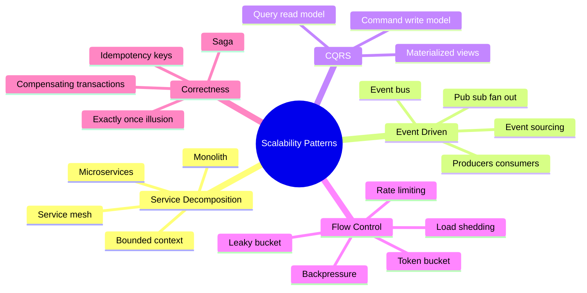
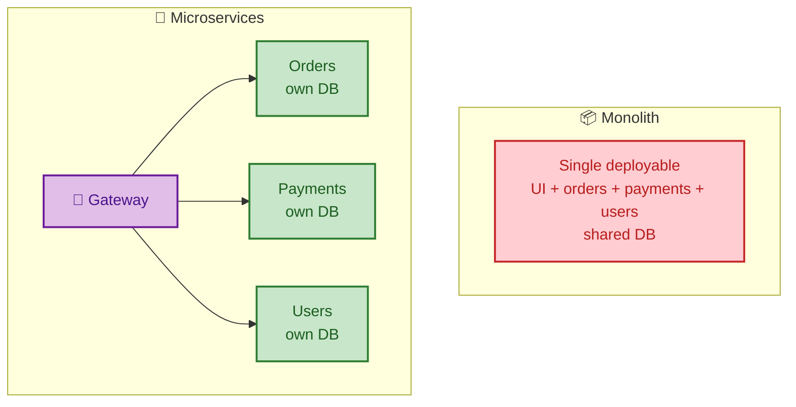
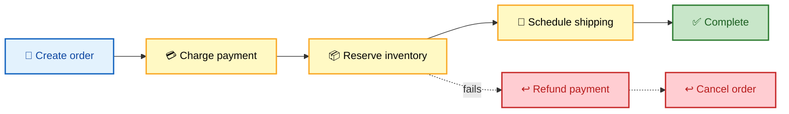
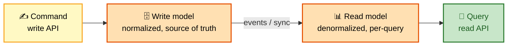

# SECTION 4: SCALABILITY PATTERNS

> **Scope:** Architectural patterns for decoupling and scaling — monolith vs microservices, event-driven architecture, CQRS and event sourcing, rate limiting algorithms, idempotency, backpressure and load shedding, and the saga pattern for distributed transactions. These are the "how do you decompose this at scale" answers.

---

## 🗺️ Visual Overview

**In one line:** Scaling beyond a single service means **decoupling** — split by business capability (microservices), communicate via events instead of synchronous calls (event-driven), separate reads from writes (CQRS), and replace cross-service transactions with compensating steps (saga).

**Monolith vs microservices — one deployable vs many** (trade coupling for independence):

**Saga — replace a distributed transaction with steps + compensations:**

> 🧠 **Memory hooks (mnemonics):**
> - **Microservices — "one team, one service, one database":** each service is independently deployable and owns its data; no shared DB.
> - **CQRS — "Commands change, Queries read":** split the write model from the read model so each scales and optimizes independently.
> - **Token bucket vs leaky bucket — "token allows bursts, leaky enforces a steady drip":** token bucket permits bursts up to capacity; leaky bucket smooths to a fixed rate.
> - **Idempotency — "same key, same result":** a retried request with the same idempotency key must not double-charge.
> - **Saga — "no locks, just undo":** instead of a distributed transaction, run local steps and compensate backward on failure.

---

## 1. Monolith vs Microservices

> 🎯 **Interview weight: HIGH** — and the mature answer is "it depends," not "always microservices."

**In one line:** A monolith is one deployable that's simple to build and operate but couples everything; microservices split by business capability for independent scaling and deployment, at the cost of distributed-systems complexity.

| | **Monolith** | **Microservices** |
|---|---|---|
| Deploy | One unit | Many independent units |
| Scaling | Whole app together | Per-service |
| Team autonomy | Coupled | Independent (own service + DB) |
| Data | Shared DB | DB-per-service |
| Complexity | Low (one process) | High (network, discovery, tracing) |
| Failure | One bug can take all down | Isolated (with bulkheads) |
| Best for | Early-stage, small teams | Large orgs, differing scale needs |

**When microservices earn their cost:** many teams needing independent deploys, components with very different scaling/resource profiles, or clear bounded contexts. **When they don't:** a small team/early product — you inherit network failures, distributed transactions, and observability overhead before you have the scale to justify them.

> ⚠️ **Gotcha:** "Microservices" is not automatically the right answer. Splitting a small app into 20 services creates a **distributed monolith** — all the network pain with none of the independence (services still deploy together, share a DB, call each other synchronously). Start with a well-structured monolith and extract services along bounded contexts when a real scaling/team need appears.

---

## 2. Event-Driven Architecture

> 🎯 **Interview weight: HIGH**

**In one line:** Instead of services calling each other synchronously, producers emit **events** to a bus and consumers react — decoupling components in time and space so they scale, fail, and deploy independently.

- **Producer/consumer via a broker** (Kafka, SQS, EventBridge): the producer doesn't know or wait for consumers.
- **Pub/sub fan-out:** one event, many independent consumers (order-placed → email, analytics, inventory, fraud) — add a new consumer without touching the producer.
- **Event sourcing:** store the **sequence of events** as the source of truth rather than just current state; rebuild state by replaying events. Gives a full audit log and time-travel, at the cost of complexity and replay/versioning concerns.

**Benefits:** loose coupling, independent scaling, natural buffering/load-leveling, easy extension. **Costs:** eventual consistency, harder debugging (flow is spread across consumers), event schema/versioning, and the need for idempotent consumers (at-least-once delivery).

> 💡 **Interview tip:** Reach for event-driven when you need **fan-out** ("when an order is placed, five things must happen") or **spike absorption**. If a workflow is a strict synchronous request-response with a single consumer, an event bus just adds latency and debugging pain — use a direct call.

---

## 3. CQRS & Materialized Views

> 🎯 **Interview weight: MEDIUM**

**In one line:** CQRS (Command Query Responsibility Segregation) splits the **write model** from the **read model** so each is optimized and scaled independently — writes stay normalized and consistent, reads are denormalized/precomputed for speed.

- **Commands** mutate state (validated, normalized, strongly consistent).
- **Queries** read from **materialized views** shaped exactly for each screen (denormalized, fast, often in a separate store like Elasticsearch or a read replica).
- The read model is updated from the write model via events — so it's **eventually consistent**.

**Use it when** read and write workloads are wildly asymmetric (a news feed read millions of times, written rarely) or reads need a very different shape than writes (search, analytics dashboards). **Avoid it** for simple CRUD — it doubles the models and adds eventual-consistency complexity for no benefit.

> ⚠️ **Gotcha:** CQRS makes reads **eventually consistent** with writes — right after a command, a query may return the old view until the read model catches up. Handle it in the UI (optimistic update) or accept the lag. Don't apply CQRS everywhere; it's a targeted tool for asymmetric or divergent read/write needs.

---

## 4. Rate Limiting

> 🎯 **Interview weight: HIGH** — a favorite deep-dive; know the algorithms.

**In one line:** Rate limiting protects a service from overload and abuse by capping how many requests a client may make per window; the algorithms differ in how they handle **bursts** and how much state they keep.

| Algorithm | How it works | Bursts | Note |
|---|---|---|---|
| **Token bucket** | Tokens refill at a steady rate; each request spends one; bucket has a max | Allows bursts up to bucket size | Most popular; smooth + bursty |
| **Leaky bucket** | Requests queue and drain at a fixed rate | Smooths to constant rate | Good for steady downstream |
| **Fixed window** | Count per fixed interval (per minute) | Spikes at window edges | Simple but boundary bursts |
| **Sliding window log** | Timestamps in a rolling window | Accurate | More memory |
| **Sliding window counter** | Weighted blend of two fixed windows | Smooths edges | Good accuracy/cost balance |

**Distributed rate limiting:** with many app servers, the counter must be shared — typically **Redis** (atomic `INCR` + TTL, or a Lua token-bucket script) so all nodes see one limit. Trade a little Redis latency for a correct global limit; or use approximate local limits per node for lower latency.

> 💡 **Interview tip:** Default to **token bucket** — it permits legitimate short bursts (a user loading a page fires several requests at once) while enforcing an average rate. Mention that in a distributed system the bucket state lives in Redis with an atomic script, and return `429 Too Many Requests` with a `Retry-After` header so clients back off politely.

---

## 5. Idempotency

> 🎯 **Interview weight: HIGH** — the antidote to at-least-once delivery and retries.

**In one line:** An idempotent operation produces the same result whether it runs once or many times, so safe retries (and duplicate messages) don't cause double-charges or duplicate records — achieved with an **idempotency key**.

- The client sends a unique **idempotency key** (e.g., a UUID per checkout attempt).
- The server records the key + result; a retry with the same key returns the stored result instead of re-executing.
- HTTP verbs: `GET`/`PUT`/`DELETE` are naturally idempotent; `POST` is not — which is why payment/order APIs require an idempotency key on `POST`.

**Why it's essential:** networks retry, queues deliver at-least-once, users double-click. Without idempotency these become double payments and duplicate orders. It's also what makes "exactly-once processing" achievable in practice (at-least-once delivery + idempotent consumer = effectively exactly-once).

> ⚠️ **Gotcha:** Idempotency must be **atomic**. Checking "have I seen this key?" and then performing the action in two steps has a race — two concurrent retries both pass the check. Use a single atomic operation (unique constraint / conditional write / `INSERT ... ON CONFLICT`) so the first wins and the rest are no-ops.

---

## 6. Backpressure & Load Shedding

> 🎯 **Interview weight: MEDIUM–HIGH**

**In one line:** When demand exceeds capacity, a resilient system **pushes back** (backpressure — slow the producer) or **sheds load** (drop/deprioritize low-value requests) so it degrades gracefully instead of collapsing.

- **Backpressure:** the consumer signals "slow down" upstream — bounded queues that block/reject when full, TCP flow control, reactive-stream demand signals. Prevents the classic failure where an unbounded queue grows until the process OOMs.
- **Load shedding:** under overload, reject or drop requests early (return `503`) — ideally shedding low-priority traffic first (e.g., drop analytics before checkout). Better to serve 90% well than 100% terribly.
- **Circuit breaker:** stop calling a failing dependency after a threshold, fail fast, and periodically probe for recovery — prevents cascading failure and retry storms.
- **Bulkheads:** isolate resource pools per dependency so one slow downstream can't exhaust all threads/connections.

> 🔍 **Insight:** Uncontrolled queues are a trap — they *hide* overload until memory runs out, turning a slowdown into a crash. **Bounded** queues plus backpressure and load shedding convert "collapse" into "graceful degradation," which is what separates resilient systems from fragile ones.

---

## 7. Saga Pattern (Distributed Transactions)

> 🎯 **Interview weight: MEDIUM–HIGH**

**In one line:** Since you can't hold an ACID transaction across microservices/shards, a **saga** runs a sequence of local transactions and, if a step fails, executes **compensating transactions** to undo the prior steps — trading atomicity for availability.

**Two coordination styles:**

- **Choreography:** each service emits an event that triggers the next; no central coordinator. Decoupled but the flow is implicit and hard to trace.
- **Orchestration:** a central orchestrator tells each service what to do and handles compensation. Clearer and easier to debug; the orchestrator is a component to run.

**Example (order saga):** create order → charge payment → reserve inventory → schedule shipping. If inventory reservation fails, compensate backward: refund payment → cancel order. There's no global rollback — each undo is its own explicit local transaction.

> ⚠️ **Gotcha:** Sagas give you **atomicity without isolation** — mid-saga, other transactions can see intermediate states (an order exists but isn't paid). Design compensations carefully (they must be idempotent and may run out of order), and use semantic locks or status flags to hide in-flight state. Two-phase commit gives isolation but is slow and blocks on coordinator failure, which is why sagas dominate at scale.

---

## Interview Questions & Answers

### Q1. A startup asks whether to build their new product as microservices. What do you tell them?

**Answer:** Probably not yet. I'd start with a **well-structured modular monolith** — clear internal boundaries (bounded contexts) but one deployable and one database. Microservices pay off when you have multiple teams needing independent deploys, components with very different scaling profiles, or organizational scale that makes a single codebase a bottleneck. A small team adopting microservices early inherits network failures, distributed transactions, service discovery, and distributed tracing — huge overhead before there's scale to justify it, often producing a *distributed monolith* (the worst of both). Extract services along module boundaries later, when a concrete need appears.

**Reasoning:** Interviewers want judgment, not cargo-culting. The mature take is that microservices are an *organizational* scaling tool with real costs, and a clean monolith is the right default early.

**Follow-up — "What signals it's time to extract a service?"** A module needs to scale independently, a team is blocked by shared deploys, or a bounded context has stabilized with a clean interface — extract that one, not everything.

### Q2. Design rate limiting for a public API across 50 app servers.

**Answer:** I'd use a **token-bucket** algorithm so clients can burst briefly but stay under an average rate, with the bucket state in **Redis** so all 50 servers enforce one global limit. Each request runs an atomic Redis Lua script that refills tokens based on elapsed time and decrements one; if none remain, return **429** with `Retry-After`. Key by API key or user ID. To reduce Redis load/latency, I can add a per-node local approximate limiter as a first gate and reconcile with Redis. I'd also apply tiered limits (free vs paid) and separate limits per endpoint cost.

**Reasoning:** Tests knowledge of the algorithm trade-offs *and* the distributed-state problem — the naive per-server counter lets a client do 50× the limit by spreading requests across servers.

**Follow-up — "Redis is a SPOF for this. Mitigate?"** Redis replication/cluster with failover, and fail-open (allow requests) rather than fail-closed if Redis is unreachable, so a limiter outage doesn't take down the API.

### Q3. How do you guarantee a payment is never charged twice despite retries and at-least-once queues?

**Answer:** Make the charge **idempotent** with a key. The client generates a unique idempotency key per checkout attempt and sends it on the `POST /charge`. The server atomically records "key → result" — using a unique constraint or conditional write so the *first* request performs the charge and stores the outcome, and any retry with the same key returns the stored result without re-charging. Combined with at-least-once queue delivery, this gives effectively exactly-once processing. The critical detail is atomicity: the dedupe check and the charge must be one atomic operation, or concurrent retries race.

**Reasoning:** This is the canonical idempotency question; the depth signal is naming the atomicity requirement, not just "use an idempotency key."

**Follow-up — "Where do you store the idempotency keys and for how long?"** In a durable store (the DB or Redis) keyed uniquely, retained long enough to cover the retry window (hours to days), then expired via TTL.

### Q4. You need to place an order that spans payment, inventory, and shipping services. There's no distributed transaction. How?

**Answer:** A **saga** — a sequence of local transactions with compensations. I'd use **orchestration**: an order orchestrator calls charge-payment, then reserve-inventory, then schedule-shipping, each a local ACID transaction in its own service. If a step fails (inventory out of stock), the orchestrator runs compensating transactions backward — refund payment, cancel order. Every step and compensation is idempotent (they may be retried), and I'd expose the order's status (pending/confirmed/cancelled) so the UI and other services don't act on an in-flight state. I choose orchestration over choreography here because the flow is complex and central visibility makes failures debuggable.

**Reasoning:** Demonstrates you know ACID can't span services and that the answer is sagas + compensations, plus the choreography/orchestration trade-off and the isolation gotcha.

**Follow-up — "What consistency anomaly can a saga expose that 2PC wouldn't?"** Lack of isolation — other transactions can observe intermediate states mid-saga (order created but not yet paid). Mitigate with status flags/semantic locks; 2PC avoids it but blocks and scales poorly.

---

**[← Previous: Data & Storage](03-DATA-STORAGE.md)** | **[Back to Index](README.md)** | **[Next: Case Studies →](05-CASE-STUDIES.md)**
