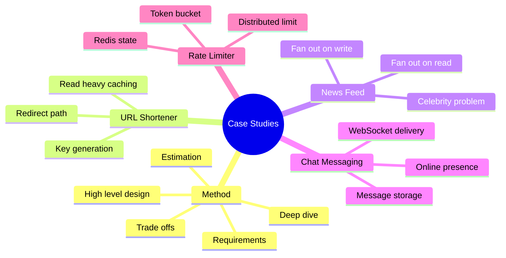
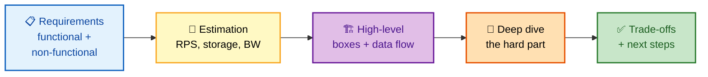
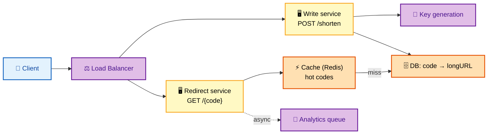
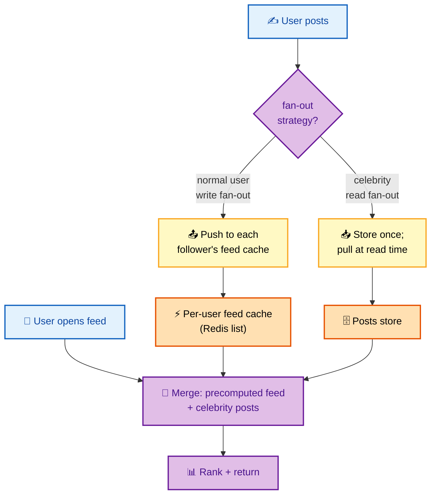
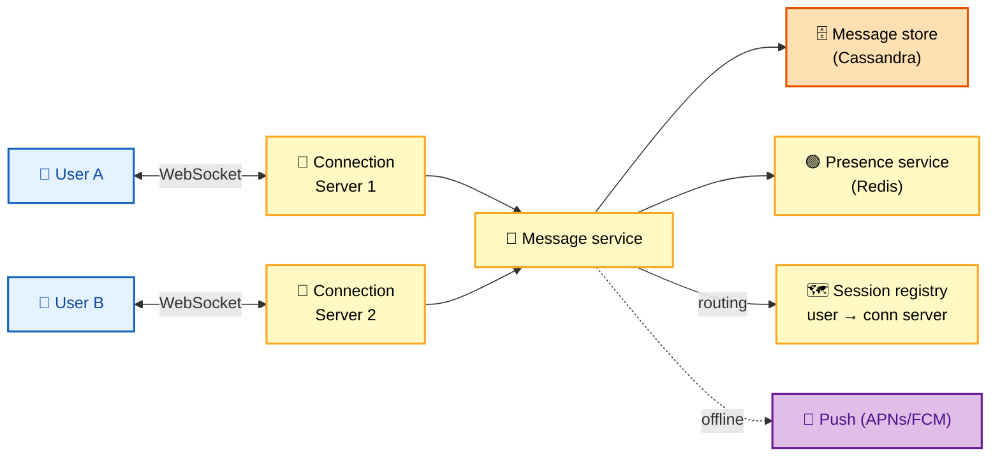
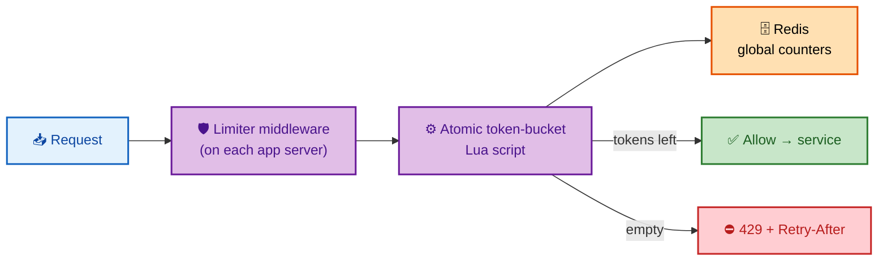

# SECTION 5: CASE STUDIES

> **Scope:** Four worked designs that exercise everything from Sections 1–4, each following the same interview flow — **Requirements → Estimation → High-level design → Deep dive → Trade-offs**. Practice these out loud: URL shortener (classic warm-up), news feed (fan-out), chat/messaging (real-time), and a distributed rate limiter (focused component design).

---

## 🗺️ Visual Overview

**In one line:** Every case study is the same skeleton — scope the requirements, size it with estimation, sketch the boxes, deep-dive the one hard part, then state trade-offs — so the *method* matters more than memorizing any single design.



**The repeatable interview flow — apply it to any prompt:**



> 🧠 **Memory hooks (mnemonics):**
> - **Same skeleton every time — "REHDT":** **R**equirements → **E**stimation → **H**igh-level → **D**eep-dive → **T**rade-offs.
> - **URL shortener — "read-heavy redirect":** the whole game is a fast, cached key→URL lookup.
> - **News feed — "write fan-out for normals, read fan-out for celebrities":** hybrid beats either alone.
> - **Chat — "persistent connection + presence + durable messages":** WebSockets deliver, a store persists, presence tracks online.
> - **Rate limiter — "token bucket in Redis":** atomic script, global counter, 429 + Retry-After.

---

## Case Study 1: URL Shortener (e.g., bit.ly)

> 🎯 **Interview weight: HIGH** — the classic warm-up; nail it crisply.

### Requirements

- **Functional:** shorten a long URL to a short code; redirect a short code to the original; optional custom alias, expiry, click analytics.
- **Non-functional:** extremely **read-heavy** (redirects ≫ creates), low-latency redirects (< 100 ms), high availability, short codes are permanent.

### Estimation

```
Writes: 100M new URLs/month → 100M / (30 × 86,400) ≈ 40 writes/sec
Read:write ≈ 100:1          → ~4,000 reads/sec (redirects), peak ~10K
Storage: 100M/mo × 500 B × 5 yr ≈ 100M × 60 × 500 B ≈ 3 TB
Short code length: base62 (a-z A-Z 0-9)
  62^7 ≈ 3.5 trillion  → 7 chars is plenty for years
```

### High-Level Design



- **Write path:** generate a unique short code, store `code → longURL` (+ owner, expiry), return the short URL.
- **Read path:** look up code (cache-first, DB on miss), return **301/302** redirect, async-log the click.

### Deep Dive — Key Generation (the interesting part)

| Approach | How | Trade-off |
|---|---|---|
| **Hash + truncate** (MD5 of URL, take 7 chars) | Deterministic | Collisions → must check and retry |
| **Counter + base62 encode** | Global counter → encode to base62 | No collisions, but predictable/sequential |
| **Pre-generated key pool** | Background service fills a table of unused keys | Fast O(1) assignment; needs a key-gen service |
| **Distributed ID (Snowflake)** | Timestamp + machine + sequence, base62 | Scales, unique, roughly sortable |

> 💡 **Recommended:** a **counter/Snowflake-style ID base62-encoded**, or a **pre-generated key pool** for O(1) assignment. If asked to avoid sequential/guessable codes, add randomness or encrypt the counter. Always mention collision handling for the hash approach.

**Redirect 301 vs 302:** `301` (permanent) lets browsers cache the redirect → fewer hits but you lose click analytics; `302` (temporary) routes every click through you → accurate analytics, more load. Choose based on whether analytics matter.

### Trade-offs

- **SQL vs NoSQL:** a simple `code → URL` key-value fits **NoSQL/KV** (DynamoDB, Cassandra) perfectly and scales horizontally; a small deployment is fine on Postgres with an index.
- **Caching is the main lever:** with 100:1 reads, a high cache hit rate on hot codes means the DB barely sees redirect traffic.
- **Analytics async:** never block the redirect on logging — fire an event to a queue and process offline.

> ⚠️ **Common miss:** forgetting to state the **read-heavy** nature early. Everything (caching, 301 vs 302, KV store) follows from "redirects vastly outnumber creates."

---

## Case Study 2: News Feed (e.g., Twitter/Facebook timeline)

> 🎯 **Interview weight: CRITICAL** — the definitive fan-out question.

### Requirements

- **Functional:** post content; view a home feed of people you follow, roughly reverse-chronological/ranked; follow/unfollow.
- **Non-functional:** read-heavy, feed load < 200 ms, eventual consistency acceptable (a post appearing a few seconds later is fine), massive scale.

### Estimation

```
300M DAU, each opens feed 10×/day → 3B feed reads/day ≈ 35K reads/sec (peak ~100K)
Each posts 2×/day → 600M posts/day ≈ 7K writes/sec
Avg followers: hundreds; celebrities: tens of millions
```

### High-Level Design — The Fan-Out Decision



| Strategy | When post happens | When feed is read | Good for | Bad for |
|---|---|---|---|---|
| **Fan-out on write (push)** | Push post into every follower's precomputed feed | Just read your ready feed (fast) | Most users | Celebrities (millions of writes per post) |
| **Fan-out on read (pull)** | Store post once | Gather posts from everyone you follow, merge | Celebrities | Normal reads (expensive merge) |
| **Hybrid** | Push for normal users; pull for celebrities | Merge precomputed feed + celebrity pulls | **Everyone** | Slightly more complex |

### Deep Dive — The Celebrity Problem

Pure fan-out-on-write dies on celebrities: one post by someone with 50M followers = 50M feed writes — a write storm and huge latency. Pure fan-out-on-read dies on normal reads: every feed open recomputes by querying hundreds of followees.

**The hybrid solution:** push for normal accounts (feeds are precomputed, reads are instant), but for a handful of **celebrities**, *don't* fan out — store their posts once and **merge them in at read time**. A user's feed = their precomputed feed (from normal followees) **+** a pull of the few celebrities they follow. This bounds both write amplification and read cost.

> 🔍 **Insight:** The hybrid works because the distribution is bimodal — almost everyone has few followers (push is cheap), and a tiny number have millions (pull avoids the write storm). You pick the strategy *per-account* based on follower count.

### Trade-offs

- **Feed store:** per-user feed as a Redis list of post IDs (capped, e.g., latest 800); hydrate post content from a posts store/cache at read time.
- **Ranking:** start reverse-chronological; mention ML ranking as a follow-up (score by recency, affinity, engagement).
- **Consistency:** eventual — a post showing up a few seconds late is acceptable, which is what lets fan-out be async via a queue.

---

## Case Study 3: Chat / Messaging (e.g., WhatsApp/Slack)

> 🎯 **Interview weight: HIGH** — real-time delivery, presence, and durable storage.

### Requirements

- **Functional:** 1:1 and group messages; delivery + read receipts; online/last-seen presence; message history; push when offline.
- **Non-functional:** low-latency delivery (< 100 ms when both online), ordered per-conversation, durable (no lost messages), massive concurrent connections.

### Estimation

```
50M concurrent users → 50M persistent connections
Each connection server holds ~65K connections → ~800 connection servers
40B messages/day → ~500K messages/sec (peak ~1M)
Message size ~100 B + metadata
```

### High-Level Design



- **Persistent connections:** clients hold a **WebSocket** (or MQTT) to a connection server — needed because the server must *push* messages, which request-response HTTP can't do well.
- **Routing:** a **session registry** (Redis) maps `user → connection server` so the message service knows where to deliver; if the recipient is on another server, route via an internal bus.
- **Delivery:** recipient online → push over their WebSocket; offline → store and send a mobile **push notification**, deliver on reconnect.

### Deep Dive — Delivery Guarantees, Ordering, Storage

- **Durability:** persist every message **before** ack'ing the sender, so nothing is lost if delivery fails. Store in a write-optimized store (**Cassandra**, wide-column) sharded by `conversation_id` so a conversation's history is co-located and ordered.
- **Ordering:** use a per-conversation sequence number (or logical clock); clients sort by it so messages never appear out of order even if network delivery races.
- **Receipts:** *sent* (server stored), *delivered* (recipient's device acked), *read* (recipient opened) — each is a small status update flowing back.
- **Presence:** heartbeats update a Redis key with a TTL; missing heartbeats → offline. Don't broadcast every presence change to everyone (that's O(n²)) — update on read or for a user's active conversations only.

> ⚠️ **Gotcha:** Presence fan-out is a hidden scaling trap. Naively notifying all contacts on every online/offline flip is quadratic. Bound it: only compute presence for conversations the user currently has open, and update lazily.

### Trade-offs

- **WebSocket vs long-polling:** WebSockets for true low-latency bidirectional push; long-polling as a fallback for restrictive networks.
- **Shard by conversation:** co-locates and orders a conversation's messages; the group-chat celebrity problem (huge group) may need special handling.
- **Consistency:** strong *per conversation* (ordering + no loss); global presence can be eventual.

---

## Case Study 4: Distributed Rate Limiter

> 🎯 **Interview weight: HIGH** — a focused component design that tests depth.

### Requirements

- **Functional:** limit each client (API key/user/IP) to N requests per window across all app servers; return `429` with `Retry-After` when exceeded; support tiered limits.
- **Non-functional:** very low added latency (< a few ms), fail gracefully if the limiter store is down, accurate global count across many servers.

### Estimation

```
1M RPS across 100 app servers → each server ~10K RPS
Limiter state per client key: a few bytes (count + timestamp)
Millions of active keys → fits comfortably in Redis memory
```

### High-Level Design & Deep Dive



- **Algorithm:** **token bucket** — allows short legitimate bursts while enforcing an average rate.
- **Shared state:** counters live in **Redis** so all 100 servers enforce one global limit. The refill-and-decrement runs as an **atomic Lua script** (or `INCR` + TTL) to avoid races.
- **Response:** on limit, return `429 Too Many Requests` + `Retry-After` so clients back off politely.
- **Latency optimization:** an optional per-node *local* approximate counter as a first gate reduces Redis round-trips for obvious over-limit clients.

### Trade-offs

| Decision | Choice | Why |
|---|---|---|
| Algorithm | Token bucket | Bursts + average rate |
| State | Redis (atomic script) | One global count across servers |
| Redis failure | **Fail open** | A limiter outage shouldn't take down the API |
| Accuracy vs latency | Local approx + Redis | Cut round-trips, reconcile globally |

> 💡 **Interview tip:** The killer detail is **why a per-server counter is wrong**: a client hitting 100 servers each allowing N gets 100×N. The shared atomic Redis counter fixes it. Then raise the Redis SPOF and choose **fail-open** — availability of the API beats perfect enforcement.

---

## Interview Questions & Answers

### Q1. In the URL shortener, how do you generate short codes at scale without collisions?

**Answer:** I'd avoid hash-and-truncate (which needs collision detection and retries) and instead use a **globally unique counter or Snowflake ID base62-encoded**, or a **pre-generated key pool** for O(1) assignment. A counter guarantees uniqueness; base62 over 7 chars gives 62⁷ ≈ 3.5 trillion codes. If the interviewer worries about sequential/guessable codes, I'll encrypt/scramble the counter or add randomness. A key-pool service hands out unused codes instantly and refills in the background.

**Reasoning:** Tests whether you know the collision trade-off of hashing vs the uniqueness guarantee of counters/IDs, plus the security angle of predictability.

**Follow-up — "Two data centers generate codes independently. How stay unique?"** Snowflake-style IDs embed a machine/DC ID, or partition the counter range per DC, so no coordination is needed.

### Q2. Explain fan-out-on-write vs fan-out-on-read and why real systems use a hybrid.

**Answer:** **Fan-out-on-write (push)** precomputes each user's feed by pushing a new post into all followers' feeds, so reads are instant — but a celebrity post means millions of writes (a storm). **Fan-out-on-read (pull)** stores a post once and builds the feed at read time by merging everyone you follow — cheap writes, but every feed open is an expensive multi-source merge. Real systems go **hybrid**: push for normal accounts (fast reads) and pull for the handful of celebrities (avoid the write storm), merging the two at read time. It works because follower counts are bimodal.

**Reasoning:** This is *the* news-feed insight; naming when each breaks and why the hybrid resolves it is the senior signal.

**Follow-up — "Where's the threshold to treat an account as a celebrity?"** A tuned follower-count cutoff (e.g., >100K–1M); above it, switch that account to pull to cap write amplification.

### Q3. Why do chat systems use persistent connections, and how do you route a message to the right server?

**Answer:** Messaging needs the server to **push** to a recipient the moment a message arrives, which plain request-response HTTP handles poorly — so clients hold a **WebSocket** to a connection server. Because a user could be connected to any of hundreds of connection servers, a **session registry** (Redis) maps `user → connection server`. When A sends to B, the message service looks up B's server and forwards it over an internal bus; that server pushes it down B's WebSocket. If B is offline, we persist the message and send a mobile push, delivering on reconnect.

**Reasoning:** Tests understanding of why WebSockets (server push), and the routing problem that arises once connections are spread across a fleet.

**Follow-up — "How do you guarantee message ordering in a group chat?"** A per-conversation monotonic sequence number assigned server-side; clients sort by it, so order is stable regardless of network races.

### Q4. In the distributed rate limiter, why is a per-server counter wrong, and what happens if Redis goes down?

**Answer:** A per-server counter lets a client evade the limit by spreading requests across servers — with 100 servers each allowing N, the client gets 100×N. So the counter must be **global**, in Redis, updated with an atomic token-bucket script so all servers share one count. If Redis goes down, I'd **fail open** (allow requests) rather than fail closed, because a limiter outage shouldn't take down the whole API — I'd rather temporarily under-enforce than cause an outage. I'd also run Redis in a replicated/cluster setup with failover to make that rare.

**Reasoning:** The two depth signals are the distributed-counting flaw and the availability trade-off (fail-open vs fail-closed) — both distinguish a senior answer.

**Follow-up — "How do you cut the Redis latency on the hot path?"** A per-node local approximate limiter as a first gate (reject obvious over-limit locally), reconciling with Redis for accuracy — trading a little precision for fewer round-trips.

---

**[← Previous: Scalability Patterns](04-SCALABILITY-PATTERNS.md)** | **[Back to Index](README.md)** | **[Next: Trade-offs & Reliability →](06-TRADEOFFS-RELIABILITY.md)**
