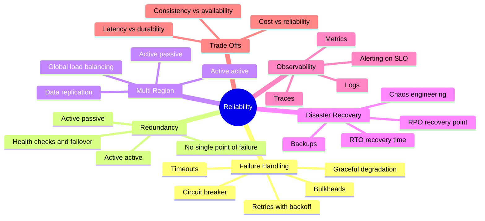
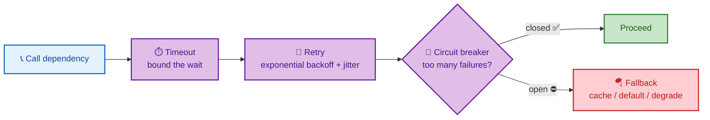
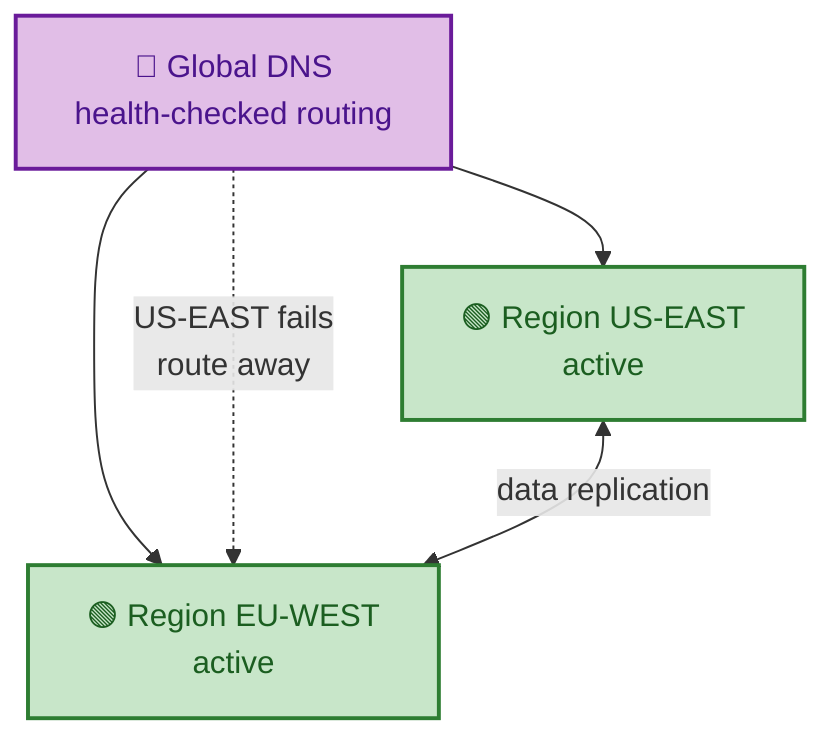
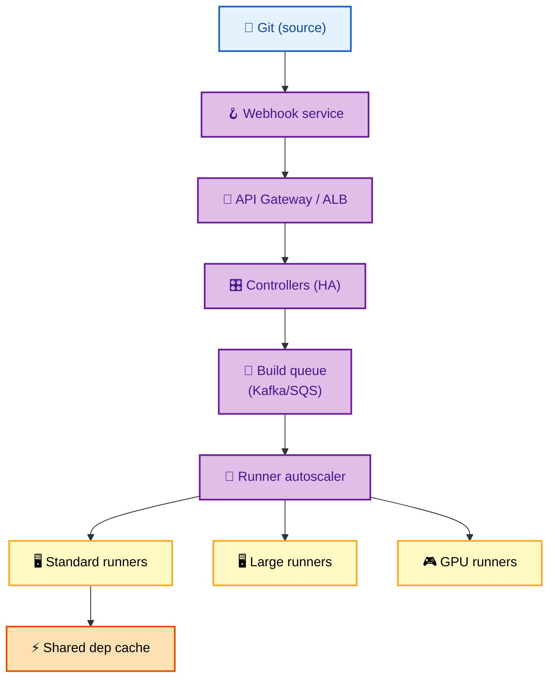
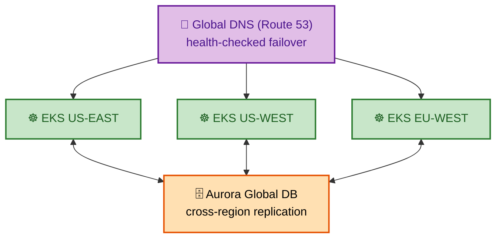
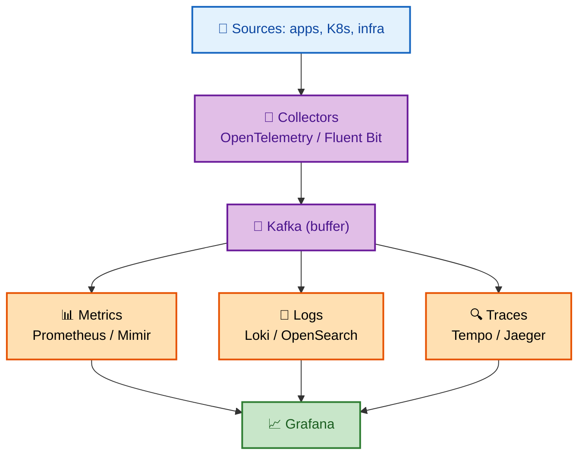

# SECTION 6: TRADE-OFFS & RELIABILITY

> **Scope:** The deep-dive topics that decide senior/staff offers — failure handling (timeouts, retries, circuit breakers), redundancy and single-points-of-failure, multi-region architecture and disaster recovery (RTO/RPO), observability (metrics/logs/traces), and the interview trade-off framework/checklist. Plus three platform-engineering design walkthroughs (CI/CD platform, multi-region Kubernetes, observability platform).

---

## 🗺️ Visual Overview

**In one line:** Reliability is designing for failure as the normal case — every dependency times out, retries with backoff, trips a circuit breaker when sick, has a redundant copy, and is watched by metrics/logs/traces — and every design choice is a stated trade-off, never a silver bullet.

**Failure-handling toolkit — how a resilient call protects itself:**

**Multi-region failover — global DNS steers around a dead region:**

> 🧠 **Memory hooks (mnemonics):**
> - **Resilient call — "Timeout, Retry, Break, Fall back":** bound the wait, retry with backoff+jitter, trip the breaker, then degrade gracefully.
> - **Retry safely — "backoff + jitter or you build a thundering herd":** exponential backoff spreads retries; jitter stops synchronized retry storms.
> - **RTO vs RPO — "Time to recover vs Point you recover to":** RTO = how long until back up; RPO = how much data you can lose.
> - **Availability math — "series multiplies down, parallel multiplies up":** synchronous chains lower availability; redundant copies raise it.
> - **Observability — "MLT: Metrics, Logs, Traces":** metrics alert, logs explain, traces locate.

---

## 1. Failure Handling

> 🎯 **Interview weight: CRITICAL** — "what happens when X fails?" is the deep-dive that separates levels.

**In one line:** Assume every dependency will be slow or down, and wrap calls with **timeouts** (never wait forever), **retries with exponential backoff + jitter** (but only for idempotent ops), **circuit breakers** (fail fast when a dependency is sick), and **fallbacks** (degrade instead of erroring).

| Mechanism | Purpose | Key detail |
|---|---|---|
| **Timeout** | Bound the wait on any call | Without it, one slow dependency exhausts all threads → cascade |
| **Retry + backoff + jitter** | Recover from transient errors | Exponential backoff spreads load; **jitter** prevents synchronized retry storms; only retry idempotent ops |
| **Circuit breaker** | Stop hammering a failing dependency | Trips open after a failure threshold, fails fast, half-opens to probe recovery |
| **Bulkhead** | Isolate resource pools | One dependency's saturation can't starve the rest |
| **Graceful degradation** | Partial function beats total failure | Serve cached/default data when a feature is down |

**The cascading failure story:** service A calls slow service B with no timeout → A's threads block waiting on B → A's thread pool exhausts → A stops serving *everything* → callers of A pile on → the failure cascades upstream. **Timeouts + circuit breakers + bulkheads** break this chain.

> ⚠️ **Gotcha:** Naive retries make outages *worse*. When a service is struggling, everyone retrying simultaneously creates a **thundering herd** that finishes it off. Always pair retries with **exponential backoff + jitter**, cap the retry count, and only retry **idempotent** operations (retrying a non-idempotent `POST` can double-charge).

---

## 2. Redundancy & Eliminating Single Points of Failure

> 🎯 **Interview weight: HIGH**

**In one line:** A single point of failure (SPOF) is any component whose failure takes down the system; you eliminate SPOFs with redundancy — multiple instances behind health checks, with automatic failover.

- **Active-active:** all replicas serve traffic; load is spread and a failure just removes capacity. Needs state sync/conflict handling but no failover delay.
- **Active-passive (standby):** one serves, a standby takes over on failure. Simpler consistency, but failover has a detection + promotion delay, and the standby is idle capacity.
- **Health checks + automatic failover:** detect failure fast (active probes + passive ejection) and route away; for stateful components (DB leader), use consensus (Raft) or a managed failover to avoid split-brain.

**Hunt for SPOFs in your own design:** the load balancer (run a redundant pair), the database leader (replicas + failover), a single cache node (cluster it), a single region (go multi-region), even DNS (multiple providers).

> 🔍 **Insight:** Recall the availability math — components **in series** multiply availability *down*, so every SPOF in the request path caps your ceiling; adding a **parallel** redundant copy multiplies it *up*. Reliability work is largely finding series SPOFs and making them parallel.

---

## 3. Multi-Region Architecture

> 🎯 **Interview weight: HIGH** — the "survive a region outage" question.

**In one line:** Going multi-region protects against an entire region failing and puts data near users, but it forces hard choices about data replication and consistency across high-latency links.

| Model | Description | Trade-off |
|---|---|---|
| **Active-passive (DR)** | Primary region serves; secondary on standby | Simpler; failover delay + idle cost |
| **Active-active** | All regions serve traffic | Best latency & availability; hardest data consistency |

**Data is the hard part:**

- **Read replicas across regions:** reads are local/fast; writes still go to one region (cross-region write latency).
- **Multi-leader / global DB** (Spanner, Cosmos DB, Aurora Global): writes in each region, but you must resolve conflicts or pay consensus latency.
- **Routing:** global DNS / anycast / global load balancer with health checks steers users to the nearest healthy region and away from a failed one.

> ⚠️ **Gotcha:** Cross-region replication is bounded by the **speed of light** (~150 ms round trip intercontinentally). Synchronous cross-region writes are painfully slow, so most designs use **async replication** — which means a region failure can lose the last un-replicated writes (a non-zero RPO). State that trade-off explicitly; pretending you get zero-RPO active-active for free is a red flag.

---

## 4. Disaster Recovery — RTO & RPO

> 🎯 **Interview weight: MEDIUM–HIGH**

**In one line:** Disaster recovery is quantified by **RTO** (how long until you're back up) and **RPO** (how much data you can afford to lose) — tighter targets cost more, so you match them to business value.

| Metric | Question it answers | Driven by |
|---|---|---|
| **RTO** (Recovery Time Objective) | How long can we be down? | Failover automation, standby readiness |
| **RPO** (Recovery Point Objective) | How much data can we lose? | Replication/backup frequency |

**DR strategy tiers (cheaper → pricier, slower → faster):**

- **Backup & restore:** periodic backups; restore on disaster. High RTO/RPO, lowest cost.
- **Pilot light:** minimal core always running in the DR region; scale up on failover.
- **Warm standby:** a scaled-down full copy running; promote and scale on failover.
- **Active-active (hot):** both regions live; near-zero RTO/RPO, highest cost.

**Test it:** untested DR is not DR. **Chaos engineering** (deliberately killing instances/regions — Chaos Monkey) and regular game-day drills prove failover actually works before a real outage does.

> 💡 **Interview tip:** Don't propose five-nines active-active for everything — it's expensive and complex. Ask the business RTO/RPO and match the tier: a marketing site is fine with backup-and-restore; a payments ledger needs warm standby or active-active. Matching reliability spend to value is a senior signal.

---

## 5. Observability

> 🎯 **Interview weight: HIGH** — you can't operate what you can't see.

**In one line:** Observability is the three pillars — **metrics** (aggregate numbers that alert), **logs** (discrete events that explain), **traces** (request paths across services that locate) — tied to SLO-based alerting so you're paged on user-facing symptoms, not noise.

| Pillar | What it is | Answers |
|---|---|---|
| **Metrics** | Aggregated numeric time-series (RPS, p99, error rate) | "Is something wrong, and how bad?" |
| **Logs** | Timestamped discrete events | "What exactly happened?" |
| **Traces** | A request's path across services with timings | "Where is the latency / failure?" |

- **Alert on symptoms/SLOs, not causes:** page on "error rate > 1%" or "p99 > 500 ms" (user-facing), not on every CPU blip. Tie alerts to **error budgets**.
- **The four golden signals:** latency, traffic, errors, saturation — a compact starting dashboard for any service.
- **Distributed tracing** (propagate a trace ID through every hop) is what makes a microservices latency problem debuggable — otherwise you can't tell which of 10 services is slow.

> 🔍 **Insight:** In a monolith a stack trace tells you everything; in microservices a single slow request touches many services, so **traces** become essential to localize the problem. Metrics tell you *something* is wrong, logs tell you *what*, traces tell you *where*.

---

## 6. Platform Design Walkthroughs

These three platform-engineering designs apply the whole toolkit — estimation, building blocks, queues, autoscaling, multi-region, and observability.

### 6.1 Design a CI/CD Platform for 1000+ Engineers

> 🎯 **Interview weight: HIGH** for platform/DevOps roles.

**Requirements:** 1000+ engineers, 500+ repos, 10,000+ builds/day, < 5 min queue time, secure multi-tenant isolation.

**Key decisions:**

- **Queue-based scaling:** builds land in a queue; a runner autoscaler scales the fleet on **queue depth** (scale up in < 30 s) to hold queue time under 5 min.
- **Ephemeral runners:** each build runs on a fresh, throwaway runner → clean environment + security isolation between tenants.
- **Shared dependency cache:** caching deps/artifacts gives 20–50% build speedups.
- **OIDC for cloud creds:** runners assume short-lived cloud roles via OIDC — **no static secrets** to leak.

### 6.2 Design a Multi-Region Kubernetes Platform

> 🎯 **Interview weight: HIGH**

**Requirements:** 99.99% availability, survive a full region failure, 500+ microservices.

**Failover strategy:** DNS health checks route away from a failed region; **stateless apps** fail over instantly; the **database** promotes a replica in the healthy region in < 1 min (non-zero RPO due to async replication — state this). Regular **chaos drills** prove region failover works.

### 6.3 Design a Centralized Observability Platform

> 🎯 **Interview weight: MEDIUM–HIGH**

**Requirements:** 1 TB logs/day, 1M metric series, < 5 s query latency, 30-day hot + 1-year cold retention.

**Key decisions:** a **Kafka buffer** absorbs ingestion spikes and decouples collection from storage; **tiered storage** (hot → warm → cold) controls cost for the 30-day/1-year split; **sampling** high-volume traces and filtering logs at the source keep 1 TB/day affordable.

---

## 7. The Interview Trade-off Checklist

> 🎯 **Interview weight: CRITICAL** — end every design here.

**In one line:** No design is free; close by naming what you optimized *for* and what you gave up — that explicit trade-off reasoning is what interviewers score highest.

**The trade-off pairs to name:**

| You gain | You give up | Example |
|---|---|---|
| Strong consistency | Availability / latency (CAP, PACELC) | Payments → CP |
| Low latency (cache) | Freshness / consistency | Feed counts → stale OK |
| High availability | Consistency / cost | Shopping cart → AP |
| Durability (sync replication) | Write latency | Ledger → sync |
| Horizontal scale (sharding) | Simple queries / transactions | Cross-shard joins hard |
| Decoupling (queues/events) | Immediate consistency, debuggability | Async fan-out |

**Closing checklist to run in the last 5 minutes:**

1. **Restate** what you optimized for (e.g., read latency, availability) and the key scale numbers.
2. **Name the main trade-offs** you made and why they fit the requirements.
3. **Identify the top bottleneck/risk** and how you'd address it next.
4. **Mention what you'd monitor** (SLIs/SLOs, golden signals) and how it fails over.
5. **List future work** (ML ranking, stronger consistency where needed, cost optimization).

> 💡 **Interview tip:** The strongest candidates never present a design as "the right answer." They say "I optimized for X, which costs me Y; if the requirement were Z instead, I'd change this part." That conditional, trade-off-aware framing is the single clearest senior/staff signal.

---

## Interview Questions & Answers

### Q1. A downstream service you depend on becomes slow (not down). What happens to your service, and how do you protect it?

**Answer:** Slow is often worse than down: without a **timeout**, my threads block waiting on the slow dependency, my thread pool exhausts, and I stop serving *all* requests — a cascading failure. I protect against it with (1) aggressive **timeouts** so no call waits indefinitely, (2) a **circuit breaker** that trips open after a failure/latency threshold and fails fast, periodically probing for recovery, (3) **bulkheads** isolating the thread/connection pool for that dependency so it can't starve everything, and (4) a **fallback** (cached or default response) so the feature degrades gracefully instead of erroring.

**Reasoning:** The subtle insight — *slow dependencies cause cascading failure via thread exhaustion* — is exactly what deep-dive questions probe. Naming timeout + circuit breaker + bulkhead + fallback shows you design for partial failure.

**Follow-up — "Why add jitter to retries?"** Without jitter, all clients retry at the same backoff intervals, creating synchronized thundering-herd spikes that re-overload the recovering service. Jitter randomizes retry timing to spread the load.

### Q2. Explain RTO vs RPO and how they drive your disaster-recovery design.

**Answer:** **RTO** is how long you can be down before recovery; **RPO** is how much data you can afford to lose. They set the DR tier and its cost: backup-and-restore gives high RTO/RPO cheaply; pilot light and warm standby cut RTO by keeping capacity ready; active-active gives near-zero RTO/RPO at the highest cost and complexity. I'd ask the business for its RTO/RPO per system and match the tier — a payments ledger needs a tight RPO (sync or near-sync replication, warm/active standby), while an internal dashboard is fine with nightly backups. Crucially, I'd **test failover** with game-days/chaos engineering, since untested DR isn't real DR.

**Reasoning:** Tests whether you quantify reliability and match spend to business value rather than over-engineering everything to five nines.

**Follow-up — "Why can't async cross-region replication give you RPO of zero?"** Because the primary acks writes before they replicate; a region loss loses the in-flight, un-replicated writes. Zero RPO needs synchronous replication, which pays cross-region latency on every write.

### Q3. How would you make a microservices system debuggable when a request is slow?

**Answer:** With the three observability pillars, anchored by **distributed tracing**. I propagate a trace ID through every service hop so a single slow request produces a trace showing time spent in each service — that localizes the bottleneck, which is impossible from logs alone in a fan-out call graph. **Metrics** (p99 latency, error rate, the four golden signals) alert me that something's wrong and how bad; **logs** with the trace ID explain what happened in the suspect service. I'd alert on SLO symptoms (p99, error rate) tied to error budgets, not on every resource blip, to avoid noise.

**Reasoning:** The senior signal is knowing that *traces* are what make microservices latency debuggable, and that alerting should be symptom/SLO-based.

**Follow-up — "Metrics, logs, or traces — which do you reach for first for a latency spike?"** Metrics to confirm and scope the spike, traces to localize which service, then logs in that service to find the root cause — in that order.

### Q4. Design a CI/CD platform that keeps build queue time under 5 minutes for 10,000 builds/day. What's the core idea?

**Answer:** The core idea is **queue-based autoscaling with ephemeral runners**. Webhooks enqueue builds into a message queue; a runner autoscaler watches **queue depth** and scales the runner fleet up within ~30 s when the queue grows, so queue time stays under 5 min even during spikes. Runners are **ephemeral** (a fresh throwaway environment per build) for clean, isolated, secure multi-tenant builds. A **shared dependency/artifact cache** cuts build time 20–50%, and runners get cloud credentials via **OIDC** (short-lived, no static secrets). Different runner classes (standard/large/GPU) match workloads.

**Reasoning:** Ties together queues (decoupling + load leveling), autoscaling on a meaningful signal (queue depth, not CPU), and platform security (ephemeral runners, OIDC) — the exact concerns of a platform interview.

**Follow-up — "Why scale on queue depth instead of CPU?"** Queue depth directly reflects unmet demand (builds waiting); CPU is a lagging, indirect signal that can miss a burst of queued work until runners are already saturated.

---

**[← Previous: Case Studies](05-CASE-STUDIES.md)** | **[Back to Index](README.md)**
