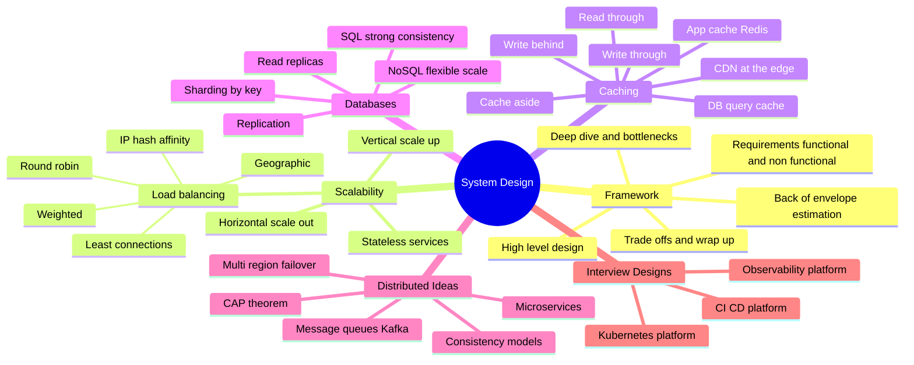
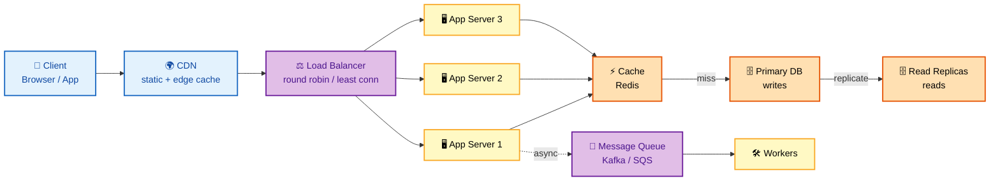
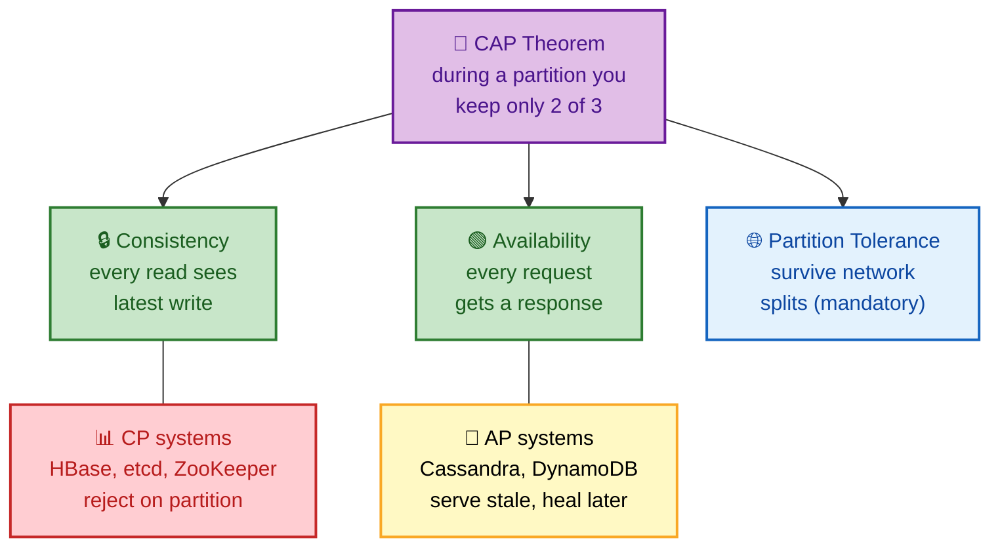
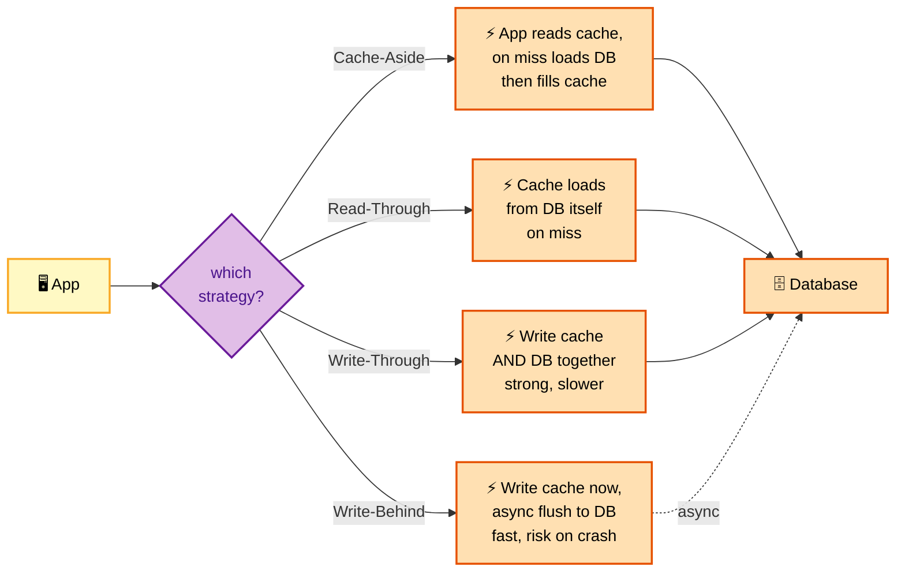
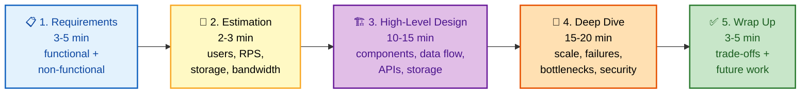
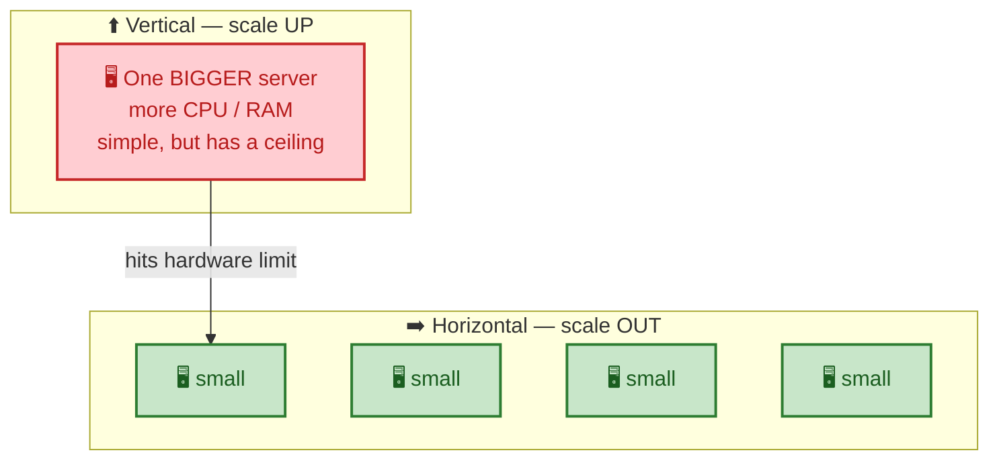
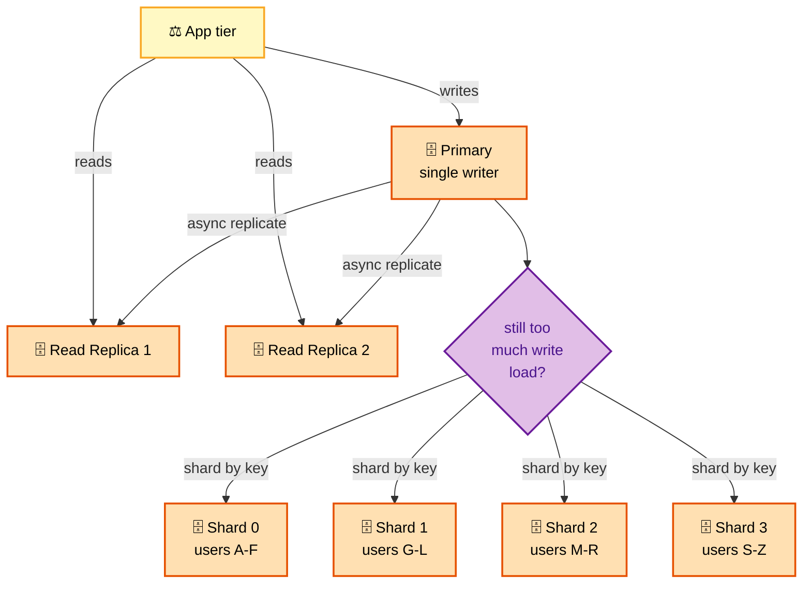
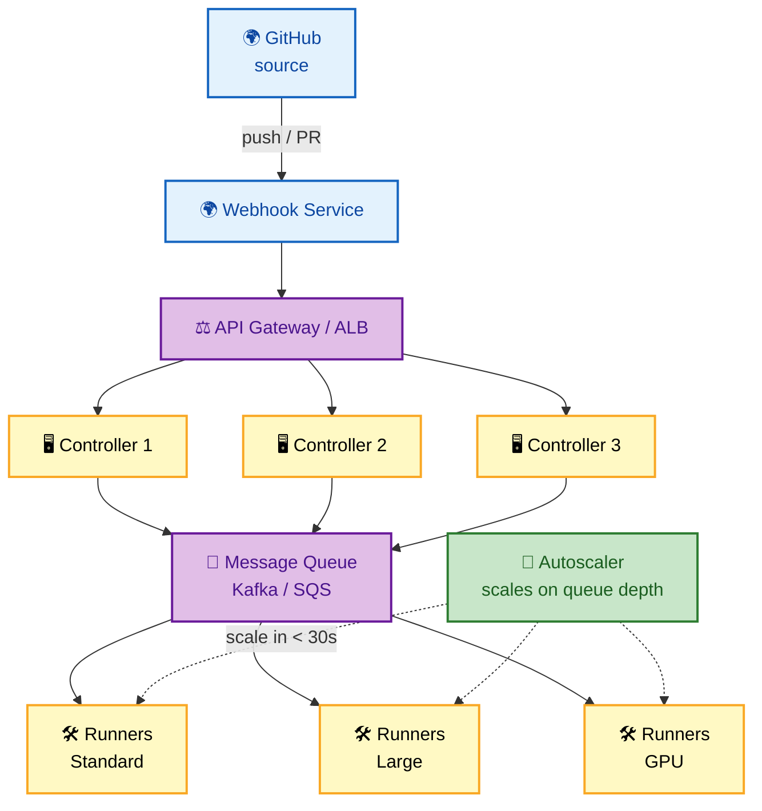
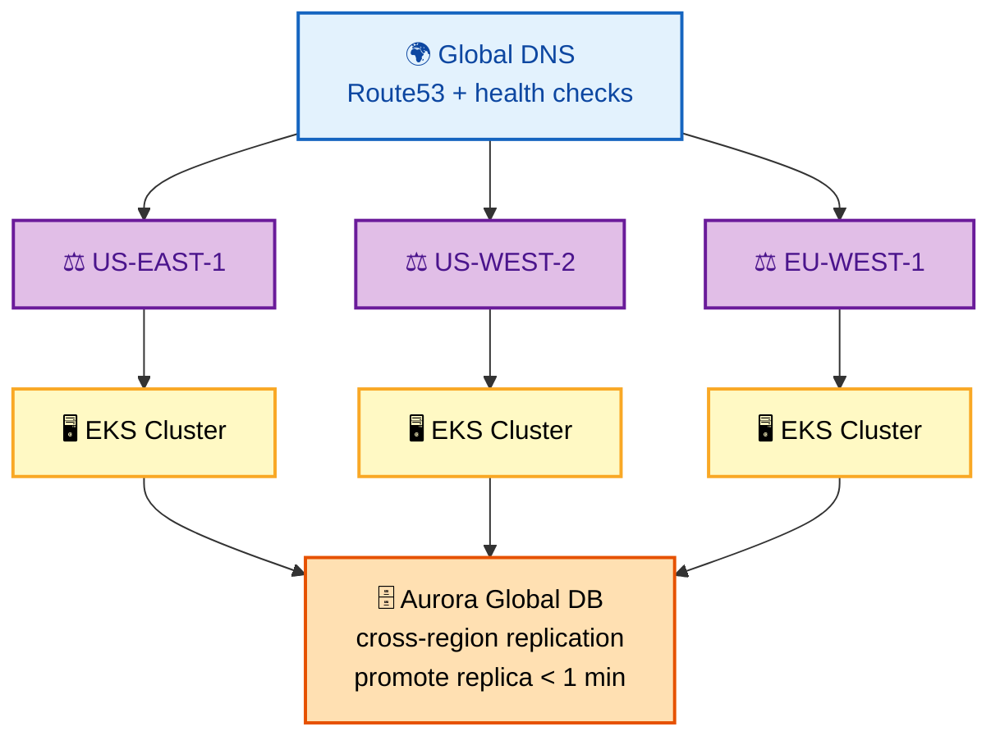
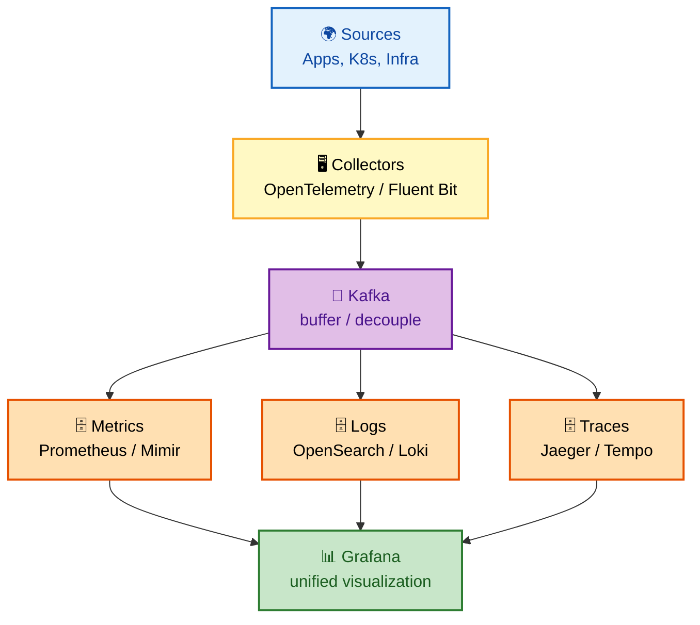

# System Design Interview Questions - Complete Guide

> **100+ System Design Interview Questions for Senior DevOps Engineer, SRE, and Platform Engineer roles at FAANG companies**

---

## 📋 Table of Contents

- [System Design Framework](#system-design-framework)
- [Scalability Concepts](#scalability-concepts)
- [Infrastructure Design Questions](#infrastructure-design-questions)
- [Platform Engineering Designs](#platform-engineering-designs)
- [SRE System Designs](#sre-system-designs)

---

## 🗺️ Visual Overview

**Mind map — the whole system-design toolkit at a glance** (skim this first, revisit it last):



**Scalable web architecture — the reference request path** (memorize this left-to-right flow):



**CAP theorem — pick two of three under a network partition** (the classic trade-off triangle):



**Caching write strategies — where the write lands** (compare the four patterns):



> 🧠 **Memory hooks (mnemonics):**
> - **Design framework — "REBHW":** *"Real Engineers Build High Walls"* → **R**equirements → **E**stimation → **B**ase (high-level) design → **H**andle deep-dive → **W**rap-up trade-offs.
> - **CAP — "you can't have your CAP and eat it":** Partition tolerance is **mandatory** on a network, so you really pick **C or A**. *CP = consistent but may reject; AP = always answers but may be stale.*
> - **Cache patterns — "Aside, Through, Through, Behind":** *Aside* = app does the work; *Read/Write-Through* = cache does it synchronously; *Write-Behind* = cache does it later (fast but risky).
> - **Load balancing — "RWLIG":** **R**ound-robin, **W**eighted, **L**east-connections, **I**P-hash, **G**eographic — "Really Weird Llamas Ignore Gravity."
> - **Scale out, not up:** stateless app tiers scale **horizontally forever**; the database is almost always the real bottleneck — cache reads, replicate reads, shard writes.

---

## System Design Framework

### How to Approach System Design Interviews

**In one line:** Spend the first ~5 minutes nailing requirements and scale, then work top-down — high-level boxes first, deep-dive and failure handling second, trade-offs last.

> 💡 **Interview tip:** Never start drawing boxes before you've stated the scale (users, RPS, read/write ratio). Interviewers reward driving the conversation from requirements → estimation → design, not jumping straight to a diagram.

**The five phases (colorized):**



```
┌─────────────────────────────────────────────────────────────────┐
│                    SYSTEM DESIGN FRAMEWORK                       │
├─────────────────────────────────────────────────────────────────┤
│                                                                  │
│  Step 1: REQUIREMENTS (3-5 minutes)                             │
│  ┌─────────────────────────────────────────────────────────┐    │
│  │  Functional:                                             │    │
│  │  • What does the system need to do?                      │    │
│  │  • Who are the users?                                    │    │
│  │  • What are the main use cases?                          │    │
│  │                                                          │    │
│  │  Non-Functional:                                         │    │
│  │  • Scale: How many users? Requests per second?           │    │
│  │  • Availability: What's the SLA?                         │    │
│  │  • Latency: What's acceptable response time?             │    │
│  │  • Consistency: Strong vs eventual?                      │    │
│  │  • Data: How much data? Retention requirements?          │    │
│  └─────────────────────────────────────────────────────────┘    │
│                                                                  │
│  Step 2: BACK-OF-ENVELOPE ESTIMATION (2-3 minutes)              │
│  ┌─────────────────────────────────────────────────────────┐    │
│  │  • Daily/Monthly active users                            │    │
│  │  • Read vs write ratio                                   │    │
│  │  • Storage requirements                                  │    │
│  │  • Bandwidth requirements                                │    │
│  │  • Number of servers needed                              │    │
│  └─────────────────────────────────────────────────────────┘    │
│                                                                  │
│  Step 3: HIGH-LEVEL DESIGN (10-15 minutes)                      │
│  ┌─────────────────────────────────────────────────────────┐    │
│  │  • Draw main components                                  │    │
│  │  • Show data flow                                        │    │
│  │  • Identify APIs                                         │    │
│  │  • Storage choices                                       │    │
│  └─────────────────────────────────────────────────────────┘    │
│                                                                  │
│  Step 4: DEEP DIVE (15-20 minutes)                              │
│  ┌─────────────────────────────────────────────────────────┐    │
│  │  • Scale each component                                  │    │
│  │  • Handle failure scenarios                              │    │
│  │  • Address bottlenecks                                   │    │
│  │  • Security considerations                               │    │
│  └─────────────────────────────────────────────────────────┘    │
│                                                                  │
│  Step 5: WRAP UP (3-5 minutes)                                  │
│  ┌─────────────────────────────────────────────────────────┐    │
│  │  • Summarize design decisions                            │    │
│  │  • Discuss trade-offs                                    │    │
│  │  • Future improvements                                   │    │
│  └─────────────────────────────────────────────────────────┘    │
│                                                                  │
└─────────────────────────────────────────────────────────────────┘
```

---

## Scalability Concepts

### Key Numbers to Remember

**In one line:** Memorize the latency ladder (cache < memory < SSD < network < disk) so your estimates and bottleneck reasoning are grounded in real orders of magnitude.

> 💡 **Interview tip:** You don't need exact nanoseconds — you need the *ratios*. Memory is ~200× faster than SSD; a same-datacenter round trip is ~300× faster than cross-region. That's what justifies caching and keeping data close.

```
┌─────────────────────────────────────────────────────────────────┐
│                    LATENCY NUMBERS                               │
├─────────────────────────────────────────────────────────────────┤
│                                                                  │
│  L1 cache reference                    0.5 ns                   │
│  L2 cache reference                    7   ns                   │
│  Main memory reference                 100 ns                   │
│  SSD random read                       150 μs                   │
│  HDD seek                              10  ms                   │
│  Network round trip (same datacenter)  500 μs                   │
│  Network round trip (cross-region)     150 ms                   │
│                                                                  │
│  THROUGHPUT ESTIMATES:                                          │
│  • Single server: ~10-50K requests/sec (depends on workload)    │
│  • Database: 10-30K queries/sec (with good indexing)            │
│  • Redis: 100K+ operations/sec                                  │
│                                                                  │
│  DATA SIZE ESTIMATES:                                           │
│  • 1 million users, 1KB data each = 1 GB                        │
│  • 1 billion daily events, 100 bytes each = 100 GB/day          │
│                                                                  │
└─────────────────────────────────────────────────────────────────┘
```

### Common Scaling Patterns

**In one line:** Scale the stateless app tier out horizontally behind a load balancer, then relieve the database with caching, read replicas, and finally sharding.

> 💡 **Interview tip:** When asked "how do you scale this?", walk the layers in order — LB → stateless app replicas → cache → read replicas → shard. Reaching for sharding first is a red flag; it's the last resort because it adds cross-shard complexity.

**Vertical vs horizontal (colorized):**



**Database scaling — replicas for reads, shards for writes (colorized):**



```
┌─────────────────────────────────────────────────────────────────┐
│                    SCALING PATTERNS                              │
├─────────────────────────────────────────────────────────────────┤
│                                                                  │
│  HORIZONTAL vs VERTICAL SCALING:                                │
│  ┌─────────────────────────────────────────────────────────┐    │
│  │                                                          │    │
│  │  Vertical:       Horizontal:                             │    │
│  │  ┌─────────┐     ┌───┐ ┌───┐ ┌───┐ ┌───┐               │    │
│  │  │ BIGGER  │     │ S │ │ S │ │ S │ │ S │               │    │
│  │  │ SERVER  │     │ M │ │ M │ │ M │ │ M │               │    │
│  │  │         │     │ A │ │ A │ │ A │ │ A │               │    │
│  │  │         │     │ L │ │ L │ │ L │ │ L │               │    │
│  │  │         │     │ L │ │ L │ │ L │ │ L │               │    │
│  │  └─────────┘     └───┘ └───┘ └───┘ └───┘               │    │
│  │  Easier but      More complex but                       │    │
│  │  has limits      near-infinite scale                    │    │
│  │                                                          │    │
│  └─────────────────────────────────────────────────────────┘    │
│                                                                  │
│  LOAD BALANCING STRATEGIES:                                     │
│  • Round Robin: Simple, equal distribution                      │
│  • Weighted: Based on server capacity                           │
│  • Least Connections: Route to least busy                       │
│  • IP Hash: Session affinity                                    │
│  • Geographic: Route to nearest datacenter                      │
│                                                                  │
│  CACHING LAYERS:                                                │
│  ┌─────────────────────────────────────────────────────────┐    │
│  │                                                          │    │
│  │  Client ──▶ CDN ──▶ App Cache ──▶ Database Cache ──▶ DB │    │
│  │   (Browser)  (Edge)   (Redis)       (Query Cache)        │    │
│  │                                                          │    │
│  │  Cache Strategies:                                       │    │
│  │  • Cache-Aside: App manages cache                        │    │
│  │  • Read-Through: Cache manages reads                     │    │
│  │  • Write-Through: Write to cache and DB                  │    │
│  │  • Write-Behind: Write to cache, async to DB             │    │
│  │                                                          │    │
│  └─────────────────────────────────────────────────────────┘    │
│                                                                  │
│  DATABASE SCALING:                                              │
│  ┌─────────────────────────────────────────────────────────┐    │
│  │                                                          │    │
│  │  Read Replicas:                                          │    │
│  │  ┌──────────┐     ┌──────────┐                          │    │
│  │  │  PRIMARY │────▶│ REPLICA  │                          │    │
│  │  │  (Write) │     │  (Read)  │                          │    │
│  │  └──────────┘     └──────────┘                          │    │
│  │       │                                                  │    │
│  │       └────▶ ┌──────────┐                               │    │
│  │              │ REPLICA  │                               │    │
│  │              │  (Read)  │                               │    │
│  │              └──────────┘                               │    │
│  │                                                          │    │
│  │  Sharding:                                               │    │
│  │  ┌────────┐ ┌────────┐ ┌────────┐ ┌────────┐           │    │
│  │  │Shard 0 │ │Shard 1 │ │Shard 2 │ │Shard 3 │           │    │
│  │  │Users   │ │Users   │ │Users   │ │Users   │           │    │
│  │  │ A-F    │ │ G-L    │ │ M-R    │ │ S-Z    │           │    │
│  │  └────────┘ └────────┘ └────────┘ └────────┘           │    │
│  │                                                          │    │
│  └─────────────────────────────────────────────────────────┘    │
│                                                                  │
└─────────────────────────────────────────────────────────────────┘
```

---

## Infrastructure Design Questions

### Q1: Design a CI/CD Platform for 1000+ Engineers

**In one line:** A webhook-driven, queue-buffered platform where stateless controllers dispatch builds to auto-scaling ephemeral runners, scaled on queue depth.

> 💡 **Interview tip:** The two decisions that win this question are **ephemeral runners** (fresh, isolated, secure per build) and **queue-depth-based autoscaling** (keeps queue time low without idle cost). Mention OIDC to kill static cloud secrets.

**Architecture (colorized):**



```
┌─────────────────────────────────────────────────────────────────┐
│          SCALABLE CI/CD PLATFORM DESIGN                          │
├─────────────────────────────────────────────────────────────────┤
│                                                                  │
│  REQUIREMENTS:                                                  │
│  • 1000+ engineers, 500+ repositories                           │
│  • 10,000+ builds per day                                       │
│  • < 5 minute queue time                                        │
│  • Secure multi-tenant                                          │
│                                                                  │
│  ARCHITECTURE:                                                  │
│  ┌─────────────────────────────────────────────────────────┐    │
│  │                                                          │    │
│  │  ┌─────────────┐     ┌─────────────┐                     │    │
│  │  │   GitHub    │────▶│  Webhooks   │                     │    │
│  │  │  (Source)   │     │   Service   │                     │    │
│  │  └─────────────┘     └──────┬──────┘                     │    │
│  │                             │                             │    │
│  │                             ▼                             │    │
│  │         ┌─────────────────────────────────┐              │    │
│  │         │       API Gateway / ALB         │              │    │
│  │         └───────────────┬─────────────────┘              │    │
│  │                         │                                 │    │
│  │         ┌───────────────┼───────────────┐                │    │
│  │         ▼               ▼               ▼                │    │
│  │  ┌───────────┐   ┌───────────┐   ┌───────────┐          │    │
│  │  │Controller │   │Controller │   │Controller │          │    │
│  │  │    (1)    │   │    (2)    │   │    (3)    │          │    │
│  │  └─────┬─────┘   └─────┬─────┘   └─────┬─────┘          │    │
│  │        │               │               │                 │    │
│  │        └───────────────┼───────────────┘                 │    │
│  │                        ▼                                  │    │
│  │         ┌─────────────────────────────────┐              │    │
│  │         │         Message Queue           │              │    │
│  │         │         (Kafka/SQS)             │              │    │
│  │         └───────────────┬─────────────────┘              │    │
│  │                         │                                 │    │
│  │         ┌───────────────┼───────────────┐                │    │
│  │         ▼               ▼               ▼                │    │
│  │  ┌───────────┐   ┌───────────┐   ┌───────────┐          │    │
│  │  │  Runners  │   │  Runners  │   │  Runners  │          │    │
│  │  │(Standard) │   │ (Large)   │   │  (GPU)    │          │    │
│  │  └───────────┘   └───────────┘   └───────────┘          │    │
│  │                                                          │    │
│  │  Auto-scaling based on queue depth                       │    │
│  │                                                          │    │
│  └─────────────────────────────────────────────────────────┘    │
│                                                                  │
│  KEY DECISIONS:                                                 │
│  • Ephemeral runners for security                               │
│  • Shared cache for dependencies (20-50% build speedup)         │
│  • OIDC for cloud credentials (no static secrets)               │
│  • Queue-based scaling (scale up in < 30 seconds)               │
│                                                                  │
└─────────────────────────────────────────────────────────────────┘
```

---

### Q2: Design a Multi-Region Kubernetes Platform

**In one line:** Active-active EKS clusters in multiple regions behind global DNS, backed by a cross-region replicated database, with DNS health-check failover.

> 💡 **Interview tip:** For 99.99% you must survive a *full region* loss — so keep app tiers stateless (instant failover) and lean on the database's cross-region replication + fast replica promotion. Prove it with regular chaos drills.

**Architecture (colorized):**



```
┌─────────────────────────────────────────────────────────────────┐
│          MULTI-REGION KUBERNETES PLATFORM                        │
├─────────────────────────────────────────────────────────────────┤
│                                                                  │
│  REQUIREMENTS:                                                  │
│  • 99.99% availability SLA                                      │
│  • Survive full region failure                                  │
│  • 500+ microservices                                           │
│                                                                  │
│  ARCHITECTURE:                                                  │
│  ┌─────────────────────────────────────────────────────────┐    │
│  │                                                          │    │
│  │                    Global DNS (Route53)                  │    │
│  │                          │                               │    │
│  │            ┌─────────────┼─────────────┐                 │    │
│  │            ▼             ▼             ▼                 │    │
│  │       US-EAST-1    US-WEST-2    EU-WEST-1                │    │
│  │       ┌──────┐     ┌──────┐     ┌──────┐                │    │
│  │       │ EKS  │     │ EKS  │     │ EKS  │                │    │
│  │       │Cluster│     │Cluster│     │Cluster│                │    │
│  │       └──────┘     └──────┘     └──────┘                │    │
│  │          │             │             │                   │    │
│  │          └─────────────┼─────────────┘                   │    │
│  │                        │                                 │    │
│  │          ┌─────────────┴─────────────┐                   │    │
│  │          │    Aurora Global Database  │                   │    │
│  │          │    (Cross-region replication)                 │    │
│  │          └─────────────────────────────┘                   │    │
│  │                                                          │    │
│  └─────────────────────────────────────────────────────────┘    │
│                                                                  │
│  FAILOVER STRATEGY:                                             │
│  • DNS-based failover (Route53 health checks)                   │
│  • Database: Aurora promotes replica in < 1 minute              │
│  • Stateless apps: Instant failover                             │
│  • Regular chaos engineering drills                             │
│                                                                  │
└─────────────────────────────────────────────────────────────────┘
```

---

### Q3: Design a Centralized Observability Platform

**In one line:** Collectors ship telemetry into a Kafka buffer that fans out to separate metrics, logs, and traces backends, all unified in Grafana.

> 💡 **Interview tip:** The Kafka buffer is the key move — it decouples spiky ingestion from slower storage so you never drop telemetry. Control cost with tiered storage (hot→warm→cold), trace sampling, and filtering at the source.

**Architecture (colorized):**



```
┌─────────────────────────────────────────────────────────────────┐
│          CENTRALIZED OBSERVABILITY PLATFORM                      │
├─────────────────────────────────────────────────────────────────┤
│                                                                  │
│  REQUIREMENTS:                                                  │
│  • 1TB logs/day, 1M metrics series                              │
│  • < 5 second query latency                                     │
│  • 30-day hot, 1-year cold storage                              │
│                                                                  │
│  ARCHITECTURE:                                                  │
│  ┌─────────────────────────────────────────────────────────┐    │
│  │                                                          │    │
│  │  Sources: Apps, K8s, Infrastructure                      │    │
│  │              │                                           │    │
│  │              ▼                                           │    │
│  │  ┌─────────────────────────────────────────────────┐    │    │
│  │  │      Collectors (OpenTelemetry/Fluent Bit)      │    │    │
│  │  └────────────────────┬────────────────────────────┘    │    │
│  │                       │                                  │    │
│  │                       ▼                                  │    │
│  │  ┌─────────────────────────────────────────────────┐    │    │
│  │  │              Kafka (Buffer)                     │    │    │
│  │  └────────────────────┬────────────────────────────┘    │    │
│  │                       │                                  │    │
│  │         ┌─────────────┼─────────────┐                   │    │
│  │         ▼             ▼             ▼                   │    │
│  │  ┌───────────┐ ┌───────────┐ ┌───────────┐             │    │
│  │  │  Metrics  │ │   Logs    │ │  Traces   │             │    │
│  │  │(Prometheus│ │(OpenSearch│ │ (Jaeger/  │             │    │
│  │  │ /Mimir)   │ │ /Loki)    │ │  Tempo)   │             │    │
│  │  └─────┬─────┘ └─────┬─────┘ └─────┬─────┘             │    │
│  │        │             │             │                    │    │
│  │        └─────────────┼─────────────┘                    │    │
│  │                      ▼                                  │    │
│  │  ┌─────────────────────────────────────────────────┐    │    │
│  │  │              Grafana (Visualization)            │    │    │
│  │  └─────────────────────────────────────────────────┘    │    │
│  │                                                          │    │
│  └─────────────────────────────────────────────────────────┘    │
│                                                                  │
│  COST OPTIMIZATION:                                             │
│  • Tiered storage (Hot → Warm → Cold)                           │
│  • Sampling for high-volume traces                              │
│  • Log aggregation and filtering at source                      │
│                                                                  │
└─────────────────────────────────────────────────────────────────┘
```

---

## 📚 Resources

- [System Design Primer](https://github.com/donnemartin/system-design-primer)
- [Designing Data-Intensive Applications](https://dataintensive.net/)
- [Google SRE Book](https://sre.google/sre-book/table-of-contents/)
- [High Scalability Blog](http://highscalability.com/)

---

**[← Back to Main README](../README.md)**
