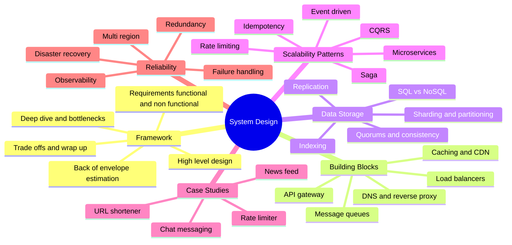
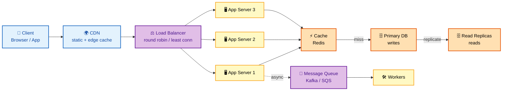
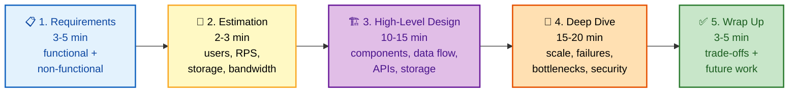

# System Design — Interview Preparation Guide

> **Target audience:** Senior DevOps Engineers, SREs, and Platform Engineers preparing for FAANG-level system design interviews.
>
> **Scope:** Distributed systems taught from first principles — the interview framework, scalability math, building blocks (LB/cache/CDN/queues), data storage and sharding, scalability patterns (microservices, event-driven, CQRS, saga), worked case studies, and the reliability/trade-off reasoning that separates a hire from a no-hire. Every section is **interview-focused**: internals, trade-offs, failure modes, and probing Q&A — no filler.

---

## 🗺️ Visual Overview

**In one line:** A scalable system is a request flowing through DNS → CDN → load balancer → stateless app tier → cache → database, with queues for async work — master each hop and every design question becomes a composition of the same building blocks.

**Scalable web architecture — the reference request path** (memorize this left-to-right flow):

**The five interview phases — drive the conversation in this order** (never draw boxes before stating scale):

> 🧠 **Memory hooks (mnemonics):**
> - **Design framework — "REBHW":** *"Real Engineers Build High Walls"* → **R**equirements → **E**stimation → **B**ase (high-level) design → **H**andle deep-dive → **W**rap-up trade-offs.
> - **CAP — "you can't have your CAP and eat it":** Partition tolerance is **mandatory** on a network, so you really pick **C or A**.
> - **Scale out, not up:** stateless app tiers scale **horizontally forever**; the database is almost always the real bottleneck — cache reads, replicate reads, shard writes.
> - **Request path — "Do Cats Love Any Cake Daily":** **D**NS → **C**DN → **L**oad balancer → **A**pp → **C**ache → **D**atabase.

---

## 📚 Master Table of Contents

| # | Section | File | Est. study time |
|---|---------|------|-----------------|
| 1 | **Fundamentals** — framework, estimation, latency vs throughput, CAP/PACELC, consistency models, availability math | [01-FUNDAMENTALS.md](01-FUNDAMENTALS.md) | 2.5 h |
| 2 | **Building Blocks** — load balancers, caching, CDN, message queues, API gateway, reverse proxy, DNS | [02-BUILDING-BLOCKS.md](02-BUILDING-BLOCKS.md) | 3 h |
| 3 | **Data & Storage** — SQL vs NoSQL, replication, sharding, partitioning, indexing, quorums, CAP in practice | [03-DATA-STORAGE.md](03-DATA-STORAGE.md) | 3 h |
| 4 | **Scalability Patterns** — microservices, event-driven, CQRS, rate limiting, idempotency, backpressure, saga | [04-SCALABILITY-PATTERNS.md](04-SCALABILITY-PATTERNS.md) | 2.5 h |
| 5 | **Case Studies** — URL shortener, news feed, chat/messaging, distributed rate limiter (full walkthroughs) | [05-CASE-STUDIES.md](05-CASE-STUDIES.md) | 4 h |
| 6 | **Trade-offs & Reliability** — failure handling, redundancy, multi-region, DR, observability, interview checklist | [06-TRADEOFFS-RELIABILITY.md](06-TRADEOFFS-RELIABILITY.md) | 2.5 h |

---

## 🧭 Suggested Study Order

1. **Start with [Fundamentals](01-FUNDAMENTALS.md)** — the framework and estimation vocabulary you'll use in every single interview. Memorize the latency ladder and the CAP trade-off here.
2. **Learn the [Building Blocks](02-BUILDING-BLOCKS.md)** — load balancers, caches, CDNs, and queues are the Lego bricks every design is assembled from.
3. **Go deep on [Data & Storage](03-DATA-STORAGE.md)** — the database is where almost every system bottlenecks; sharding and replication are the highest-value topics.
4. **Then [Scalability Patterns](04-SCALABILITY-PATTERNS.md)** — microservices, event-driven, CQRS, and saga show how to decompose and decouple at scale.
5. **Apply it in [Case Studies](05-CASE-STUDIES.md)** — this is where it all comes together; practice the Requirements → Estimation → Design → Deep-dive → Trade-offs flow out loud.
6. **Finish with [Trade-offs & Reliability](06-TRADEOFFS-RELIABILITY.md)** — failure handling and multi-region reasoning are the deep-dive questions that decide senior/staff offers; best reviewed last and before interviews.

> 💡 **How to use each section:** Every file opens with a **Visual Overview** (mind map + colorful diagrams + memory hooks) — skim it first and revisit it last. Topics carry an **Interview weight** marker and an **In one line** summary. Each closes with **Interview Questions & Answers** (answer → reasoning → follow-up).

---

## 🎯 What Makes This Interview-Focused

- **Framework over guessing** — you'll drive every design from requirements → estimation → design → deep-dive → trade-offs, the exact structure interviewers score against.
- **Trade-offs & failure modes** — every topic covers when *not* to use something and how it breaks under partition, load, and region failure.
- **Colorful Mermaid diagrams** for the hardest flows (request path, sharded+replicated DB, write strategies, case-study architectures).
- **Memory hooks** (mnemonics) so numbers and patterns actually stick under interview pressure.

---

**[← Back to Main README](../README.md)** | **[Start: Fundamentals →](01-FUNDAMENTALS.md)**
