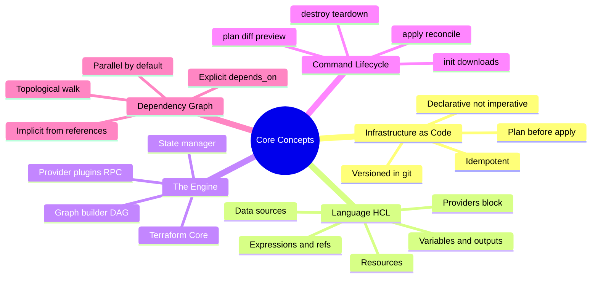
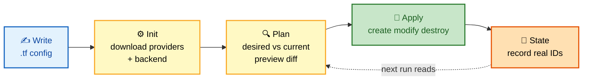
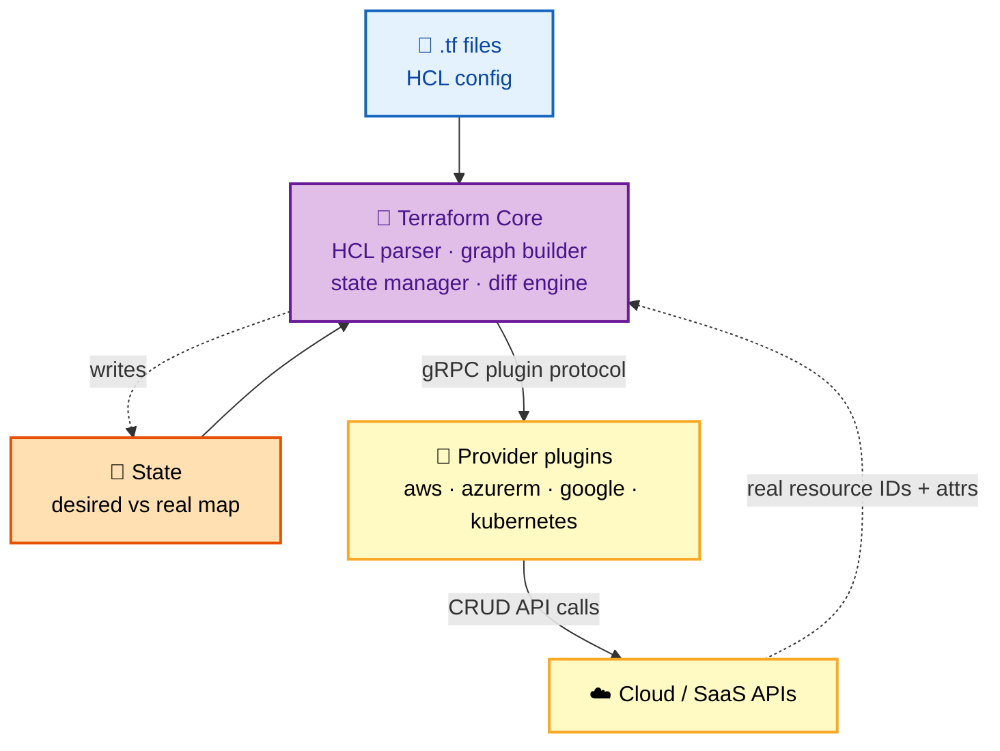
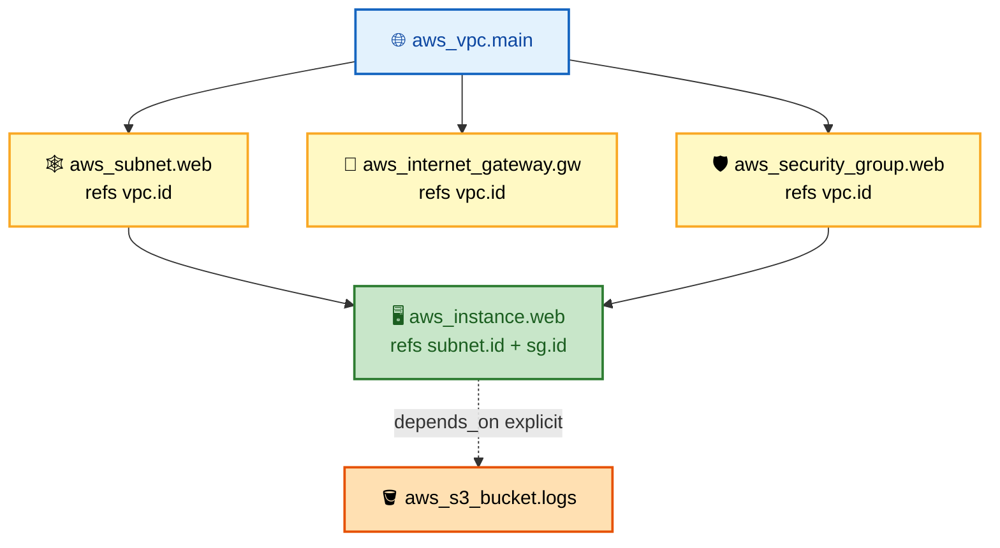
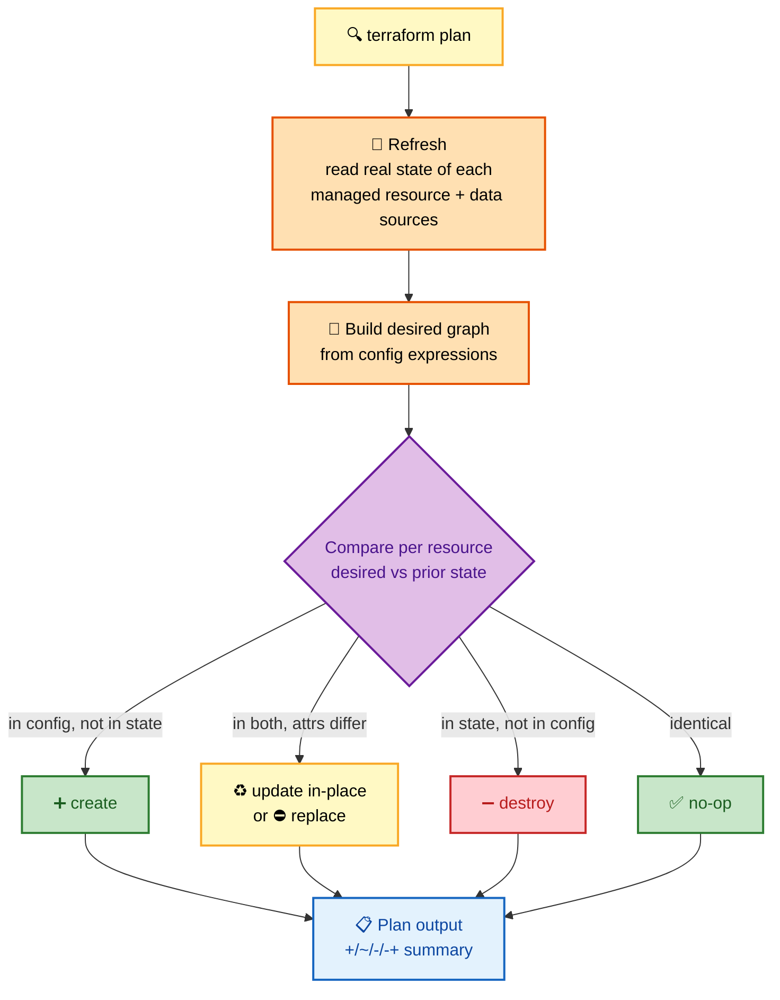

# SECTION 1: CORE CONCEPTS

> **Scope:** What Terraform *is*, how HCL describes infrastructure, and exactly how the `init → plan → apply` engine turns declarative config into cloud API calls via a dependency graph.

---

## 🗺️ Visual Overview

**In one line:** Terraform reads your declarative `.tf` files, builds a **dependency graph**, diffs desired-vs-real, and walks the graph calling **provider plugins** to reach the state you described — you say *what*, the engine decides *how* and *in what order*.

**Mind map — the whole section at a glance:**



**The core workflow — memorize this five-step flow (highest-value diagram in the guide):**



**Architecture — how Core, providers, and the cloud fit together:**



**The dependency graph — how references (not file order) decide apply ordering:**



> 🧠 **Memory hooks (mnemonics):**
> - **Workflow:** *"Willing Iguanas Plan Around Snacks"* → **W**rite → **I**nit → **P**lan → **A**pply → **S**tate.
> - **Declarative vs imperative:** *"Declare the destination, don't drive the route."* You write the end-state; the graph picks the path.
> - **Graph edges:** *"A reference is a dependency."* Every `${a.b.c}` interpolation draws an edge — that is 95% of ordering.
> - **Idempotent:** *"Re-run, no harm."* A second `apply` with no config change is a no-op.

---

## 1. Infrastructure as Code (IaC)

> 🎯 **Interview weight:** ⭐⭐⭐ — the conceptual framing that every follow-up builds on.

**In one line:** IaC means your infrastructure is described in version-controlled, reviewable text files that a tool applies **idempotently**, replacing click-ops and snowflake servers with a reproducible source of truth.

**Why it matters:**

- **Reproducibility** — the same config produces the same environment in dev, staging, prod.
- **Version control** — infra changes go through PRs, code review, and git history/rollback.
- **Idempotency** — applying the same config twice is a no-op; the tool converges to the declared state.
- **Auditability** — `plan` is a diff you can review *before* touching production.

**Declarative vs imperative** — the single most-asked conceptual contrast:

| Aspect | Declarative (Terraform) | Imperative (bash, AWS CLI scripts) |
|---|---|---|
| You specify | The **desired end state** | The **exact steps** to get there |
| Ordering | Engine derives it from the graph | You hand-code it |
| Re-run behavior | Converges (idempotent) | Often breaks or duplicates |
| Drift handling | Detected on next `plan` | Invisible |
| Example | `resource "aws_instance"` block | `aws ec2 run-instances ...` |

> 💡 **Interview tip:** Terraform is **declarative + provisioning-focused**; Ansible/Chef/Puppet are **configuration management** (imperative-ish, in-place mutation of existing hosts). Terraform *creates* the servers; config-mgmt *configures* them. They're complementary, not competitors.

**Terraform vs CloudFormation vs Pulumi vs CDK:**

| Tool | Language | Multi-cloud | State | Notes |
|---|---|---|---|---|
| **Terraform** | HCL (declarative) | ✅ (any provider) | Self-managed state file | Largest provider ecosystem |
| **CloudFormation** | YAML/JSON | ❌ AWS-only | AWS-managed (no state file) | Native AWS, drift detection built-in |
| **Pulumi** | Real langs (TS/Go/Py) | ✅ | Pulumi/self-managed | Loops/logic in a real language |
| **CDK** | Real langs → CFN | ❌ AWS (CDKTF for TF) | Via CFN/TF | Synthesizes to CFN templates |

---

## 2. Providers — the plugins that do the work

> 🎯 **Interview weight:** ⭐⭐⭐⭐ — understanding the plugin boundary explains version pinning, auth, and `init`.

**In one line:** A **provider** is a plugin that teaches Terraform Core how to CRUD a specific platform's resources; Core speaks a stable gRPC protocol to providers, and providers translate that into AWS/Azure/GCP/Kubernetes API calls.

```hcl
terraform {
  required_version = ">= 1.5.0"
  required_providers {
    aws = {
      source  = "hashicorp/aws"   # registry namespace/type
      version = "~> 5.0"          # allow 5.x, block 6.0
    }
  }
}

provider "aws" {
  region = "us-east-1"
  # auth resolved from env vars / shared config / assumed role
}
```

**Key internals:**

- Providers are **separate binaries** downloaded by `terraform init` into `.terraform/providers/` and pinned in `.terraform.lock.hcl` (the **dependency lock file** — commit it).
- Core ↔ provider communication is over a **local gRPC plugin protocol**, so a provider crash surfaces as a plugin error, not a Core crash.
- **Provider version pinning** with `~>` (pessimistic operator) prevents `init` from silently pulling a breaking major.

> ⚠️ **Gotcha:** `version` constraints in `required_providers` are *ranges*; the actual resolved versions are locked in `.terraform.lock.hcl`. If you don't commit the lock file, two engineers can resolve different provider versions and produce different plans. Always commit `.terraform.lock.hcl`.

**Provider aliases** — multiple configurations of the same provider (e.g., multi-region):

```hcl
provider "aws" {
  alias  = "east"
  region = "us-east-1"
}
provider "aws" {
  alias  = "west"
  region = "us-west-2"
}

resource "aws_s3_bucket" "replica" {
  provider = aws.west   # explicitly target the west config
  bucket   = "my-replica"
}
```

---

## 3. Resources & Data Sources

> 🎯 **Interview weight:** ⭐⭐⭐⭐ — the two building blocks of every config.

**In one line:** A **resource** is something Terraform *manages* (creates/updates/destroys and tracks in state); a **data source** is something Terraform only *reads* to feed values into your config.

```hcl
# RESOURCE — managed, appears in state, has a lifecycle
resource "aws_instance" "web" {
  ami           = data.aws_ami.ubuntu.id   # read from a data source
  instance_type = "t3.micro"
}

# DATA SOURCE — read-only lookup, never created/destroyed
data "aws_ami" "ubuntu" {
  most_recent = true
  owners      = ["099720109477"]
  filter {
    name   = "name"
    values = ["ubuntu/images/hvm-ssd/ubuntu-jammy-22.04-*"]
  }
}
```

| | Resource | Data source |
|---|---|---|
| Keyword | `resource` | `data` |
| Lifecycle | create / update / destroy | read-only |
| In state? | ✅ tracked | ✅ cached (refreshed each plan) |
| Address | `aws_instance.web` | `data.aws_ami.ubuntu` |
| Use for | things you own | things that already exist / are owned elsewhere |

> 🔍 **Deep detail:** Data sources are read during **refresh/plan**, so their values can change the plan even when your config didn't. A data source that queries "latest AMI" will show a diff the day a new AMI is published — a common source of surprise plans.

---

## 4. HCL — the language

> 🎯 **Interview weight:** ⭐⭐⭐ — syntax fluency; deep logic lives in Section 4.

**In one line:** HCL (HashiCorp Configuration Language) is a declarative, JSON-compatible language of **blocks** (`resource`, `variable`, `module`…) and **expressions** (references, functions, conditionals) that Core evaluates into a value graph.

Building blocks:

- **Blocks:** `resource "type" "name" { ... }` — typed, named containers.
- **Arguments:** `key = value` assignments inside blocks.
- **Expressions:** `var.env`, `aws_vpc.main.id`, `"${a}-${b}"`, `length(var.list)`, ternaries `cond ? a : b`.
- **References create graph edges** — this is the crucial link to ordering (see §5).

> 💡 **Interview tip:** HCL is not Turing-complete by design — no unbounded loops, no arbitrary imperative flow. You express iteration with `count`/`for_each` and transformation with `for` expressions and functions. This keeps configs analyzable so Core can build the graph *before* execution.

---

## 5. The Command Lifecycle (init → plan → apply)

> 🎯 **Interview weight:** ⭐⭐⭐⭐⭐ — the single most important mechanism in Terraform.

**In one line:** `init` prepares the working dir (providers, modules, backend), `plan` computes a diff between desired config and real/recorded state, and `apply` executes that diff by walking the dependency graph.

### `terraform init`

- Downloads **providers** (into `.terraform/`) and writes/verifies `.terraform.lock.hcl`.
- Initializes the **backend** (local or remote state).
- Downloads **modules** referenced by `source`.
- Idempotent and safe to re-run; add `-upgrade` to bump provider versions within constraints.

### `terraform plan` — the reconcile/diff algorithm

This is the algorithm interviewers love to unpack:



**Reading plan symbols:**

| Symbol | Meaning |
|---|---|
| `+` | create |
| `~` | update in-place |
| `-` | destroy |
| `-/+` | destroy **then** create (replace) — a *forces replacement* attribute changed |
| `+/-` | create then destroy (with `create_before_destroy`) |
| `<=` | read (data source) |

> ⚠️ **Gotcha — the silent `-/+`:** Some attributes are immutable in the cloud API (e.g., an EC2 `availability_zone`, an RDS `engine`). Changing them in config forces **replace**, not update. In prod that can mean a destroyed database. Always read the plan's *"# forces replacement"* annotations before applying.

> 💡 **Interview tip:** Save the plan to guarantee apply-does-exactly-this: `terraform plan -out=tfplan` then `terraform apply tfplan`. Between a plan and an unsaved apply, real state can drift; a saved plan makes apply deterministic (and is how CI/CD pipelines gate approvals).

### `terraform apply`

- Without a saved plan, it runs plan again and asks for approval.
- Walks the graph **topologically**, creating independent resources **in parallel** (default 10, tune with `-parallelism=N`).
- Writes real resource IDs/attributes back to **state** as each node completes.

### `terraform destroy`

- Builds the graph and walks it **in reverse** dependency order (leaves first, roots last), so an instance is destroyed before the subnet it lives in.

---

## 6. The Dependency Graph (DAG)

> 🎯 **Interview weight:** ⭐⭐⭐⭐⭐ — the mechanism behind ordering, parallelism, and cycle errors.

**In one line:** Terraform builds a **directed acyclic graph** where nodes are resources/data/modules and edges are dependencies derived from references; it then walks the graph in topological order, parallelizing everything that isn't connected.

**Two kinds of edges:**

1. **Implicit (preferred)** — any expression that references another resource's attribute, e.g. `subnet_id = aws_subnet.web.id`, draws an edge `aws_subnet.web → aws_instance.web`. ~95% of ordering comes for free this way.
2. **Explicit (`depends_on`)** — for dependencies that exist but aren't expressed through an attribute (e.g., an IAM policy must exist before a Lambda runs, but the Lambda config never references the policy's ARN).

```hcl
resource "aws_instance" "app" {
  # ... no reference to the bucket's attributes ...
  depends_on = [aws_s3_bucket.logs]   # but it needs the bucket to exist first
}
```

> 🔍 **Deep detail:** Because it's a **DAG**, a reference cycle (A needs B, B needs A) is a hard error: *"Cycle: aws_x.a, aws_y.b"*. Break it by removing one direction of the dependency, splitting a resource, or restructuring so the shared value comes from a third resource or a `local`. Visualize with `terraform graph | dot -Tsvg > graph.svg`.

> ⚠️ **Gotcha:** Over-using `depends_on` serializes the graph and hurts apply performance. Prefer wiring real attribute references so Terraform can maximize parallelism. Reach for `depends_on` only for true hidden ordering.

---

## 7. Idempotency & Convergence

> 🎯 **Interview weight:** ⭐⭐⭐ — a defining property interviewers probe with "what does a second apply do?"

**In one line:** Terraform is **idempotent** — it computes the delta to the desired state each run, so re-applying an unchanged config makes **zero** changes; it *converges* real infrastructure toward config rather than replaying steps.

- First `apply`: creates resources, records them in state.
- Second `apply` (no config change): plan shows *"No changes. Your infrastructure matches the configuration."*
- If something drifted out-of-band, the next plan shows the delta to *reconcile* it.

> 💡 **Interview tip:** Contrast with a shell script that runs `aws ec2 run-instances` — running it twice makes two instances. Terraform running twice makes zero extra, because it reconciles against recorded state. That reconciliation is only possible *because* of the state file — which is the entire topic of [Section 2](./02-STATE-MANAGEMENT.md).

---

## Interview Questions & Answers

### Q1: What is Terraform and how does the plan/apply workflow function internally?

**Answer:** Terraform is a declarative IaC tool. You write HCL describing the desired end state; `init` downloads providers and initializes the backend; `plan` refreshes real state, builds a dependency graph from your config, and diffs desired-vs-recorded to produce a change set; `apply` executes that change set by walking the graph and calling provider APIs, then records results in state.

**Internals:** Terraform Core parses HCL → builds a **DAG** from attribute references → for each node compares config (desired) against prior state (recorded) and, during refresh, against real infrastructure → emits create/update/replace/destroy. Apply walks the DAG topologically, parallelizing independent nodes (default 10). Providers are gRPC plugins that translate CRUD into cloud API calls.

**Follow-up — "Why declarative?"** Because the engine can derive ordering and parallelism from the graph, detect drift, and make runs idempotent — none of which an imperative script gives you.

### Q2: How does Terraform decide the order to create resources?

**Answer:** Not by file order — by the **dependency graph**. Any expression referencing another resource's attribute creates an implicit edge; `depends_on` creates an explicit one. Terraform topologically sorts the DAG and creates independent resources in parallel, dependents after their dependencies.

**Internals:** It's a true DAG, so cycles are fatal errors. Destroy walks the same graph in reverse. `-parallelism=N` tunes concurrency (default 10).

**Follow-up — "When do you use `depends_on`?"** Only for real dependencies not expressed via attributes (e.g., IAM policy before the principal that uses it implicitly). Over-use serializes the graph and slows applies.

### Q3: What's the difference between a resource and a data source?

**Answer:** A `resource` is managed — Terraform creates/updates/destroys it and owns its lifecycle in state. A `data` source is read-only — Terraform queries it during refresh to feed values into config but never modifies it.

**Internals:** Data sources are evaluated during plan/refresh, so their results can change the plan even with no config change (e.g., "most recent AMI" flips when a new image publishes).

**Follow-up — "Why did my plan show changes when I changed nothing?"** Likely a data source returning new values, or out-of-band drift detected on refresh.

### Q4: What does `-/+` in a plan mean and why is it dangerous?

**Answer:** It means **destroy then recreate (replace)** — an attribute that's immutable at the cloud-API level changed, so Terraform can't update in place. It's dangerous because for stateful resources (databases, volumes) replacement means data loss and downtime.

**Internals:** Providers mark certain attributes as `ForceNew`. Changing one produces `-/+`. Mitigate with `lifecycle { create_before_destroy = true }` where valid, or `prevent_destroy` to hard-block, or a `moved`/migration strategy.

**Follow-up — "How do you avoid an accidental prod DB replacement?"** Review plans in CI, gate applies on approval, set `prevent_destroy` on critical resources, and prefer saved plans (`-out`) so apply does exactly what was reviewed.

### Q5: Why commit `.terraform.lock.hcl` but not `.terraform/`?

**Answer:** `.terraform.lock.hcl` pins the exact provider versions and checksums so every engineer and CI runner resolves identical providers — reproducible plans. `.terraform/` is a local cache of downloaded provider binaries and modules, machine-specific and re-creatable via `init`, so it's git-ignored.

**Follow-up — "What breaks if you don't commit the lock file?"** Two people can resolve different provider versions within the same `~>` range and get different plans/behaviors — non-reproducible infrastructure.

---

## ✅ Best Practices

- **Always `plan` before `apply`**, and in CI use `-out=tfplan` so apply is deterministic.
- **Pin provider versions** with `~>` and **commit `.terraform.lock.hcl`**.
- **Prefer implicit dependencies** (attribute references) over `depends_on`.
- **Read `# forces replacement`** annotations before applying to stateful resources.
- Keep configs **small and graph-friendly**; heavy `depends_on` kills parallelism.

---

**[← Back to Index](./README.md)** | **[Next: State Management →](./02-STATE-MANAGEMENT.md)**
