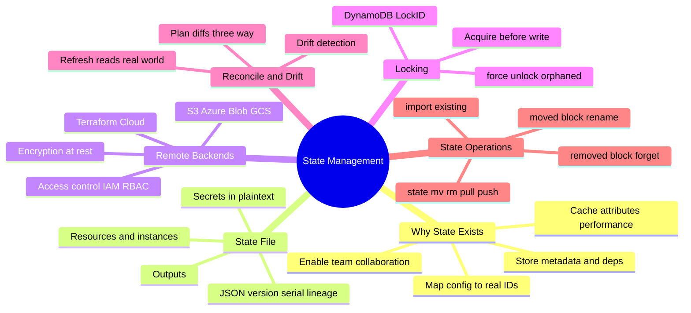
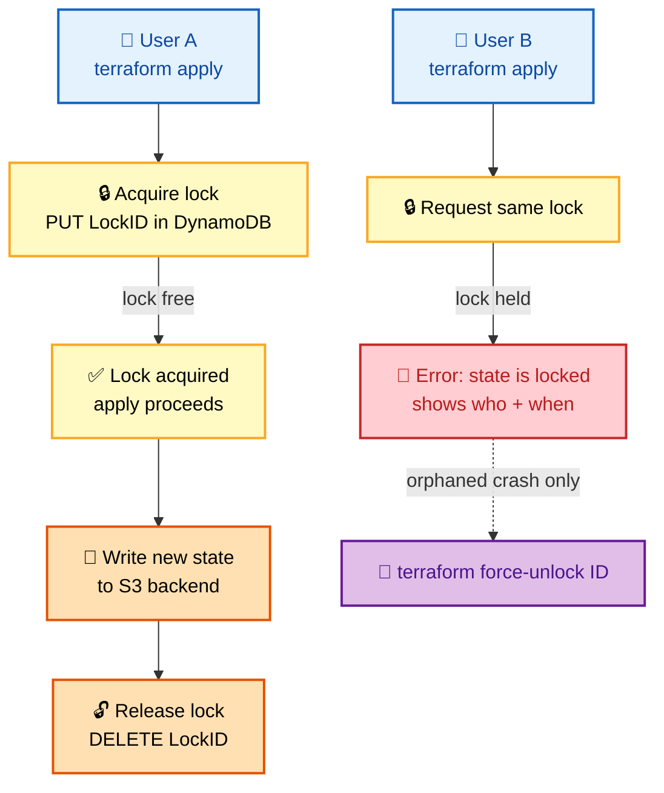
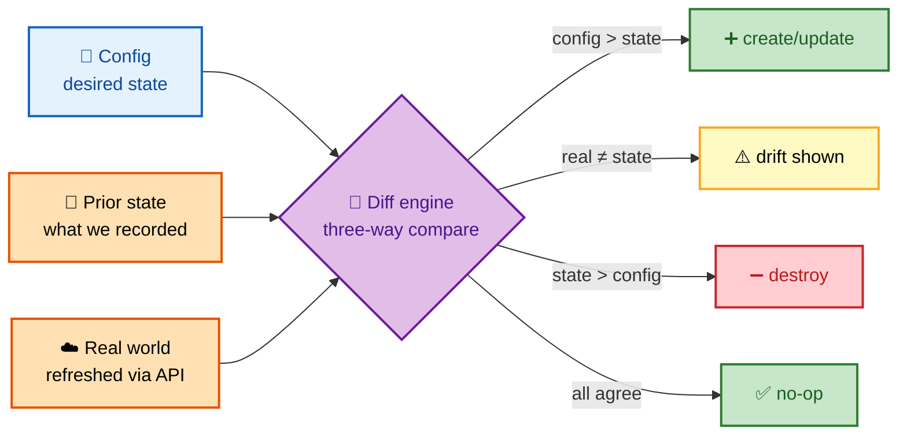
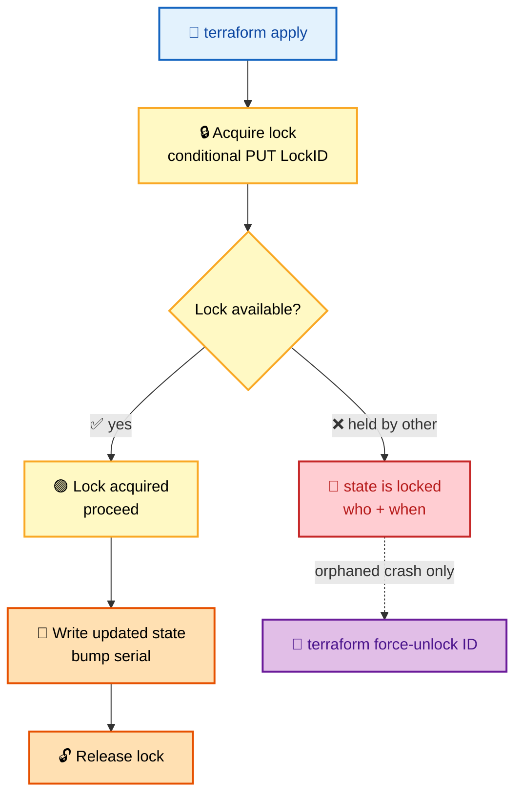
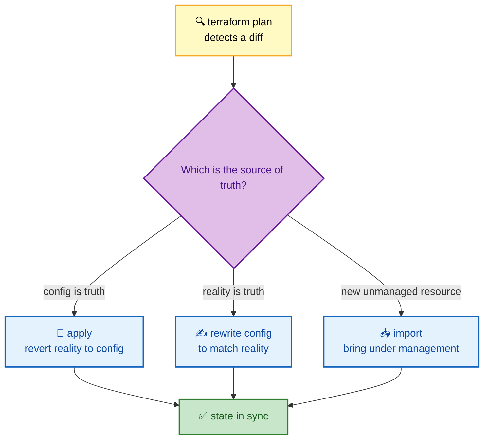

# SECTION 2: STATE MANAGEMENT

> **Scope:** What the state file is, its internals, remote backends & locking, the refresh/reconcile algorithm, drift, `import`, and safe state surgery (`moved`, `removed`, `state mv/rm`).

---

## 🗺️ Visual Overview

**In one line:** State is Terraform's **memory** — a JSON map from your config addresses to real cloud resource IDs; without it Terraform can't tell create from update from destroy, which is why state internals, remote backends, and locking dominate Terraform interviews.

**Mind map — the whole section at a glance:**



**State locking with a remote backend — why two engineers never corrupt state:**



**The three-way reconcile — config vs prior state vs real world:**



> 🧠 **Memory hooks (mnemonics):**
> - **What state is for:** *"Map, Meta, Money, Many"* → **Map**ping config→real, **Meta**data/deps, performance (**Money**/API caching), and **Many** users (locking).
> - **State-lock flow:** *"Lock → Apply → Write → Unlock"* (LAWU). Lock is grabbed *before* the write, released *after* — a crash mid-apply leaves an orphaned lock you clear with `force-unlock`.
> - **Drift fixes:** *"Revert, Rewrite, or Reimport"* → `apply` to revert, edit config to match, or `import` the change.
> - **State surgery safety:** *"`rm` forgets, it never destroys."* `state rm` removes tracking only; the cloud resource lives on.

---

## 1. Why State Exists

> 🎯 **Interview weight:** ⭐⭐⭐⭐⭐ — if you can't explain *why* state exists, you fail the topic.

**In one line:** State is the mapping that lets Terraform know a config block like `aws_instance.web` corresponds to real resource `i-0abc123` — without it, every plan would be a guess.

State serves four jobs — the *"Map, Meta, Money, Many"* mnemonic:

1. **Resource Mapping** — `aws_instance.web` → `i-0abc123def456`. This is the core reason it exists.
2. **Metadata** — dependency ordering, provider info, Terraform version, resource schema.
3. **Performance (caching)** — cached attribute values reduce API calls; large infra would be slow if every plan re-read everything (tune with `-refresh=false` at your own risk).
4. **Collaboration** — a shared remote state + locking lets a team work on the same infrastructure safely.

> 💡 **Interview tip:** The killer one-liner: *"Terraform needs state because cloud APIs have no way to ask 'which of these resources did **I** create from **this** config?' — state is that memory."* Config alone can't distinguish "create new" from "update existing."

---

## 2. State File Internals

> 🎯 **Interview weight:** ⭐⭐⭐⭐ — knowing the fields explains serial conflicts, lineage, and secrets-in-state.

**In one line:** State is a JSON document with a `version`, a monotonically increasing `serial`, a unique `lineage`, `outputs`, and a `resources` array mapping each address to real attributes — including **secrets in plaintext**.

```json
{
  "version": 4,
  "terraform_version": "1.5.0",
  "serial": 42,
  "lineage": "abc-123-def",
  "outputs": { "vpc_id": { "value": "vpc-0a1b", "type": "string" } },
  "resources": [
    {
      "mode": "managed",
      "type": "aws_instance",
      "name": "web",
      "provider": "provider[\"registry.terraform.io/hashicorp/aws\"]",
      "instances": [
        {
          "attributes": {
            "id": "i-0abc123def456",
            "ami": "ami-12345",
            "instance_type": "t3.micro"
          }
        }
      ]
    }
  ]
}
```

**Field meanings interviewers ask about:**

| Field | Meaning | Why it matters |
|---|---|---|
| `version` | State format version (4 today) | Compatibility across TF versions |
| `serial` | Increments on every write | Detects stale writes; conflict if you push an older serial |
| `lineage` | Random UUID created once | Guards against pushing an *unrelated* state onto another |
| `resources[].instances` | One per `count`/`for_each` key | Where `-/+` decisions read from |
| `outputs` | Root output values | Read by `terraform_remote_state` in other configs |

> ⚠️ **Gotcha — secrets in plaintext:** State stores sensitive attributes (DB passwords, private keys, generated secrets) **unencrypted** in the JSON. Never commit `terraform.tfstate` to git. Always use an **encrypted remote backend** with restricted IAM/RBAC. Marking a variable `sensitive` only hides it from CLI output — it's still plaintext in state.

---

## 3. Remote Backends

> 🎯 **Interview weight:** ⭐⭐⭐⭐⭐ — "how do you manage state for a team?" is asked in nearly every round.

**In one line:** A **backend** determines where state lives and how operations run; a **remote backend** (S3, Azure Blob, GCS, Terraform Cloud) gives you shared, encrypted, access-controlled, lockable state — the prerequisite for any team workflow.

**Local vs remote:**

| | Local backend | Remote backend |
|---|---|---|
| State location | `terraform.tfstate` on disk | S3 / Blob / GCS / TFC |
| Collaboration | ❌ one person | ✅ whole team |
| Locking | ❌ | ✅ (DynamoDB / native) |
| Encryption | ❌ (plaintext file) | ✅ at rest + in transit |
| Secrets safety | ❌ risky | ✅ with IAM/RBAC |

**S3 + DynamoDB backend (the canonical AWS pattern):**

```hcl
terraform {
  backend "s3" {
    bucket         = "my-terraform-state"
    key            = "environments/production/terraform.tfstate"
    region         = "us-east-1"
    encrypt        = true
    kms_key_id     = "alias/terraform-state"
    dynamodb_table = "terraform-state-lock"   # enables locking
    role_arn       = "arn:aws:iam::123456789012:role/TerraformStateAccess"
  }
}
```

```hcl
# The lock table — LockID is the hash key Terraform writes/deletes
resource "aws_dynamodb_table" "terraform_lock" {
  name         = "terraform-state-lock"
  billing_mode = "PAY_PER_REQUEST"
  hash_key     = "LockID"
  attribute {
    name = "LockID"
    type = "S"
  }
}
```

> 🔍 **Deep detail:** With the S3 backend, S3 stores the state object and **DynamoDB stores the lock** (a single item keyed by `LockID`). S3's read-after-write consistency plus the DynamoDB conditional-write lock together guarantee no two applies race. Terraform Cloud/Enterprise bundles storage + locking + remote runs natively (no DynamoDB needed).

> 💡 **Interview tip:** A backend block **can't use variables or interpolation** — it's read before the rest of the config is evaluated. Parameterize it with **partial configuration**: leave keys out of the block and pass them via `terraform init -backend-config=prod.hcl` or `-backend-config="key=..."`.

---

## 4. State Locking

> 🎯 **Interview weight:** ⭐⭐⭐⭐⭐ — the classic "how do you prevent two people corrupting state" question.

**In one line:** Before any state-writing operation, Terraform **acquires a lock**; a concurrent operation sees the lock and fails fast with *who/when* info, preventing interleaved writes that would corrupt state.

**Lifecycle (LAWU — Lock, Apply, Write, Unlock):**



```bash
# Emergency: clear an orphaned lock (crashed CI runner, killed apply)
terraform force-unlock <LOCK_ID>
```

> ⚠️ **Gotcha:** `force-unlock` does **not** verify the other process is dead — it blindly removes the lock. Running it against an *active* apply lets two writers race and corrupt state. Only use it when you are certain the holder crashed (check the lock's `Who`/`Created` fields first). You can skip locking with `-lock=false`, but that's almost always a mistake in shared state.

---

## 5. The Refresh / Reconcile Algorithm & Drift

> 🎯 **Interview weight:** ⭐⭐⭐⭐⭐ — the mechanism behind "why did my plan change?"

**In one line:** During plan, Terraform **refreshes** (reads real infrastructure), then does a **three-way compare** of config (desired) vs prior state (recorded) vs real world (actual); any real-vs-state mismatch is **drift**.

**Drift** = infrastructure changed outside Terraform (someone clicked in the console, an autoscaler resized, a script patched a tag).

```text
# Plan reveals drift — someone resized the box in the console:
~ aws_instance.web
    ~ instance_type = "t3.micro" -> "t3.large"   # (changed outside of Terraform)
```

**Three ways to resolve drift** (*"Revert, Rewrite, or Reimport"*):



> 🔍 **Deep detail:** `terraform refresh` (now folded into `plan`/`apply`) updates state to match reality **without changing config** — use `terraform plan -refresh-only` and `apply -refresh-only` to accept drift into state deliberately. `-refresh=false` skips the refresh for speed on huge state, at the cost of possibly stale plans.

> 💡 **Interview tip:** To *detect* drift on a schedule (compliance), run `terraform plan -detailed-exitcode`: exit `0` = no changes, `2` = changes/drift present, `1` = error. Wire that into a cron/CI job and alert on `2`.

---

## 6. Importing Existing Resources

> 🎯 **Interview weight:** ⭐⭐⭐⭐ — "we have resources made by hand; how do you adopt them?"

**In one line:** `import` brings a pre-existing, unmanaged resource under Terraform by writing its real ID into state so future plans manage it instead of trying to recreate it.

**Legacy CLI import (pre-1.5):**

```hcl
resource "aws_instance" "imported" {
  # config to be filled in after import
}
```
```bash
terraform import aws_instance.imported i-0abc123
terraform show   # read real attributes, then hand-write matching config
```

**Modern `import` block (1.5+, recommended — plannable & reviewable):**

```hcl
import {
  to = aws_instance.imported
  id = "i-0abc123"
}
```
```bash
# Generate config automatically and preview the import in the plan
terraform plan -generate-config-out=imported.tf
terraform apply
```

> ⚠️ **Gotcha:** Import **only populates state** — it does not write config for you (legacy CLI) and the generated config (1.5+) still needs review. If your hand-written config doesn't match the imported reality, the very next plan will show spurious changes (or a destructive `-/+`). Always run a plan after import and reconcile until it's a clean no-op.

---

## 7. State Surgery: `moved`, `removed`, `state mv/rm`

> 🎯 **Interview weight:** ⭐⭐⭐⭐ — refactoring without destroying prod is a senior skill.

**In one line:** These tools change *how Terraform tracks* a resource (rename, stop managing, relocate) **without** destroying the real infrastructure — essential for refactors.

**`moved` block — rename/refactor without destroy+recreate (1.1+):**

```hcl
# Renamed the resource or moved it into a module — tell Terraform it's the same thing
moved {
  from = aws_instance.web
  to   = aws_instance.web_server
}
```

**`removed` block — stop managing without destroying (1.7+):**

```hcl
removed {
  from = aws_instance.legacy
  lifecycle {
    destroy = false   # forget it, but leave the real instance running
  }
}
```

**Imperative state commands (use with care):**

```bash
terraform state list                       # inspect what's tracked
terraform state show aws_instance.web       # dump one resource's attrs
terraform state mv aws_instance.a aws_instance.b   # relocate/rename in state
terraform state rm aws_instance.abandoned   # FORGET (does NOT destroy cloud resource)
terraform state pull > state.json           # download raw state
terraform state push state.json             # upload (dangerous!)
```

| Command / block | Effect on state | Effect on real resource |
|---|---|---|
| `moved` block | Re-addresses in place | None (no destroy) |
| `removed` block | Drops tracking | None (stays alive) |
| `state mv` | Renames/relocates | None |
| `state rm` | **Forgets** (untracks) | None — resource keeps running |
| `import` | Adds tracking | None (adopts existing) |

> ⚠️ **Gotcha:** `state rm` is *forget*, not *delete* — it orphans the real resource (you'll keep paying for it and it's now unmanaged). Prefer declarative `moved`/`removed` blocks over imperative `state mv/rm`: they're code-reviewed, version-controlled, and reproducible across the team, whereas CLI surgery is invisible to everyone else.

---

## Interview Questions & Answers

### Q1: Why does Terraform need a state file? Can't it just read the cloud?

**Answer:** Because cloud APIs can't answer "which resources did *this config* create?" State is the mapping from config addresses (`aws_instance.web`) to real IDs (`i-0abc123`). It also caches attributes for performance, stores dependency metadata, and enables team collaboration via locking.

**Internals:** Without state, a plan couldn't distinguish "create new" from "update the one I made last time," and it couldn't know what to destroy when you remove a block. Refresh reconciles state against reality each run.

**Follow-up — "Why not tag and query?"** Tag-based discovery is fragile (tags get edited/removed), can't capture computed attributes or dependency order, and doesn't give you locking or a diffable prior value.

### Q2: How do you configure remote state with locking for a team?

**Answer:** Use a remote backend (S3/Blob/GCS/TFC) with encryption and a lock mechanism. On AWS: S3 for the state object + a DynamoDB table (`LockID` hash key) for locking + KMS encryption + IAM-restricted access.

**Internals:** Terraform acquires a DynamoDB lock (conditional write) before writing, releases it after. S3 stores versioned, encrypted state. The backend block can't use variables — parameterize via `-backend-config`.

**Follow-up — "What if a runner crashes mid-apply?"** The lock is orphaned; verify the holder is dead via the lock's who/when, then `terraform force-unlock <ID>`.

### Q3: What is drift and how do you handle it?

**Answer:** Drift is infrastructure changing outside Terraform. Plan's refresh detects it via a three-way compare (config vs state vs real). Resolve by *reverting* (apply config over reality), *rewriting* config to match reality, or *importing* a genuinely new unmanaged resource.

**Internals:** `plan -refresh-only` + `apply -refresh-only` accepts drift into state without changing infra. `plan -detailed-exitcode` (exit 2 = drift) automates detection in CI.

**Follow-up — "How do you prevent drift?"** Lock down console/CLI write access (IaC-only via IAM), require all changes through PRs, and run scheduled drift-detection plans.

### Q4: Someone renamed a resource and now the plan wants to destroy+recreate it. Fix it without downtime.

**Answer:** Add a `moved` block from the old address to the new one. Terraform re-addresses the existing resource in state instead of destroying it. (Or the legacy imperative `terraform state mv old new`.)

**Internals:** The destroy+recreate happened because Terraform saw the old address gone (→ destroy) and a new address absent from state (→ create). `moved` tells it they're the same object.

**Follow-up — "Why prefer `moved` over `state mv`?"** `moved` is declarative, code-reviewed, and applied consistently by everyone; `state mv` is a one-off local command invisible to teammates and CI.

### Q5: What's the difference between `state rm`, a `removed` block, and `destroy`?

**Answer:** `destroy`/removing a resource block deletes the real resource. `state rm` and `removed` blocks make Terraform **stop tracking** the resource while leaving it alive in the cloud. `removed` is the declarative, reviewable form; `state rm` is the imperative CLI form.

**Internals:** All three change state; only `destroy` calls the provider's delete API. `state rm` orphans the resource (now unmanaged, still billed).

**Follow-up — "When would you forget a resource?"** When splitting it into another state/config, handing ownership to another team, or removing Terraform management without an outage.

### Q6: State contains a database password in plaintext. How do you secure it?

**Answer:** Use an **encrypted remote backend** (S3+KMS, Blob with encryption, TFC) and restrict access with IAM/RBAC. Never commit state to git. Enable bucket versioning for recovery and server-side encryption. Treat state as a secret.

**Internals:** `sensitive = true` only redacts CLI output — the value is still plaintext in state. True protection is encryption-at-rest + least-privilege access + audit logging on the backend.

**Follow-up — "Can you keep secrets out of state entirely?"** Largely no for generated/attribute secrets, but you can reduce exposure by sourcing secrets from a secrets manager at runtime and minimizing sensitive resources; the state backend must still be encrypted and locked down.

---

## 🛠️ Troubleshooting Quick Reference

| Symptom | Likely cause | Fix |
|---|---|---|
| `Error: state is locked` | Concurrent apply or orphaned lock | Wait; if crashed, `force-unlock <ID>` |
| Plan shows changes you didn't make | Drift or a data source flipped | `plan -refresh-only`; reconcile |
| `-/+` on a database | Immutable attr changed (`ForceNew`) | `prevent_destroy`, or migrate deliberately |
| Serial/lineage mismatch on push | Pushing stale/unrelated state | Re-pull, re-apply changes; never blind-push |
| Import then plan shows a big diff | Config doesn't match reality | Edit config until plan is a no-op |

---

## ✅ Best Practices

- **Remote, encrypted, locked** state from day one — never local for shared infra.
- **Isolate state** per environment/region/component to limit blast radius (see [Section 5](./05-PRODUCTION-CICD.md)).
- **Commit `.terraform.lock.hcl`**, never commit `terraform.tfstate`.
- Prefer **declarative `moved`/`removed`** over imperative `state mv/rm`.
- Enable **bucket versioning** on the state backend for point-in-time recovery.
- Schedule **drift detection** with `plan -detailed-exitcode`.

---

**[← Prev: Core Concepts](./01-CORE-CONCEPTS.md)** | **[Back to Index](./README.md)** | **[Next: Modules & Structure →](./03-MODULES-STRUCTURE.md)**
