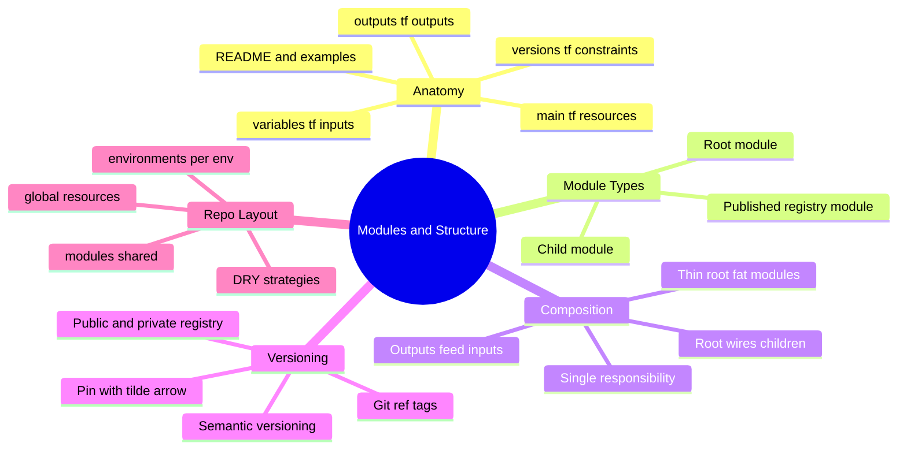
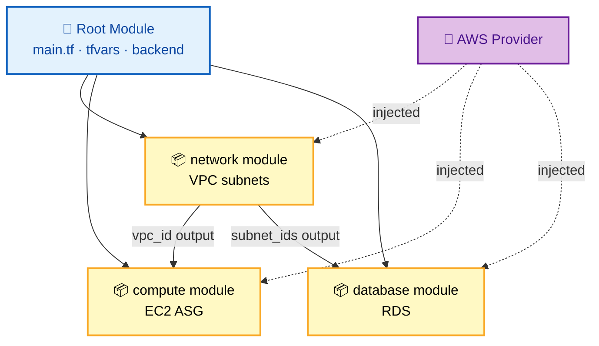
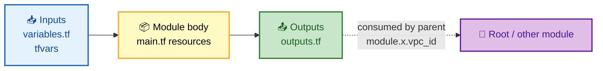

# SECTION 3: MODULES & PROJECT STRUCTURE

> **Scope:** Module anatomy, composition patterns, versioning & registry sources, root vs child modules, and how real enterprises lay out a Terraform repo to stay DRY.

---

## 🗺️ Visual Overview

**In one line:** A **module** is a reusable, parameterized folder of `.tf` files with **inputs** (variables) and **outputs**; you compose small single-purpose modules under a **root module** that wires providers and backends — the same "functions and libraries" idea applied to infrastructure.

**Mind map — the whole section at a glance:**



**Module composition — root config wires providers into reusable modules:**



**Input → module → output data flow:**



> 🧠 **Memory hooks (mnemonics):**
> - **Module = function:** *"Inputs in, resources built, outputs out."* variables → body → outputs.
> - **Thin root, fat modules:** the root is the *wiring*; the logic lives in reusable children.
> - **Version pin:** *"`~>` guards the major."* `~> 5.0` allows 5.x, blocks 6.0.
> - **Single responsibility:** *"One module, one job"* — VPC, EKS, RDS as separate modules.

---

## 1. Module Anatomy

> 🎯 **Interview weight:** ⭐⭐⭐⭐ — "how do you structure a reusable module?"

**In one line:** A module is just a directory of `.tf` files; by convention it splits into `main.tf` (resources), `variables.tf` (inputs), `outputs.tf` (outputs), and `versions.tf` (provider/TF constraints), plus a README and examples.

**Standard module structure:**

```text
modules/
└── vpc/
    ├── main.tf          # Primary resources
    ├── variables.tf     # Input variables
    ├── outputs.tf       # Output values
    ├── versions.tf      # Provider + terraform version requirements
    ├── README.md        # Documentation
    ├── examples/        # Usage examples
    │   └── complete/
    │       └── main.tf
    └── tests/           # Terratest / native tests
        └── vpc_test.go
```

**The three interfaces of a module:**

```hcl
# variables.tf — the INPUT contract (with defaults + validation)
variable "instance_type" {
  type        = string
  default     = "t3.micro"
  description = "EC2 instance type"
}

variable "environment" {
  type = string
  validation {
    condition     = contains(["dev", "staging", "prod"], var.environment)
    error_message = "Must be dev, staging, or prod."
  }
}

# outputs.tf — the OUTPUT contract (what parents can consume)
output "vpc_id" {
  description = "The ID of the VPC"
  value       = aws_vpc.main.id
}
```

> 💡 **Interview tip:** Treat a module's `variables.tf` + `outputs.tf` as its **public API**. Changing a variable's type/name or removing an output is a **breaking change** — which is exactly why modules need semantic versioning.

---

## 2. Root vs Child Modules

> 🎯 **Interview weight:** ⭐⭐⭐ — clarifies where providers/backends belong.

**In one line:** The **root module** is the directory where you run `terraform` — it owns the backend and provider configuration; **child modules** are called via `module` blocks and should *not* configure providers or backends.

| | Root module | Child module |
|---|---|---|
| Where you run `terraform` | ✅ yes | ❌ no |
| Configures `backend` | ✅ yes | ❌ never |
| Configures `provider` | ✅ yes | ❌ receives injected provider |
| Called by | you / CI | a `module` block |

```hcl
# Root module calling a child module
module "network" {
  source      = "./modules/vpc"
  environment = "prod"
  cidr_block  = "10.0.0.0/16"
}

resource "aws_instance" "app" {
  subnet_id = module.network.subnet_ids[0]   # consume child output
}
```

> ⚠️ **Gotcha:** Don't put a `backend` or hard-coded `provider` block inside a reusable child module. Providers are **inherited** from the root (or passed explicitly with `providers = { aws = aws.west }`). A provider block in a child makes the module non-reusable and can't be removed cleanly later without breaking configs.

---

## 3. Module Sources & Versioning

> 🎯 **Interview weight:** ⭐⭐⭐⭐ — version pinning is a reproducibility/safety question.

**In one line:** The `source` argument points at local paths, Git refs, or registries; for anything shared, pin an explicit **version** (registry) or **`?ref=tag`** (Git) so `init` can't silently pull a breaking change.

```hcl
# Local path — no version (same repo)
module "vpc" { source = "./modules/vpc" }

# Git with a pinned tag — the ?ref is the version pin
module "vpc" {
  source = "git::https://github.com/org/modules.git//vpc?ref=v1.2.3"
}

# Public Terraform Registry — pessimistic version constraint
module "vpc" {
  source  = "terraform-aws-modules/vpc/aws"
  version = "~> 5.0"   # allows 5.x, blocks 6.0
}

# Private registry (Terraform Cloud/Enterprise)
module "vpc" {
  source  = "app.terraform.io/myorg/vpc/aws"
  version = "1.2.3"    # exact pin
}
```

**Version constraint operators:**

| Operator | Example | Allows |
|---|---|---|
| `=` / exact | `1.2.3` | only 1.2.3 |
| `~>` (pessimistic) | `~> 5.0` | `>= 5.0, < 6.0` |
| `~>` finer | `~> 5.1.0` | `>= 5.1.0, < 5.2.0` |
| `>=`, `<` | `>= 2.0, < 3.0` | explicit range |

> 💡 **Interview tip:** For **modules you consume**, pin versions aggressively (`~>` or exact) — a surprise major upgrade can rewrite your infrastructure. For **modules you publish**, follow semver strictly: bump **major** on any input/output breaking change so consumers' `~>` pins protect them.

---

## 4. Composition & DRY Patterns

> 🎯 **Interview weight:** ⭐⭐⭐⭐ — "how do you avoid copy-pasting config across 3 environments?"

**In one line:** Keep the **root thin** and **modules fat** — environments become small root configs that call the same versioned modules with different variables, so dev/staging/prod share logic but differ only in inputs.

**Enterprise repo layout:**

```text
terraform-infrastructure/
├── modules/                 # Shared, versioned building blocks
│   ├── networking/
│   ├── compute/
│   ├── database/
│   └── security/
├── environments/            # Thin roots — one per env/region
│   ├── dev/
│   │   └── us-east-1/
│   │       ├── main.tf          # calls modules
│   │       ├── backend.tf       # per-env state key
│   │       └── terraform.tfvars # env-specific inputs
│   ├── staging/
│   └── production/
│       ├── us-east-1/
│       └── eu-west-1/
├── global/                  # Org-wide: IAM, DNS, org structure
└── .github/workflows/       # CI/CD: plan on PR, apply on merge
```

**Two DRY strategies interviewers compare:**

| Strategy | How | Trade-off |
|---|---|---|
| **Directory-per-env** (shown above) | Separate root dir per env, shared modules | Explicit, isolated state, more files |
| **Workspaces** | One root, `terraform workspace` switches state | DRY-er but easy to apply to the wrong env (see [Section 4](./04-PROVISIONING-WORKFLOW.md)) |
| **Terragrunt** | Wrapper generating backends + DRY inputs | Powerful, extra tool to learn (see [Section 5](./05-PRODUCTION-CICD.md)) |

> 💡 **Interview tip:** The phrase interviewers want is **"limit the blast radius."** Directory-per-env with **isolated state per env/region/component** means a bad apply in `dev/networking` can never touch `prod/database`, and it enables parallel applies and per-team permissions. Workspaces share one config and are riskier for prod because a single wrong `workspace select` targets the wrong environment.

> ⚠️ **Gotcha — module churn:** Passing `count` into a module to create N copies shifts every index when you remove the middle one, destroying and recreating the tail. Prefer `for_each` with a stable map key so add/remove is surgical. (Covered in depth in [Section 4](./04-PROVISIONING-WORKFLOW.md).)

---

## Interview Questions & Answers

### Q1: How do you design a reusable Terraform module?

**Answer:** Give it a single responsibility (one logical resource group), a clear input contract (`variables.tf` with sensible defaults and validation), a clear output contract (`outputs.tf`), version constraints in `versions.tf`, a README, and examples. Never embed backend/provider config — inherit those from the root.

**Internals:** `variables.tf` + `outputs.tf` are the module's public API; changing them is a breaking change, which is why modules need semver. Providers are injected from the root or passed via `providers = {}`.

**Follow-up — "How granular should modules be?"** One job each — VPC, EKS, RDS as separate modules — so they compose and version independently. Avoid "god modules" that do everything.

### Q2: How do you version modules and why does it matter?

**Answer:** Registry modules use `version = "~> 5.0"`; Git modules use `source = "...?ref=v1.2.3"`. Pinning matters because `terraform init` resolves `source` at init time — an unpinned module can silently pull a breaking change that rewrites infra.

**Internals:** `~>` (pessimistic) allows patch/minor within a major and blocks the next major. Published modules must follow semver so consumers' pins actually protect them.

**Follow-up — "Exact pin or `~>`?"** Exact for maximum safety in prod roots; `~>` when you want automatic patches and trust the publisher's semver discipline.

### Q3: How would you structure Terraform for a large org with many teams?

**Answer:** Shared versioned modules in `modules/`, thin per-environment roots in `environments/<env>/<region>/`, org-wide resources in `global/`, and CI/CD that plans on PR and applies on merge. Isolate state per env/region/component to limit blast radius and enable per-team permissions.

**Internals:** Each root has its own backend key → its own state → its own lock. A bad apply is contained to one state. Parallel applies across states become possible.

**Follow-up — "Workspaces or directories?"** Directories for prod isolation and clarity; workspaces only for ephemeral/identical environments where the risk of targeting the wrong one is acceptable.

### Q4: Why shouldn't a child module contain a provider or backend block?

**Answer:** Backends and providers are a **root** concern. A backend defines where *this configuration's* state lives — meaningless inside a reusable child. A hard-coded provider block makes the module non-reusable across regions/accounts and can't be cleanly removed later without breaking existing consumers.

**Internals:** Children inherit the root's default provider, or receive explicit ones via `providers = { aws = aws.west }`. Terraform even warns that removing a provider block from a module that once had one is a breaking change.

**Follow-up — "How do you use a module in two regions?"** Call it twice with provider aliases: `providers = { aws = aws.east }` and `{ aws = aws.west }`.

---

## ✅ Best Practices

- **Single responsibility** per module; compose many small modules.
- Treat `variables.tf`/`outputs.tf` as a **public API** and **semver** it.
- **Pin versions** (`~>` or `?ref=tag`) for every shared module.
- **Thin roots, fat modules**; environments differ only by inputs.
- **No backend/provider blocks** inside child modules.
- Prefer **`for_each`** over `count` for module/resource collections.
- Ship each module with a **README + `examples/`**.

---

**[← Prev: State Management](./02-STATE-MANAGEMENT.md)** | **[Back to Index](./README.md)** | **[Next: Provisioning Workflow →](./04-PROVISIONING-WORKFLOW.md)**
