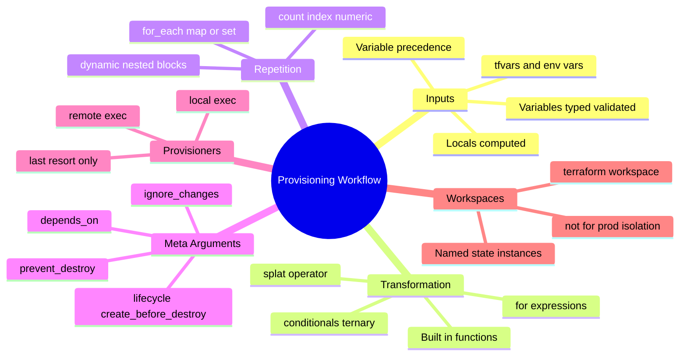
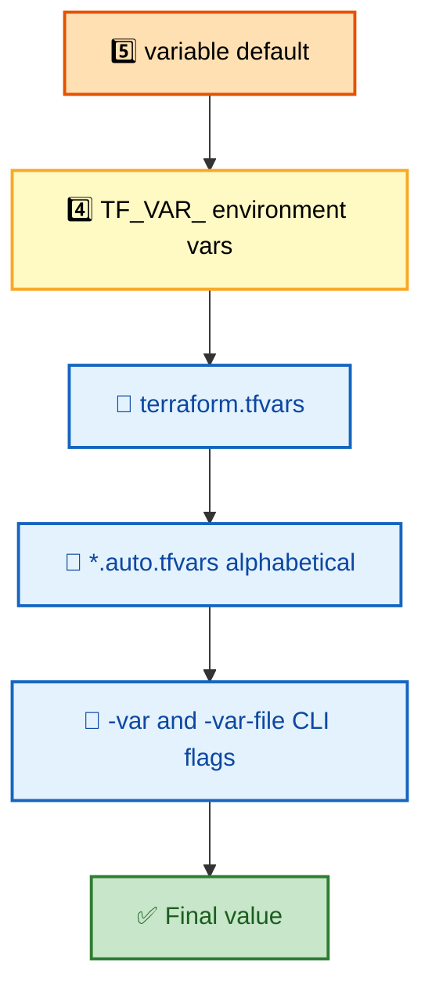
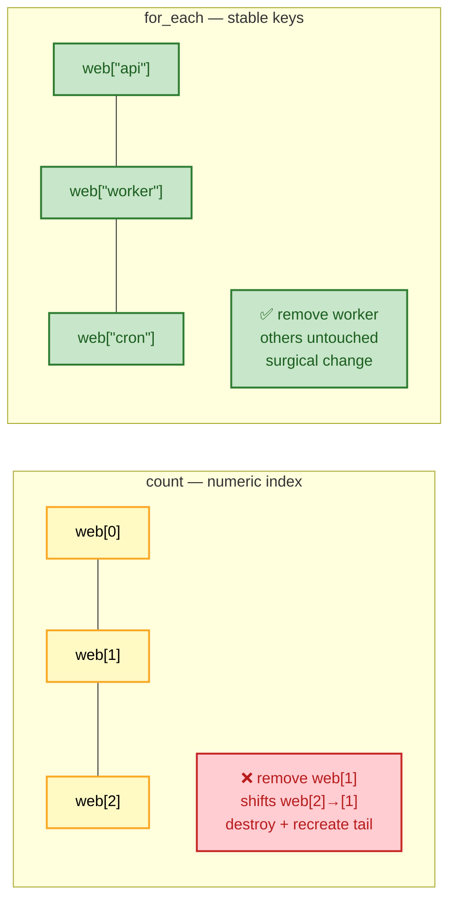

# SECTION 4: PROVISIONING WORKFLOW

> **Scope:** The mechanics you use to parameterize and shape configs — variables/locals/outputs, built-in functions, `count` vs `for_each`, `dynamic` blocks, the `lifecycle` meta-arguments, provisioners, and workspaces.

---

## 🗺️ Visual Overview

**In one line:** Once the plan/apply engine and modules are understood, this section is the **toolbox** — how you feed values in (variables/locals), transform them (functions/`for`), repeat resources (`count`/`for_each`), generate nested blocks (`dynamic`), and control replace/destroy behavior (`lifecycle`).

**Mind map — the whole section at a glance:**



**Variable precedence — who wins when a value is set in many places:**



**count vs for_each — the addressing model that decides churn:**



> 🧠 **Memory hooks (mnemonics):**
> - **count vs for_each:** *"Count for clones, for_each for names."* `count` = identical numbered copies; `for_each` = keyed, stable addresses.
> - **Variable precedence:** *"CLI beats files beats env beats default"* — command-line `-var` always wins.
> - **lifecycle trio:** *"Create-before, Prevent, Ignore"* → `create_before_destroy`, `prevent_destroy`, `ignore_changes`.
> - **Provisioners:** *"Last resort"* — reach for user_data / config-mgmt first.

---

## 1. Variables, Locals & Outputs

> 🎯 **Interview weight:** ⭐⭐⭐⭐ — the input/parameterization layer.

**In one line:** **Variables** are typed, validatable inputs; **locals** are named computed expressions (DRY within a config); **outputs** expose values to the CLI, to parent modules, or to other configs via remote state.

```hcl
variable "environment" {
  type        = string
  description = "Deployment environment"
  validation {
    condition     = contains(["dev", "staging", "prod"], var.environment)
    error_message = "Must be dev, staging, or prod."
  }
}

variable "instance_count" {
  type    = number
  default = 2
}

locals {                              # computed once, reused everywhere
  name_prefix = "${var.environment}-app"
  common_tags = {
    Environment = var.environment
    ManagedBy   = "terraform"
  }
}

output "app_url" {
  description = "Public URL of the app"
  value       = aws_lb.main.dns_name
}
```

**Variable precedence (highest wins)** — *"CLI beats files beats env beats default"*:

1. `-var` / `-var-file` on the command line
2. `*.auto.tfvars` (alphabetical order)
3. `terraform.tfvars`
4. `TF_VAR_<name>` environment variables
5. `default` in the `variable` block

| Concept | Purpose | Scope |
|---|---|---|
| `variable` | External input | Set by caller/CLI/env |
| `local` | Computed/derived value | Internal to the module |
| `output` | Expose a value | To CLI / parent / remote state |

> 💡 **Interview tip:** Use **`sensitive = true`** on variables and outputs holding secrets to redact them from CLI/log output — but remember (from [Section 2](./02-STATE-MANAGEMENT.md)) that the value is still plaintext in state. Redaction ≠ encryption.

---

## 2. Functions & Expressions

> 🎯 **Interview weight:** ⭐⭐⭐ — fluency with transforming data.

**In one line:** Terraform ships ~100 built-in functions (string, numeric, collection, encoding, filesystem, type conversion) plus `for` expressions and conditionals — there are **no user-defined functions**, so you compose built-ins.

```hcl
# String / collection functions
name        = lower(trimspace(var.raw_name))
subnet_ids  = slice(aws_subnet.all[*].id, 0, 2)
merged_tags = merge(local.common_tags, { Team = "payments" })

# Conditional (ternary)
instance_type = var.environment == "prod" ? "m5.large" : "t3.micro"

# for expression — transform a list/map
upper_names = [for n in var.names : upper(n)]
name_to_id  = { for s in aws_subnet.all : s.tags["Name"] => s.id }

# Splat operator — pull an attribute from every instance
all_ips = aws_instance.web[*].private_ip
```

> ⚠️ **Gotcha:** Functions run at **plan time**, on values known during planning. A function referencing an attribute that's only known *after* apply (e.g., a not-yet-created resource's ID) yields `(known after apply)` in the plan — you can't, say, `substr()` an ID that doesn't exist yet and branch on it.

---

## 3. `count` vs `for_each` — Resource Repetition

> 🎯 **Interview weight:** ⭐⭐⭐⭐⭐ — one of the most-asked Terraform mechanics.

**In one line:** Both create multiple instances of a resource, but `count` addresses by **numeric index** (`[0]`, `[1]`) while `for_each` addresses by **stable string key** (`["api"]`) — and that addressing difference decides whether add/remove is surgical or destructive.

```hcl
# count — identical numbered copies
resource "aws_instance" "web" {
  count         = 3
  instance_type = "t3.micro"
  tags = { Name = "web-${count.index}" }
}

# for_each — keyed by a map/set, stable addresses
resource "aws_instance" "app" {
  for_each      = toset(["api", "worker", "cron"])
  instance_type = "t3.micro"
  tags = { Name = "app-${each.key}" }
}
```

| | `count` | `for_each` |
|---|---|---|
| Argument | a number | a map or set of strings |
| Instance address | `web[0]`, `web[1]` | `app["api"]`, `app["worker"]` |
| Iterator | `count.index` | `each.key` / `each.value` |
| Remove-middle behavior | **shifts indices → destroy+recreate tail** | keyed → only the removed one changes |
| Best for | truly identical clones, on/off toggles | named, heterogeneous sets |

> 💡 **Interview tip:** *"Count for clones, for_each for names."* Use `count = var.enabled ? 1 : 0` as a clean **conditional-create** toggle. Use `for_each` for anything with identity (per-AZ subnets, per-service instances) so removing one item doesn't churn the rest.

> ⚠️ **Gotcha:** You can't `for_each` over a value that's **unknown at plan time** (e.g., IDs of resources not yet created) — Terraform needs the *keys* during planning. Key off known inputs (names, static maps), not computed attributes.

---

## 4. `dynamic` Blocks

> 🎯 **Interview weight:** ⭐⭐⭐ — generating repeated nested blocks.

**In one line:** A `dynamic` block programmatically generates **repeatable nested blocks** (like multiple `ingress` rules in a security group) from a collection, instead of hand-writing each one.

```hcl
resource "aws_security_group" "web" {
  name = "web-sg"

  dynamic "ingress" {
    for_each = var.allowed_ports          # e.g. [80, 443, 8080]
    content {
      from_port   = ingress.value
      to_port     = ingress.value
      protocol    = "tcp"
      cidr_blocks = ["0.0.0.0/0"]
    }
  }
}
```

> ⚠️ **Gotcha:** `dynamic` blocks hurt readability fast. If a block always has one or two fixed entries, write them literally. Reserve `dynamic` for genuinely variable-length nested blocks driven by input.

---

## 5. `lifecycle` Meta-Arguments

> 🎯 **Interview weight:** ⭐⭐⭐⭐ — controlling replace/destroy behavior is a prod-safety topic.

**In one line:** The `lifecycle` block overrides Terraform's default create/update/destroy behavior — the key trio is `create_before_destroy`, `prevent_destroy`, and `ignore_changes`.

```hcl
resource "aws_instance" "web" {
  # ...
  lifecycle {
    create_before_destroy = true          # spin up replacement before killing old (zero-downtime)
    prevent_destroy       = true          # hard-block any plan that would destroy this
    ignore_changes        = [tags["LastPatched"]]  # don't fight out-of-band tag changes
  }
}
```

| Meta-arg | Effect | Use case |
|---|---|---|
| `create_before_destroy` | New resource created **before** old is destroyed | Zero-downtime replacement (ASG launch templates, instances behind an LB) |
| `prevent_destroy` | Plan **errors** if the resource would be destroyed | Protect prod databases, state buckets |
| `ignore_changes` | Ignore drift on listed attributes | Attributes managed by autoscalers/other tools |
| `replace_triggered_by` | Force replace when a referenced thing changes | Rotate an instance when its config hash changes |

> ⚠️ **Gotcha:** `prevent_destroy` blocks *destroy*, but a **`-/+` replace** (immutable attribute change) also triggers it — the plan will error until you remove the flag or stop forcing replacement. And `create_before_destroy` requires the resource's naming to allow two to coexist briefly (unique names, no hard-coded conflicting identifiers).

---

## 6. Provisioners

> 🎯 **Interview weight:** ⭐⭐⭐ — interviewers want to hear "last resort."

**In one line:** Provisioners (`local-exec`, `remote-exec`, `file`) run scripts as part of create/destroy — but HashiCorp explicitly calls them a **last resort** because they break the declarative model and aren't tracked in state.

```hcl
resource "aws_instance" "web" {
  # ...
  provisioner "local-exec" {
    command = "echo ${self.private_ip} >> inventory.txt"
  }
  provisioner "remote-exec" {
    inline = ["sudo systemctl restart nginx"]
  }
}
```

> 💡 **Interview tip:** Prefer alternatives: **`user_data`/cloud-init** for bootstrap, **baked AMIs (Packer)** for immutable images, and **config-management (Ansible)** for in-place setup. Provisioners run **once at create** (not on subsequent applies), have no drift detection, and a failed provisioner marks the resource **tainted**. Say "last resort" and you've answered correctly.

---

## 7. Workspaces

> 🎯 **Interview weight:** ⭐⭐⭐ — commonly misunderstood; interviewers probe the misconception.

**In one line:** A **workspace** is a named, separate state instance within the *same* backend/config — handy for ephemeral or parallel copies, but **not** a substitute for real per-environment isolation.

```bash
terraform workspace new dev
terraform workspace select prod
terraform workspace list
# reference the current workspace in config:
#   name = "app-${terraform.workspace}"
```

> ⚠️ **Gotcha — the classic trap:** Workspaces share **one config and one backend**; only the state differs. That makes it dangerously easy to run `apply` against the wrong workspace and hit prod. For production, prefer **directory-per-environment with separate backends** (see [Section 3](./03-MODULES-STRUCTURE.md)) so dev and prod can't share a config or a credential path. Use workspaces for short-lived, identical environments (per-PR previews, feature branches).

---

## Interview Questions & Answers

### Q1: `count` vs `for_each` — when do you use each, and why does it matter?

**Answer:** `count` for identical numbered copies or an on/off toggle (`count = var.enabled ? 1 : 0`); `for_each` for named, heterogeneous sets. It matters because `count` addresses by index — removing a middle element shifts every later index and Terraform destroys+recreates the tail. `for_each` keys by a stable string, so add/remove touches only that element.

**Internals:** Resource instance addresses (`web[0]` vs `app["api"]`) are stored in state; the address is what plan diffs against. Index shifts change addresses; string keys don't.

**Follow-up — "Can you `for_each` over resource IDs?"** No — keys must be known at plan time. Key off static inputs/names, not computed attributes.

### Q2: How does variable precedence work?

**Answer:** Highest to lowest: CLI `-var`/`-var-file` → `*.auto.tfvars` (alphabetical) → `terraform.tfvars` → `TF_VAR_*` env vars → the variable's `default`. Command-line flags always win.

**Follow-up — "Where do secrets go?"** Not in `*.tfvars` committed to git. Use `TF_VAR_*` from a secrets manager/CI secret, or a secrets provider — and remember they still land plaintext in state.

### Q3: Explain `create_before_destroy` and when it's required.

**Answer:** By default Terraform destroys the old resource before creating the replacement, causing downtime. `create_before_destroy = true` inverts that — new first, then destroy old — enabling zero-downtime replacement (e.g., instances behind a load balancer, launch templates).

**Internals:** It requires the two resources to coexist briefly, so names/identifiers must not collide. It also propagates: dependencies may need the same flag to reorder correctly.

**Follow-up — "What blocks it?"** Hard-coded unique names that can't have two live at once; you must template the name or let the provider generate it.

### Q4: Why are provisioners a last resort?

**Answer:** They're imperative escape hatches that break Terraform's declarative, idempotent model: they run once at create, aren't re-evaluated or drift-detected, and a failure taints the resource. Prefer `user_data`/cloud-init, baked AMIs, or config-management tools.

**Follow-up — "When are they legitimately OK?"** Genuinely one-off glue with no native resource — e.g., `local-exec` to trigger an external API that has no provider, or bootstrapping in a lab. Even then, keep them idempotent and minimal.

### Q5: Are Terraform workspaces good for separating prod and dev?

**Answer:** Generally no. Workspaces share one config and one backend/credential path, so it's easy to apply to the wrong environment and hit prod. Use directory-per-environment with separate backends for real isolation and blast-radius control. Workspaces suit ephemeral, identical environments (per-PR previews).

**Follow-up — "What do workspaces actually change?"** Only the state instance (e.g., a state key suffix). The config, providers, and backend are identical across workspaces.

---

## ✅ Best Practices

- Prefer **`for_each`** over `count` unless you truly need index-based clones.
- Use **`count = cond ? 1 : 0`** for conditional creation.
- Keep **secrets out of committed `tfvars`**; use env vars / secrets managers.
- Protect prod with **`prevent_destroy`**; achieve zero-downtime with **`create_before_destroy`**.
- Use **`ignore_changes`** for attributes owned by autoscalers/other tools.
- Treat **provisioners as a last resort**; prefer `user_data`/Packer/Ansible.
- Use **directory-per-env**, not workspaces, for production isolation.

---

**[← Prev: Modules & Structure](./03-MODULES-STRUCTURE.md)** | **[Back to Index](./README.md)** | **[Next: Production & CI/CD →](./05-PRODUCTION-CICD.md)**
