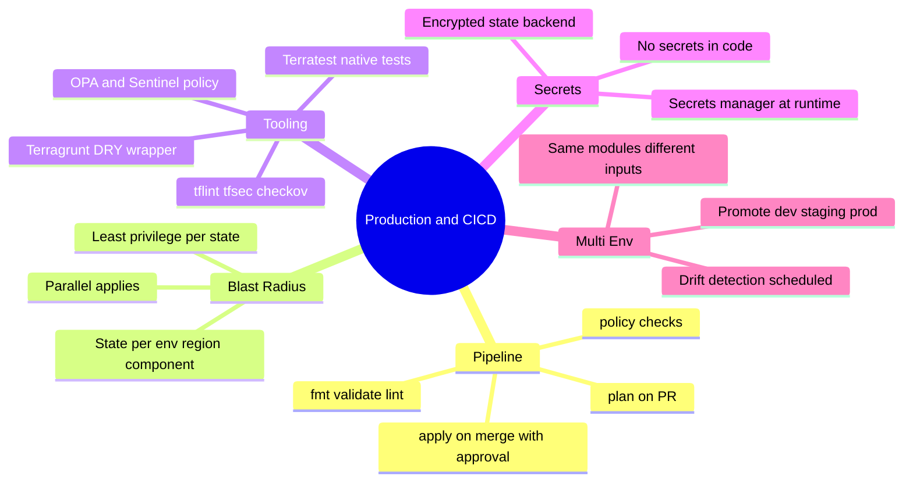
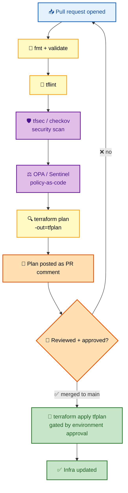
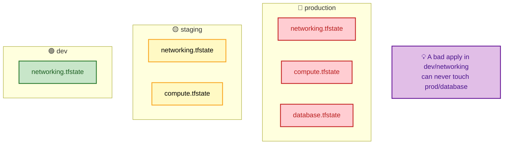

# SECTION 5: PRODUCTION & CI/CD

> **Scope:** Running Terraform at scale — plan/apply pipelines, Terragrunt, policy-as-code (OPA/Sentinel), testing & linting, secrets handling, and multi-environment blast-radius design.

---

## 🗺️ Visual Overview

**In one line:** Production Terraform is less about HCL and more about **governance** — gating applies behind reviewed plans, enforcing policy automatically, isolating state per env to limit blast radius, and keeping secrets out of code and logs.

**Mind map — the whole section at a glance:**



**The CI/CD pipeline — plan on PR, apply on merge:**



**Blast-radius isolation — state per env / region / component:**



> 🧠 **Memory hooks (mnemonics):**
> - **Pipeline order:** *"Format, Validate, Lint, Scan, Plan, Approve, Apply"* (FVLSPAA).
> - **Blast radius:** *"Isolate to insulate"* — separate state per env/region/component.
> - **Secrets:** *"Never in code, always at runtime, always encrypted at rest."*
> - **Gate:** *"Plan is the PR, apply is the merge."* Humans review the plan diff, not the raw HCL alone.

---

## 1. The Plan/Apply Pipeline

> 🎯 **Interview weight:** ⭐⭐⭐⭐⭐ — "how do you run Terraform safely in CI/CD?"

**In one line:** The golden pattern is **plan on PR (as a comment), apply on merge (behind an approval)** — so every infrastructure change is a reviewed diff, and apply runs the *exact* plan that was reviewed via a saved plan file.

**Pipeline stages (FVLSPAA):**

1. **`terraform fmt -check`** — formatting gate.
2. **`terraform validate`** — syntax/type validation.
3. **`tflint`** — provider-aware linting (deprecated args, invalid instance types).
4. **`tfsec` / `checkov`** — security scanning (open SGs, unencrypted buckets).
5. **`terraform plan -out=tfplan`** — posted as a PR comment for review.
6. **Approval** — human review + environment protection rule.
7. **`terraform apply tfplan`** — runs the saved plan exactly.

```yaml
name: Terraform
on:
  pull_request:
    paths: ['environments/**']
  push:
    branches: [main]
    paths: ['environments/**']

jobs:
  plan:
    runs-on: ubuntu-latest
    steps:
      - uses: actions/checkout@v4
      - uses: hashicorp/setup-terraform@v3
        with: { terraform_version: 1.5.0 }
      - name: Configure AWS via OIDC      # no long-lived keys in CI
        uses: aws-actions/configure-aws-credentials@v4
        with:
          role-to-assume: arn:aws:iam::123456789012:role/TerraformCI
          aws-region: us-east-1
      - run: terraform init
        working-directory: environments/production/us-east-1
      - name: Terraform Plan
        id: plan
        run: terraform plan -no-color -out=tfplan
        working-directory: environments/production/us-east-1
      - name: Comment plan on PR
        uses: actions/github-script@v7
        with:
          script: |
            github.rest.issues.createComment({
              issue_number: context.issue.number,
              owner: context.repo.owner, repo: context.repo.repo,
              body: `#### Terraform Plan 📖\n\`\`\`\n${{ steps.plan.outputs.stdout }}\n\`\`\``
            })

  apply:
    needs: plan
    if: github.ref == 'refs/heads/main'
    runs-on: ubuntu-latest
    environment: production        # GitHub environment protection = manual approval
    steps:
      - run: terraform apply -auto-approve tfplan
```

> 💡 **Interview tip:** Two things senior interviewers listen for: (1) **saved plan** (`-out`) so apply ≠ a fresh, possibly-different plan; and (2) **OIDC federation** instead of long-lived cloud keys in CI — the runner assumes a short-lived role, so there are no static secrets to leak.

> ⚠️ **Gotcha:** Don't run `terraform apply -auto-approve` directly against `main` without a saved plan — between the reviewed PR plan and the merge apply, real state can drift and apply could do something nobody reviewed. Always `apply` the saved `tfplan`.

---

## 2. Terragrunt

> 🎯 **Interview weight:** ⭐⭐⭐ — DRY at scale; know *why* it exists.

**In one line:** **Terragrunt** is a thin wrapper around Terraform that removes repetition — it generates backend blocks, keeps inputs DRY across environments, and can apply multiple modules with dependency ordering (`run-all`).

```hcl
# terragrunt.hcl — generates the backend so you don't copy it into every env
remote_state {
  backend = "s3"
  config = {
    bucket         = "my-tf-state"
    key            = "${path_relative_to_include()}/terraform.tfstate"
    region         = "us-east-1"
    encrypt        = true
    dynamodb_table = "tf-locks"
  }
}

include "root" { path = find_in_parent_folders() }

inputs = {
  environment = "prod"
  vpc_cidr    = "10.0.0.0/16"
}
```

| Problem in raw Terraform | Terragrunt answer |
|---|---|
| Backend block copy-pasted per env | `remote_state` generates it |
| Same inputs repeated across envs | `inputs` + include hierarchy |
| Apply 10 modules in order by hand | `terragrunt run-all apply` (dependency graph) |

> 💡 **Interview tip:** Terragrunt's value is **keeping backends and inputs DRY** across many state-isolated environments. The trade-off is another tool/abstraction to learn and debug; native Terraform (1.6+) plus good directory structure covers many cases without it. Mention both sides.

---

## 3. Policy-as-Code (OPA & Sentinel)

> 🎯 **Interview weight:** ⭐⭐⭐⭐ — governance/guardrails is a senior/platform topic.

**In one line:** Policy-as-code evaluates the **plan** against rules *before* apply — blocking non-compliant changes (public S3 buckets, untagged resources, oversized instances) automatically instead of relying on human review.

| Tool | Language | Ecosystem | Typical use |
|---|---|---|---|
| **OPA / Conftest** | Rego | Open-source, any CI | Test `terraform show -json` plan output |
| **Sentinel** | Sentinel | Terraform Cloud/Enterprise | Native TFC policy enforcement |
| **tfsec / checkov** | built-in rules | Open-source scanners | Static security checks on HCL |

```rego
# OPA/Rego — deny any S3 bucket that isn't private
package terraform.s3
deny[msg] {
  r := input.resource_changes[_]
  r.type == "aws_s3_bucket_acl"
  r.change.after.acl == "public-read"
  msg := sprintf("S3 bucket %s must not be public-read", [r.address])
}
```

```bash
terraform plan -out=tfplan
terraform show -json tfplan > plan.json
conftest test plan.json          # OPA evaluates the plan, fails CI on deny
```

> 💡 **Interview tip:** The key design point: policy evaluates the **machine-readable plan** (`terraform show -json`), not the HCL source. That means it checks *actual resolved changes* (including computed values and module expansions), which HCL-only linters can miss. Enforcement modes — advisory (warn), soft-mandatory (override with approval), hard-mandatory (block) — mirror Sentinel.

---

## 4. Testing & Validation

> 🎯 **Interview weight:** ⭐⭐⭐ — "how do you test infrastructure code?"

**In one line:** Terraform testing spans **static** (fmt/validate/lint/security scan), **unit/contract** (native `terraform test`, module input validation), and **integration** (Terratest spins up real resources, asserts, tears down).

| Layer | Tool | What it checks |
|---|---|---|
| Format/syntax | `fmt`, `validate` | Style, valid HCL/types |
| Lint | `tflint` | Provider-specific mistakes |
| Security | `tfsec`, `checkov` | Misconfigurations/CVE patterns |
| Native tests | `terraform test` (1.6+) | Assertions on plan/apply in `.tftest.hcl` |
| Integration | Terratest (Go) | Deploys real infra, asserts, destroys |

```hcl
# native test (1.6+): example.tftest.hcl
run "validate_instance_type" {
  command = plan
  assert {
    condition     = aws_instance.web.instance_type == "t3.micro"
    error_message = "Default instance type must be t3.micro"
  }
}
```

> ⚠️ **Gotcha:** Integration tests (Terratest) create **real, billable** resources and can leave orphans if a test crashes before teardown. Always `defer terraform.Destroy`, run in an isolated sandbox account, and add a reaper job to clean stray resources tagged by the test harness.

---

## 5. Secrets Handling

> 🎯 **Interview weight:** ⭐⭐⭐⭐ — ties back to state-in-plaintext from Section 2.

**In one line:** Keep secrets **out of HCL and tfvars**, inject them at runtime from a secrets manager, and always run on an **encrypted, access-controlled state backend** — because any secret Terraform touches lands in state as plaintext.

**Where secrets should and shouldn't live:**

| ❌ Don't | ✅ Do |
|---|---|
| Hard-code in `.tf` | Read from Vault / AWS Secrets Manager / SSM at runtime |
| Commit in `terraform.tfvars` | Pass via `TF_VAR_*` from CI secret store |
| Rely on `sensitive = true` for security | Encrypt state at rest + restrict IAM/RBAC |
| Print with `terraform output` in logs | Mark `sensitive`, fetch via `-raw` only when needed |

```hcl
# Pull a secret at runtime instead of storing it
data "aws_secretsmanager_secret_version" "db" {
  secret_id = "prod/db/password"
}
resource "aws_db_instance" "main" {
  password = data.aws_secretsmanager_secret_version.db.secret_string
}
```

> ⚠️ **Gotcha:** Even when you source a password from Secrets Manager, its value is written into **state** as plaintext (it's now a resource attribute). `sensitive = true` only redacts it from CLI/log output. The real controls are: encrypted backend (S3+KMS), least-privilege IAM on the state bucket, and audit logging. This is the recurring "secrets in state" theme from [Section 2](./02-STATE-MANAGEMENT.md).

---

## 6. Multi-Environment Design

> 🎯 **Interview weight:** ⭐⭐⭐⭐⭐ — the system-design layer of Terraform interviews.

**In one line:** Promote the **same versioned modules** through dev → staging → prod with **different inputs and isolated state per env/region/component**, so changes are tested low and applied high with a contained blast radius.

**State isolation strategy (blast radius):**

```text
s3://terraform-state-bucket/
├── production/us-east-1/networking/terraform.tfstate
├── production/us-east-1/compute/terraform.tfstate
├── production/us-east-1/database/terraform.tfstate
├── production/eu-west-1/networking/terraform.tfstate
├── staging/us-east-1/networking/terraform.tfstate
└── dev/us-east-1/networking/terraform.tfstate
```

**Benefits:** limited blast radius, parallel applies across states, per-team state permissions, and independent lifecycle per component.

> 💡 **Interview tip:** The phrase to land is **"limit the blast radius."** Isolate state per `environment / region / component` so a bad apply in `dev/networking` can never reach `prod/database`. This also unlocks **parallel applies** and **per-team IAM** on each state. Share values across states read-only via `terraform_remote_state` data sources — but sparingly, since it couples states.

---

## Interview Questions & Answers

### Q1: Describe a safe Terraform CI/CD pipeline.

**Answer:** On PR: `fmt` → `validate` → `tflint` → `tfsec/checkov` → `plan -out=tfplan`, post the plan as a PR comment. On merge to main, behind an environment approval, run `apply tfplan` — the *saved* plan, so apply does exactly what was reviewed. Authenticate via OIDC (short-lived role), not static keys.

**Internals:** The saved plan pins the change set; applying `main` with a fresh `-auto-approve` risks drift between review and apply. Policy-as-code and security scans gate the PR before a human ever sees it.

**Follow-up — "How do you stop a bad apply reaching prod?"** Environment protection rules (manual approval), isolated prod state/credentials, `prevent_destroy` on critical resources, and hard-mandatory policies.

### Q2: What is policy-as-code and how does it fit the workflow?

**Answer:** Automated rules (OPA/Rego or Sentinel) that evaluate the machine-readable plan (`terraform show -json`) and block non-compliant changes — public buckets, missing tags, disallowed instance types — before apply. It scales governance beyond manual review.

**Internals:** Evaluating the JSON plan catches resolved/computed values and module expansions that HCL linters miss. Enforcement can be advisory, soft-mandatory (overridable), or hard-mandatory (blocking).

**Follow-up — "OPA vs Sentinel?"** OPA/Conftest is open-source and CI-agnostic; Sentinel is native to Terraform Cloud/Enterprise. Pick OPA for open tooling, Sentinel if you're on TFC/TFE.

### Q3: How do you handle secrets in Terraform?

**Answer:** Never hard-code or commit them. Inject at runtime from a secrets manager (Vault/Secrets Manager/SSM) or via `TF_VAR_*` from CI secrets. Run on an encrypted, IAM-restricted state backend. Mark sensitive to redact logs — but know the value is still plaintext in state.

**Follow-up — "Can you keep secrets out of state?"** Mostly not for attribute secrets; minimize sensitive resources and rely on encrypted backend + least-privilege + audit logging as the real protection.

### Q4: How do you structure multiple environments to limit blast radius?

**Answer:** Same versioned modules, thin per-env roots, and isolated state per env/region/component. A bad apply is contained to one state and one lock. This enables parallel applies and per-team permissions, and lets you promote changes dev → staging → prod with different inputs.

**Internals:** Each root's backend key = its own state object + lock. Cross-state reads go through `terraform_remote_state` (read-only), used sparingly to avoid coupling.

**Follow-up — "Workspaces instead?"** Riskier for prod — shared config/credentials make wrong-env applies easy. Directories + separate backends are safer.

### Q5: What does Terragrunt solve that raw Terraform doesn't?

**Answer:** DRY backends and inputs across many state-isolated environments, plus `run-all` to apply multiple modules in dependency order. It removes copy-pasted backend blocks and repeated inputs.

**Follow-up — "Downside?"** Another abstraction/tool to learn and debug; modern Terraform plus disciplined directory structure covers many cases without it.

---

## ✅ Best Practices

- **Plan on PR, apply on merge**, always with a **saved plan** (`-out`).
- **OIDC/short-lived credentials** in CI — no static cloud keys.
- **Policy-as-code + security scanning** as required gates.
- **Isolate state** per env/region/component to limit blast radius.
- **Secrets at runtime**, encrypted backend, least-privilege IAM.
- **Environment protection rules** (manual approval) before prod apply.
- **Scheduled drift detection** (`plan -detailed-exitcode`) with alerting.

---

**[← Prev: Provisioning Workflow](./04-PROVISIONING-WORKFLOW.md)** | **[Back to Index](./README.md)** | **[Next: Troubleshooting →](./06-TROUBLESHOOTING.md)**
