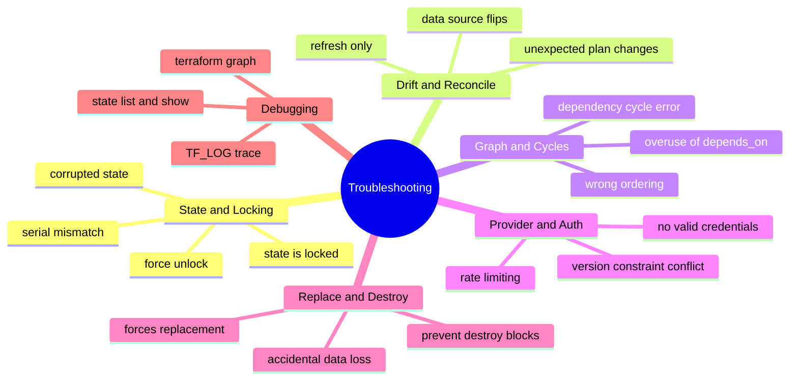
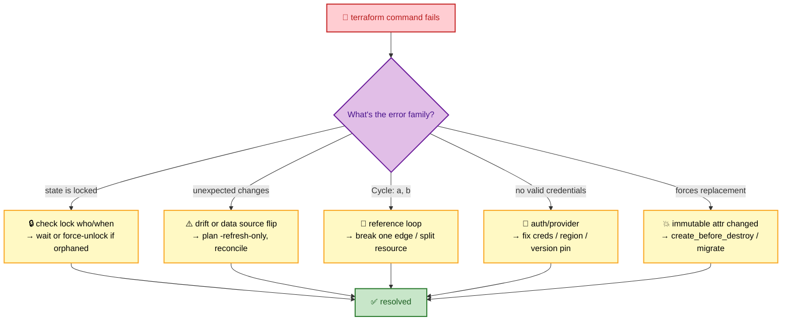
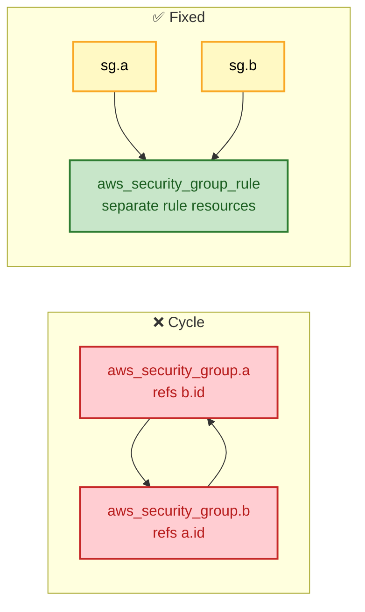

# SECTION 6: TROUBLESHOOTING

> **Scope:** The failure modes every earlier section can hit — lock conflicts, drift, dependency cycles, provider/auth errors, state corruption, and `-/+` surprises — with a decision-tree method and `TF_LOG` debugging.

---

## 🗺️ Visual Overview

**In one line:** Terraform failures cluster into a handful of families — **state/locking**, **drift/reconcile**, **graph/cycles**, **provider/auth**, and **replace/destroy surprises** — and each has a recognizable symptom → root-cause → fix path.

**Mind map — the whole section at a glance:**



**Triage decision tree — symptom to fix (red = problem, green = resolution):**



**Breaking a dependency cycle:**



> 🧠 **Memory hooks (mnemonics):**
> - **Five families:** *"Locks, Drift, Cycles, Creds, Replace"* (LDCCR).
> - **Lock rule:** *"Check who before you force."* Never `force-unlock` a live apply.
> - **Replace rule:** *"Read the `# forces replacement` before you apply."*
> - **Debug ladder:** *"Plan → `TF_LOG` → `graph` → `state show`."*

---

## 1. State & Locking Failures

> 🎯 **Interview weight:** ⭐⭐⭐⭐⭐ — on-call scenarios lean here.

### `Error: state is locked`

**Symptom:** Apply/plan refuses to start, showing `Lock Info` (ID, who, created, operation).

**Root causes (ranked):**
1. A concurrent apply is genuinely running — **wait**.
2. A previous run crashed (killed CI job, lost network) leaving an **orphaned lock**.
3. `force-unlock` was skipped after a crash.

**Fix:**
```bash
# Inspect the lock's Who/Created fields first
# Only if you're certain the holder is dead:
terraform force-unlock <LOCK_ID>
```

> ⚠️ **Gotcha:** `force-unlock` doesn't verify the holder is dead. Unlocking an *active* apply lets two writers race and corrupt state. Check the lock's `Who`/`Created` before forcing.

### Serial / lineage mismatch on push

**Symptom:** `Error: state snapshot was created by a different ...` or a serial conflict when pushing.

**Root cause:** Pushing a **stale** state (lower serial) or an **unrelated** state (different lineage) over the current one.

**Fix:** Re-`pull` the latest state, re-apply your intended changes, and never blind-`state push`. Bucket versioning lets you recover a prior good snapshot.

### Corrupted / truncated state

**Root cause:** A crash mid-write, a bad manual edit, or a partial upload.

**Fix:** Restore from **backend versioning** (S3 object version, Blob snapshot) — this is *why* you enable versioning on the state bucket. As a last resort, reconcile by `import`ing resources into a fresh state.

---

## 2. Drift & Unexpected Plan Changes

> 🎯 **Interview weight:** ⭐⭐⭐⭐ — "why does my plan show changes I didn't make?"

**Symptom:** `plan` proposes changes to resources you didn't edit.

**Root causes:**
1. **Drift** — something changed the resource out-of-band (console click, autoscaler, patch script).
2. **Data source flip** — a `data` lookup (e.g., "most recent AMI") now returns a new value.
3. **Provider default changes** — a provider upgrade changed a default/computed attribute.
4. **`ignore_changes` missing** — an attribute another system manages keeps drifting back.

**Fix path:**
```bash
terraform plan -refresh-only     # see drift without proposing config changes
terraform apply -refresh-only    # accept reality into state (config unchanged)
# or edit config to match reality, or apply to revert reality to config
```

> 💡 **Interview tip:** For attributes owned by another system (autoscaler desired count, externally-managed tags), add them to `lifecycle { ignore_changes = [...] }` so Terraform stops fighting them every plan.

---

## 3. Dependency Cycles & Ordering

> 🎯 **Interview weight:** ⭐⭐⭐⭐ — tests real understanding of the graph.

**Symptom:** `Error: Cycle: aws_security_group.a, aws_security_group.b`.

**Root cause:** Two (or more) resources reference each other's attributes, so the DAG has a loop — which Terraform can't topologically order.

**Fixes:**
- **Break one edge:** extract the mutual reference into a separate resource (e.g., `aws_security_group_rule` instead of inline `ingress` referencing the other SG).
- **Introduce a third resource / `local`** that both depend on, instead of each other.
- **Remove an unnecessary `depends_on`** that created an artificial loop.

```bash
terraform graph | dot -Tsvg > graph.svg   # visualize to spot the loop
```

> ⚠️ **Gotcha:** Over-using `depends_on` not only causes cycles — it **serializes** the graph and slows applies by defeating parallelism. Prefer real attribute references; use `depends_on` only for genuine hidden ordering.

---

## 4. Provider & Authentication Errors

> 🎯 **Interview weight:** ⭐⭐⭐⭐ — the most common "it won't even start" failures.

| Error | Root cause | Fix |
|---|---|---|
| `No valid credential sources found` | Missing/expired creds, wrong profile, no role assumed | Set env vars / profile; in CI use OIDC role; check `AWS_PROFILE`/`role_arn` |
| `Failed to query available provider packages` | Version constraint conflict or registry/network issue | Reconcile `required_providers` ranges; `init -upgrade`; check proxy |
| `Inconsistent dependency lock file` | `.terraform.lock.hcl` doesn't match constraints | `terraform init -upgrade` to refresh the lock |
| `RequestLimitExceeded` / throttling | Too many parallel API calls | Lower `-parallelism=N`; add retry/backoff; split state |
| `Error: Provider produced inconsistent result` | Provider bug or eventual-consistency race | Re-apply; pin/upgrade provider; report upstream |

> 💡 **Interview tip:** For CI, the fix for credential errors is almost always **OIDC federation** — the runner assumes a short-lived role, so there are no expired static keys. For throttling, reducing `-parallelism` and splitting monolithic state into smaller states (fewer concurrent calls per apply) both help.

---

## 5. Replace & Destroy Surprises

> 🎯 **Interview weight:** ⭐⭐⭐⭐⭐ — the "you almost dropped prod" scenario.

**Symptom:** Plan shows `-/+ destroy and then create replacement` on a stateful resource (database, volume).

**Root cause:** An **immutable** (`ForceNew`) attribute changed — e.g., an RDS `engine`, an EC2 `availability_zone`, a resource `name` the API can't change in place.

**Fixes / guards:**
- Read the plan's **`# forces replacement`** annotation before applying.
- Add `lifecycle { create_before_destroy = true }` where coexistence is valid (zero-downtime).
- Add `lifecycle { prevent_destroy = true }` to hard-block accidental destruction of prod-critical resources.
- For a legitimate rename, use a **`moved` block** ([Section 2](./02-STATE-MANAGEMENT.md)) so it's *not* destroy+recreate.

> ⚠️ **Gotcha:** `prevent_destroy` will make the plan **error** on a forced replacement — that's the point. To proceed intentionally you must remove the flag and plan a real migration (snapshot, create new, cut over, destroy old). Never `-target` your way around it blindly.

---

## 6. Debugging Toolkit

> 🎯 **Interview weight:** ⭐⭐⭐ — knowing the ladder of diagnostics.

**In one line:** Climb the ladder — start with a plain `plan`, escalate to `TF_LOG` for provider/API traces, use `terraform graph` for ordering issues, and `state list`/`state show` to inspect what Terraform actually tracks.

```bash
# Verbose logging (TRACE, DEBUG, INFO, WARN, ERROR)
export TF_LOG=DEBUG
export TF_LOG_PATH=./tf.log        # send logs to a file
terraform apply

# Inspect the graph / ordering
terraform graph | dot -Tsvg > graph.svg

# Inspect tracked state
terraform state list
terraform state show aws_instance.web

# Targeted operation (debugging only — not routine!)
terraform plan -target=aws_instance.web
```

| Tool | When to use |
|---|---|
| `terraform plan` | First look — what does TF *think* it will do? |
| `TF_LOG=DEBUG/TRACE` | Provider/API-level failures, auth, throttling |
| `terraform graph` | Cycle/ordering problems |
| `state list` / `state show` | "Is this even tracked? What are its attrs?" |
| `terraform console` | Evaluate expressions/functions interactively |

> ⚠️ **Gotcha — `-target`:** It's a **debugging** tool, not a workflow. Routinely applying with `-target` produces a partial, out-of-sync state and hides real drift. Use it to unstick a bad apply, then run a full plan/apply to reconcile.

---

## Interview Questions & Answers

### Q1: A teammate's apply crashed and now everyone gets `state is locked`. What do you do?

**Answer:** Inspect the lock's `Who`/`Created`/`Operation` info. Confirm no apply is actually running (check CI, ask the person). If the holder is genuinely dead (crashed runner), run `terraform force-unlock <LOCK_ID>`. Never force-unlock a live apply — it can corrupt state.

**Internals:** The lock is a DynamoDB item (S3 backend) or native lock; a crash before release orphans it. Force-unlock deletes it unconditionally.

**Follow-up — "How do you prevent orphaned locks?"** Run applies in CI with proper timeouts/cleanup, and prefer short applies over giant monolithic states.

### Q2: Your plan wants to destroy and recreate the production database. Walk through handling it.

**Answer:** Stop — read the `# forces replacement` line to find the immutable attribute that changed. Don't apply. If the change is unnecessary, revert the config. If it's required, plan a migration: snapshot, create the new instance (`create_before_destroy` or a new resource), cut over, then decommission — and keep `prevent_destroy` on the critical DB as a guard.

**Internals:** Providers mark attributes `ForceNew`; changing one yields `-/+`. `prevent_destroy` makes such a plan error, forcing a deliberate migration path.

**Follow-up — "It was just a rename."** Use a `moved` block so Terraform re-addresses the existing resource instead of destroy+recreate.

### Q3: `terraform plan` shows changes but nobody edited the config. Why?

**Answer:** Drift (out-of-band change), a data source returning new values (e.g., latest AMI), or a provider upgrade changing defaults. Use `plan -refresh-only` to see drift, then reconcile: revert reality to config, rewrite config to match, or `ignore_changes` for attributes another system owns.

**Follow-up — "How do you detect drift proactively?"** Scheduled `plan -detailed-exitcode` (exit 2 = drift) wired to alerting.

### Q4: You hit `Error: Cycle`. How do you diagnose and fix it?

**Answer:** Two resources reference each other, creating a loop in the DAG. Visualize with `terraform graph`. Break the cycle by extracting the mutual dependency into a separate resource (e.g., standalone `aws_security_group_rule`), routing through a shared third resource/`local`, or removing an artificial `depends_on`.

**Follow-up — "Why can't Terraform just handle it?"** Because it's a *directed acyclic* graph — topological ordering is impossible with a cycle, so it must error.

### Q5: Applies are randomly failing with `RequestLimitExceeded`. Fix it.

**Answer:** The provider is making too many concurrent API calls and the cloud is throttling. Lower `-parallelism=N` (default 10), ensure the provider's retry/backoff is enabled, and split a monolithic state into smaller isolated states so each apply makes fewer concurrent calls.

**Follow-up — "Design-level fix?"** State isolation per component (Section 5) reduces per-apply API pressure and blast radius simultaneously.

---

## 🛠️ Quick Reference

| Symptom | Family | First move |
|---|---|---|
| `state is locked` | Lock | Check who/when → `force-unlock` if orphaned |
| Plan shows unexpected changes | Drift | `plan -refresh-only`, `ignore_changes` |
| `Error: Cycle` | Graph | `terraform graph`, break one edge |
| `No valid credential sources` | Auth | Fix creds/profile; OIDC in CI |
| `-/+` on stateful resource | Replace | Read `# forces replacement`; migrate; `prevent_destroy` |
| `RequestLimitExceeded` | Provider | Lower `-parallelism`; split state |
| Corrupted state | State | Restore from backend versioning |

---

## ✅ Best Practices

- Enable **backend versioning** so corrupted/lost state is recoverable.
- **Check the lock** before you ever `force-unlock`.
- **Read `# forces replacement`** on every plan touching stateful resources.
- Use **`prevent_destroy`** on prod-critical resources; **`moved`** for renames.
- Prefer **attribute references** over `depends_on` to avoid cycles and keep parallelism.
- Keep **`-target`** for emergencies only; always follow with a full reconcile.
- Debug with the ladder: **`plan` → `TF_LOG` → `graph` → `state show`**.

---

**[← Prev: Production & CI/CD](./05-PRODUCTION-CICD.md)** | **[Back to Index](./README.md)**
