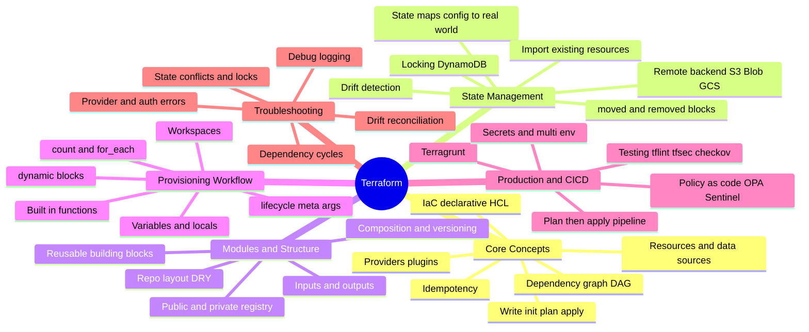

# Terraform — Deep Dive Interview Preparation

> **Scope:** Infrastructure as Code with Terraform for Senior DevOps, SRE, and Platform Engineer roles at FAANG/MANGA companies.
> **Coverage:** Core concepts & the plan/apply engine, state internals & remote backends, modules & project structure, the provisioning workflow (variables, functions, meta-args, lifecycle), production CI/CD & policy-as-code, and troubleshooting.

This guide is split into **section-wise files**. Each file is self-contained, interview-focused, and goes deep on **internals, trade-offs, and failure modes** — not trivia. Read the mind map below first to see how the pieces connect, then follow the study order.

---

## 🗺️ Repo-Wide Mind Map

**Skim this first, revisit it last** — it is the whole guide on one screen:

> 🧠 **Memory hooks (mnemonics):**
> - **Core workflow:** *"Willing Iguanas Plan Around Snacks"* → **W**rite → **I**nit → **P**lan → **A**pply → **S**tate.
> - **What state is for:** *"Map, Meta, Money, Many"* → resource **Map**ping, **Meta**data, performance (**Money**/API caching), and team collaboration (**Many** via locking).
> - **count vs for_each:** *"Count for clones, for_each for names."*
> - **Drift fix options:** *"Revert, Rewrite, or Reimport."*

---

## 📚 Master Table of Contents

| # | Section | File | Topics | Interview Weight |
|---|---------|------|--------|------------------|
| 1 | Core Concepts | [01-CORE-CONCEPTS.md](./01-CORE-CONCEPTS.md) | IaC vs config mgmt, providers, resources/data sources, HCL, the init→plan→apply lifecycle, the dependency graph, idempotency | ⭐⭐⭐⭐⭐ |
| 2 | State Management | [02-STATE-MANAGEMENT.md](./02-STATE-MANAGEMENT.md) | State file internals, remote backends, locking, the refresh/reconcile algorithm, drift, import, `moved`/`removed`, `state mv/rm` | ⭐⭐⭐⭐⭐ |
| 3 | Modules & Structure | [03-MODULES-STRUCTURE.md](./03-MODULES-STRUCTURE.md) | Module anatomy, composition, versioning, registry sources, project layout, DRY strategies | ⭐⭐⭐⭐ |
| 4 | Provisioning Workflow | [04-PROVISIONING-WORKFLOW.md](./04-PROVISIONING-WORKFLOW.md) | Variables/locals/outputs, functions, `count`/`for_each`, `dynamic`, `lifecycle`, provisioners, workspaces | ⭐⭐⭐⭐ |
| 5 | Production & CI/CD | [05-PRODUCTION-CICD.md](./05-PRODUCTION-CICD.md) | Plan/apply pipelines, Terragrunt, policy-as-code (OPA/Sentinel), testing, secrets, multi-env & blast-radius | ⭐⭐⭐⭐⭐ |
| 6 | Troubleshooting | [06-TROUBLESHOOTING.md](./06-TROUBLESHOOTING.md) | Lock conflicts, drift, dependency cycles, provider/auth errors, state corruption, debugging with `TF_LOG` | ⭐⭐⭐⭐ |

---

## 🎯 Recommended Study Order

1. **Start with [01-CORE-CONCEPTS](./01-CORE-CONCEPTS.md)** — you cannot reason about anything else until the plan/apply engine and the dependency graph are second nature.
2. **Then [02-STATE-MANAGEMENT](./02-STATE-MANAGEMENT.md)** — state is *the* Terraform interview topic. Master the reconcile algorithm, locking, and drift.
3. **[03-MODULES-STRUCTURE](./03-MODULES-STRUCTURE.md)** and **[04-PROVISIONING-WORKFLOW](./04-PROVISIONING-WORKFLOW.md)** — how real codebases are organized and parameterized.
4. **[05-PRODUCTION-CICD](./05-PRODUCTION-CICD.md)** — the "how do you run this for 50 teams" system-design layer that senior interviews probe hard.
5. **[06-TROUBLESHOOTING](./06-TROUBLESHOOTING.md)** — the failure modes every one of the above can hit. Read it last, but expect it first in on-call-style rounds.

> 💡 **How to use each file:** Every section opens with a **Visual Overview** (mind map + colorful flow diagrams + memory hooks), teaches topics depth-first with `🎯 Interview weight` and `In one line` framing, and closes with an **Interview Questions & Answers** block (crisp answer → internals → follow-up) plus troubleshooting/best-practices.

---

## 📖 Depth Model (applied to every section)

- **Level 1 — Foundation:** plain-language definition + the problem it solves.
- **Level 2 — Mechanics:** components, data flow, configuration choices.
- **Level 3 — Internals:** control-plane/graph behavior, failure modes, performance.
- **Level 4 — Interview depth:** trade-offs, design decisions, and follow-up Q&A.

---

## 📚 Documentation Links

- [Terraform Documentation](https://developer.hashicorp.com/terraform/docs)
- [Terraform Language (HCL) Reference](https://developer.hashicorp.com/terraform/language)
- [Terraform Best Practices](https://www.terraform-best-practices.com/)
- [Terraform Registry (modules & providers)](https://registry.terraform.io/)
- [Terraform Cloud/Enterprise](https://developer.hashicorp.com/terraform/cloud-docs)

---

**[← Back to Main README](../README.md)** | **[Start: Core Concepts →](./01-CORE-CONCEPTS.md)**
