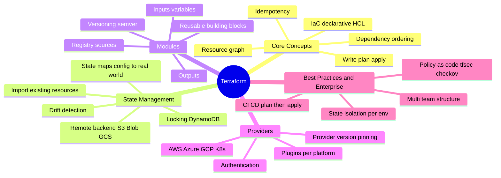
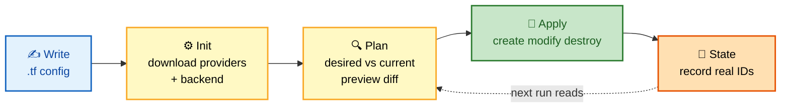
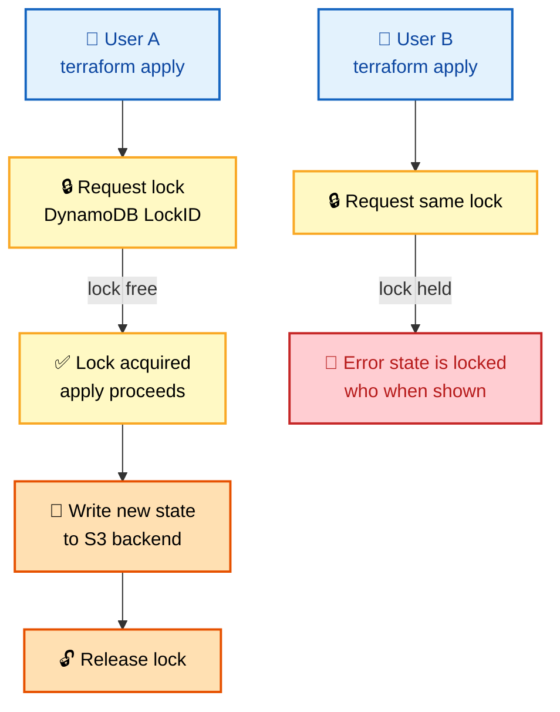
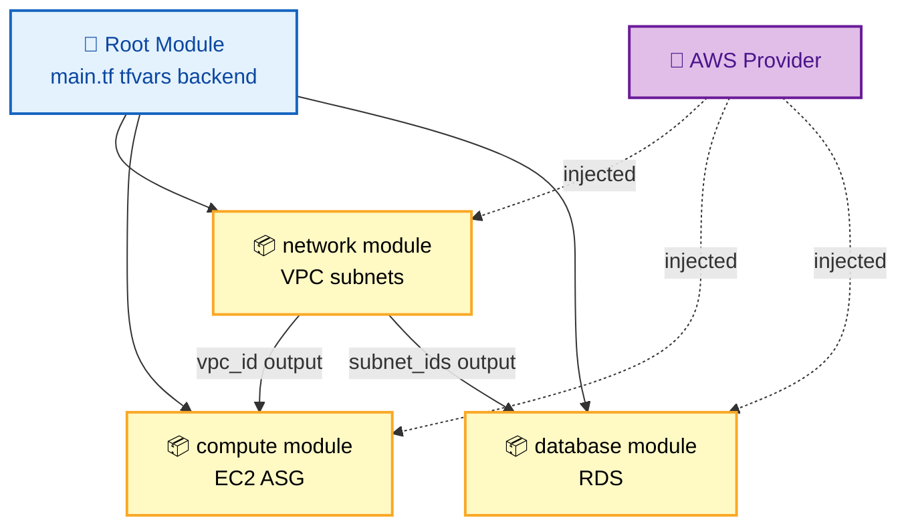
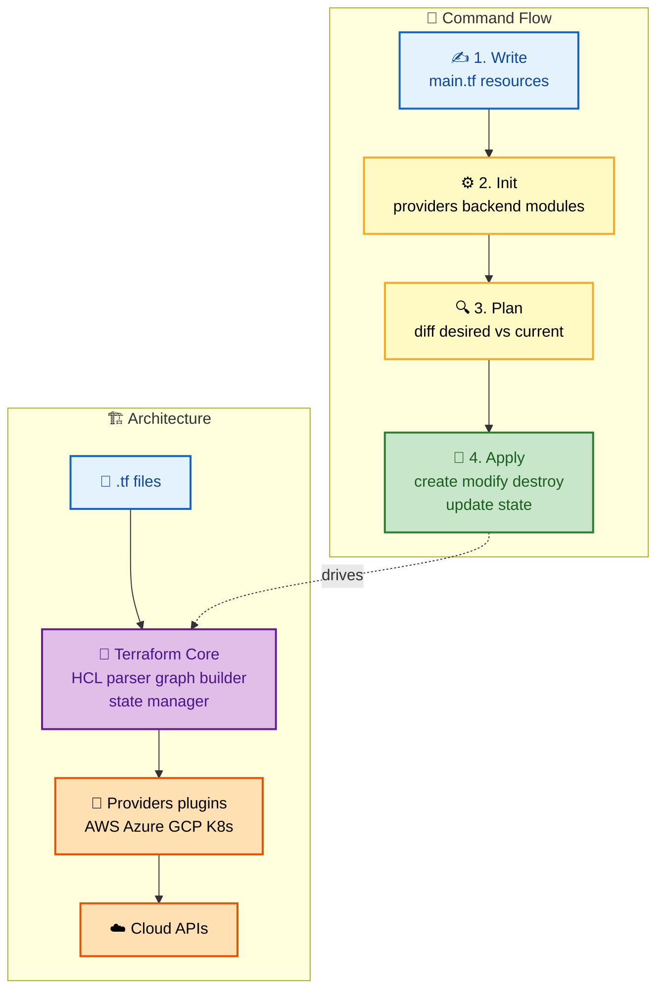
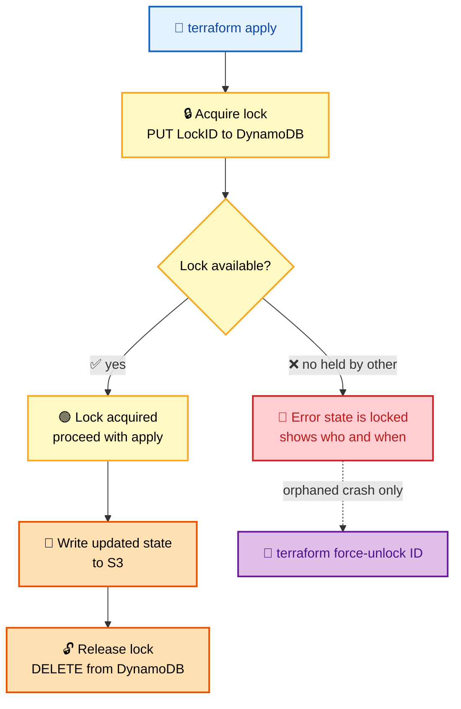
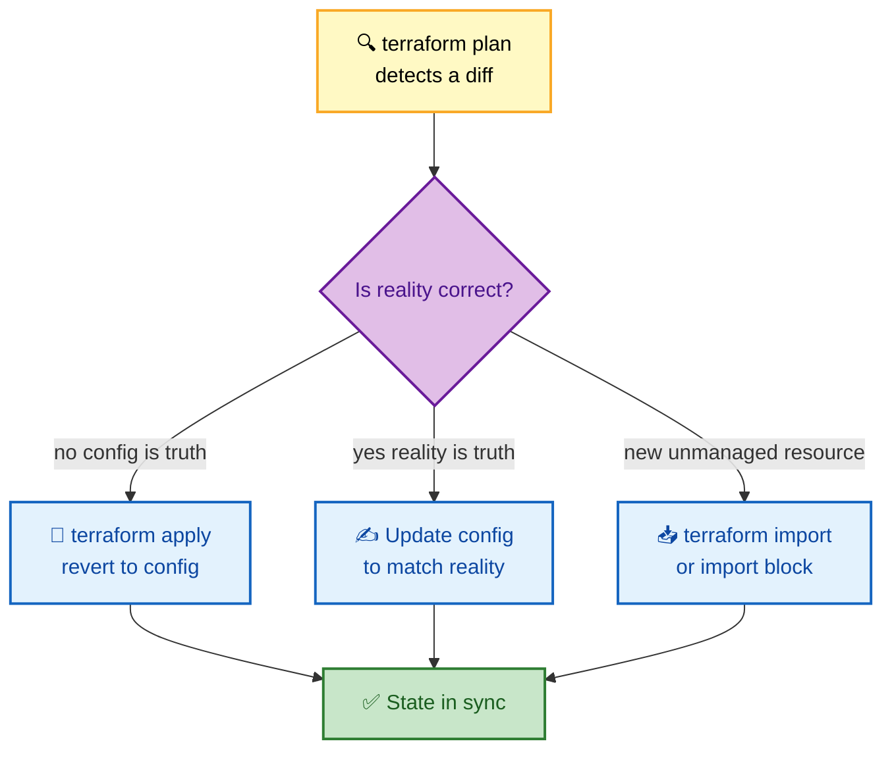
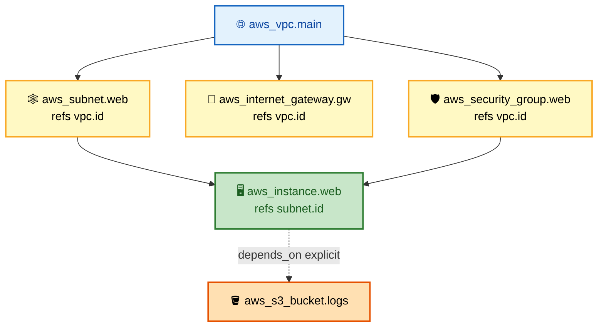

# Terraform Interview Questions - Complete Guide

> **250+ Terraform Interview Questions for Senior DevOps Engineer, SRE, and Platform Engineer roles at FAANG companies**

---

## 📋 Table of Contents

- [Core Concepts](#core-concepts)
- [State Management](#state-management)
- [Modules](#modules)
- [Providers](#providers)
- [Best Practices](#best-practices)
- [Troubleshooting](#troubleshooting)
- [Enterprise Patterns](#enterprise-patterns)

---

## 🗺️ Visual Overview

**Mind map — the whole guide at a glance** (skim this first, revisit it last):



**The core workflow — memorize this five-step flow** (highest-value diagram in the guide):



**State locking with a remote backend — why two engineers never corrupt state:**



**Module composition — root config wires providers into reusable modules:**



> 🧠 **Memory hooks (mnemonics):**
> - **Core workflow:** *"Willing IguanasPlan Around Snacks"* → **W**rite → **I**nit → **P**lan → **A**pply → **S**tate.
> - **State-lock flow:** *"Lock → Apply → Write → Unlock"* (LAWU). The lock is grabbed *before* the write and dropped *after* — so a crash mid-apply leaves an orphaned lock you clear with `force-unlock`.
> - **count vs for_each:** *"Count for clones, for_each for names."* `count` = identical numbered copies (index changes = churn); `for_each` = keyed map/set (stable addresses, safe add/remove).
> - **What state is for:** *"Map, Meta, Money, Many"* → resource **Map**ping, **Meta**data, performance (**Money**/API caching), and team collaboration (**Many** users via locking).
> - **Drift fix options:** *"Revert, Rewrite, or Reimport"* → apply to revert, update config to match, or import the change.

---

## Core Concepts

### 🟢 Basic Questions

#### Q1: What is Terraform and how does it work?

**Basic Answer:**
Terraform is an Infrastructure as Code tool that uses declarative configuration files to provision and manage infrastructure across multiple cloud providers using a plan-apply workflow.

**Advanced Answer:**

```
┌─────────────────────────────────────────────────────────────────┐
│                    TERRAFORM WORKFLOW                            │
├─────────────────────────────────────────────────────────────────┤
│                                                                  │
│  1. WRITE (Configuration)                                       │
│     ┌─────────────────────────────────────────────────────┐     │
│     │  main.tf                                             │     │
│     │  resource "aws_instance" "web" {                     │     │
│     │    ami           = "ami-12345"                       │     │
│     │    instance_type = "t3.micro"                        │     │
│     │  }                                                   │     │
│     └─────────────────────────────────────────────────────┘     │
│                            │                                     │
│                            ▼                                     │
│  2. INIT (Initialize)                                           │
│     ┌─────────────────────────────────────────────────────┐     │
│     │  terraform init                                      │     │
│     │  • Downloads providers                               │     │
│     │  • Initializes backend                               │     │
│     │  • Downloads modules                                 │     │
│     └─────────────────────────────────────────────────────┘     │
│                            │                                     │
│                            ▼                                     │
│  3. PLAN (Preview)                                              │
│     ┌─────────────────────────────────────────────────────┐     │
│     │  terraform plan                                      │     │
│     │  • Compares desired state vs current state          │     │
│     │  • Shows what will be created/modified/destroyed    │     │
│     │  • No changes made to infrastructure                 │     │
│     └─────────────────────────────────────────────────────┘     │
│                            │                                     │
│                            ▼                                     │
│  4. APPLY (Execute)                                             │
│     ┌─────────────────────────────────────────────────────┐     │
│     │  terraform apply                                     │     │
│     │  • Creates/modifies/destroys resources              │     │
│     │  • Updates state file                                │     │
│     │  • Handles dependencies automatically                │     │
│     └─────────────────────────────────────────────────────┘     │
│                                                                  │
│  TERRAFORM ARCHITECTURE:                                        │
│  ┌─────────────────────────────────────────────────────────┐    │
│  │                                                          │    │
│  │  Configuration Files (.tf)                               │    │
│  │         │                                                │    │
│  │         ▼                                                │    │
│  │  ┌─────────────────┐                                     │    │
│  │  │  Terraform Core │                                     │    │
│  │  │  • HCL Parser   │                                     │    │
│  │  │  • Graph Builder│                                     │    │
│  │  │  • State Manager│                                     │    │
│  │  └────────┬────────┘                                     │    │
│  │           │                                              │    │
│  │           ▼                                              │    │
│  │  ┌─────────────────────────────────────────────────┐     │    │
│  │  │              Providers (Plugins)                 │     │    │
│  │  │  ┌─────┐  ┌─────┐  ┌─────┐  ┌─────┐           │     │    │
│  │  │  │ AWS │  │Azure│  │ GCP │  │K8s  │  ...       │     │    │
│  │  │  └──┬──┘  └──┬──┘  └──┬──┘  └──┬──┘           │     │    │
│  │  └─────┼────────┼───────┼────────┼───────────────┘     │    │
│  │        │        │       │        │                       │    │
│  │        ▼        ▼       ▼        ▼                       │    │
│  │     Cloud APIs / Infrastructure                          │    │
│  │                                                          │    │
│  └─────────────────────────────────────────────────────────┘    │
│                                                                  │
└─────────────────────────────────────────────────────────────────┘
```

**🎨 Same workflow + architecture, colorized:**



> 💡 **Interview tip:** Terraform is **declarative** — you describe the desired end state, and the graph engine figures out the order. Contrast with **imperative** tools (scripts) where you spell out each step. The provider plugins are what actually translate HCL into cloud API calls.

---

#### Q2: Explain Terraform state and why it's important.

**Basic Answer:**
Terraform state is a JSON file that maps real-world resources to your configuration. It tracks resource metadata, dependencies, and is essential for determining what changes need to be made.

**Advanced Answer:**

```
┌─────────────────────────────────────────────────────────────────┐
│                    TERRAFORM STATE                               │
├─────────────────────────────────────────────────────────────────┤
│                                                                  │
│  PURPOSE OF STATE:                                              │
│  ┌─────────────────────────────────────────────────────────┐    │
│  │  1. Resource Mapping                                     │    │
│  │     Configuration resource → Real infrastructure         │    │
│  │     aws_instance.web → i-0abc123def456                   │    │
│  │                                                          │    │
│  │  2. Metadata Tracking                                    │    │
│  │     • Resource dependencies                              │    │
│  │     • Provider information                               │    │
│  │     • Terraform version                                  │    │
│  │                                                          │    │
│  │  3. Performance                                          │    │
│  │     • Caches attribute values                            │    │
│  │     • Reduces API calls                                  │    │
│  │                                                          │    │
│  │  4. Team Collaboration                                   │    │
│  │     • Shared state for team members                      │    │
│  │     • Locking prevents concurrent modifications          │    │
│  └─────────────────────────────────────────────────────────┘    │
│                                                                  │
│  STATE FILE STRUCTURE:                                          │
│  ┌─────────────────────────────────────────────────────────┐    │
│  │  {                                                       │    │
│  │    "version": 4,                                         │    │
│  │    "terraform_version": "1.5.0",                         │    │
│  │    "serial": 42,                                         │    │
│  │    "lineage": "abc-123-def",                             │    │
│  │    "outputs": { ... },                                   │    │
│  │    "resources": [                                        │    │
│  │      {                                                   │    │
│  │        "mode": "managed",                                │    │
│  │        "type": "aws_instance",                           │    │
│  │        "name": "web",                                    │    │
│  │        "provider": "provider[\"registry.../aws\"]",      │    │
│  │        "instances": [                                    │    │
│  │          {                                               │    │
│  │            "attributes": {                               │    │
│  │              "id": "i-0abc123def456",                    │    │
│  │              "ami": "ami-12345",                         │    │
│  │              ...                                         │    │
│  │            }                                             │    │
│  │          }                                               │    │
│  │        ]                                                 │    │
│  │      }                                                   │    │
│  │    ]                                                     │    │
│  │  }                                                       │    │
│  └─────────────────────────────────────────────────────────┘    │
│                                                                  │
│  SENSITIVE DATA IN STATE:                                       │
│  ⚠️ State contains sensitive data in plaintext!                 │
│  • Database passwords                                           │
│  • API keys                                                     │
│  • Encryption keys                                              │
│                                                                  │
│  → Always use encrypted remote backend                          │
│  → Enable encryption at rest                                    │
│  → Restrict access via IAM/RBAC                                 │
│                                                                  │
└─────────────────────────────────────────────────────────────────┘
```

> ⚠️ **Gotcha:** State stores **secrets in plaintext** (DB passwords, keys). Never commit `terraform.tfstate` to Git. Always use an **encrypted remote backend** with restricted IAM/RBAC — this is a classic interview trap.

---

## State Management

### 🟡 Intermediate Questions

#### Q3: How do you configure remote state with locking?

**Basic Answer:**
Use a backend configuration to store state remotely (S3, Azure Blob, GCS) with locking (DynamoDB for AWS) to prevent concurrent modifications.

**Advanced Answer:**

```hcl
# AWS S3 Backend with DynamoDB Locking
terraform {
  backend "s3" {
    bucket         = "my-terraform-state"
    key            = "environments/production/terraform.tfstate"
    region         = "us-east-1"
    encrypt        = true
    kms_key_id     = "alias/terraform-state"
    dynamodb_table = "terraform-state-lock"
    
    # Role assumption for cross-account
    role_arn       = "arn:aws:iam::123456789012:role/TerraformStateAccess"
  }
}

# DynamoDB table for locking
resource "aws_dynamodb_table" "terraform_lock" {
  name           = "terraform-state-lock"
  billing_mode   = "PAY_PER_REQUEST"
  hash_key       = "LockID"

  attribute {
    name = "LockID"
    type = "S"
  }

  tags = {
    Purpose = "Terraform State Locking"
  }
}
```

```
┌─────────────────────────────────────────────────────────────────┐
│                    STATE LOCKING FLOW                            │
├─────────────────────────────────────────────────────────────────┤
│                                                                  │
│  User A: terraform apply                                        │
│  ┌─────────────────────────────────────────────────────────┐    │
│  │  1. Request lock from DynamoDB                           │    │
│  │     PUT: LockID = "my-bucket/path/terraform.tfstate"     │    │
│  │                                                          │    │
│  │  2. Lock acquired ✓                                      │    │
│  │     → Proceed with apply                                 │    │
│  │                                                          │    │
│  │  User B: terraform apply (concurrent)                    │    │
│  │  ┌─────────────────────────────────────────────────┐     │    │
│  │  │  1. Request lock from DynamoDB                   │     │    │
│  │  │  2. Lock exists! ✗                               │     │    │
│  │  │  3. Error: "state is locked"                     │     │    │
│  │  │     Lock Info:                                   │     │    │
│  │  │     - Who: user-a@example.com                    │     │    │
│  │  │     - When: 2024-01-15T10:30:00Z                 │     │    │
│  │  └─────────────────────────────────────────────────┘     │    │
│  │                                                          │    │
│  │  3. Apply completes                                      │    │
│  │  4. Release lock (DELETE from DynamoDB)                  │    │
│  └─────────────────────────────────────────────────────────┘    │
│                                                                  │
│  Force unlock (emergency):                                      │
│  terraform force-unlock <LOCK_ID>                               │
│  ⚠️ Only use if lock is orphaned (crashed process)              │
│                                                                  │
└─────────────────────────────────────────────────────────────────┘
```

**🎨 Lock lifecycle, colorized (happy path vs blocked path):**



> ⚠️ **Gotcha:** `force-unlock` does **not** verify the other process is dead — only run it when you're certain the lock is orphaned (e.g. a CI runner crashed mid-apply). Force-unlocking an active apply can corrupt state.

---

#### Q4: How do you handle state drift and imports?

**Basic Answer:**
State drift occurs when infrastructure changes outside Terraform. Use `terraform refresh` to update state, `terraform import` to bring existing resources under management, and `terraform plan` to detect drift.

**Advanced Answer:**

```
┌─────────────────────────────────────────────────────────────────┐
│                    HANDLING STATE DRIFT                          │
├─────────────────────────────────────────────────────────────────┤
│                                                                  │
│  DRIFT DETECTION:                                               │
│  ┌─────────────────────────────────────────────────────────┐    │
│  │                                                          │    │
│  │  # Plan shows drift                                      │    │
│  │  terraform plan                                          │    │
│  │                                                          │    │
│  │  # Resource modified outside Terraform:                  │    │
│  │  ~ aws_instance.web                                      │    │
│  │      ~ instance_type = "t3.micro" -> "t3.large"          │    │
│  │        # (changed outside of Terraform)                  │    │
│  │                                                          │    │
│  │  Options:                                                │    │
│  │  1. Apply to revert to Terraform config                  │    │
│  │  2. Update config to match reality                       │    │
│  │  3. Import the change                                    │    │
│  │                                                          │    │
│  └─────────────────────────────────────────────────────────┘    │
│                                                                  │
│  IMPORTING EXISTING RESOURCES:                                  │
│  ┌─────────────────────────────────────────────────────────┐    │
│  │                                                          │    │
│  │  # Traditional import (requires empty resource block)    │    │
│  │  resource "aws_instance" "imported" {                    │    │
│  │    # Configuration will be filled after import           │    │
│  │  }                                                       │    │
│  │                                                          │    │
│  │  terraform import aws_instance.imported i-0abc123        │    │
│  │                                                          │    │
│  │  # Then run terraform show to see attributes             │    │
│  │  # Copy attributes to configuration                      │    │
│  │                                                          │    │
│  │  # Terraform 1.5+ import block (recommended)             │    │
│  │  import {                                                │    │
│  │    to = aws_instance.imported                            │    │
│  │    id = "i-0abc123"                                      │    │
│  │  }                                                       │    │
│  │                                                          │    │
│  │  # Generate configuration                                │    │
│  │  terraform plan -generate-config-out=imported.tf         │    │
│  │                                                          │    │
│  └─────────────────────────────────────────────────────────┘    │
│                                                                  │
│  STATE MANIPULATION (Use with caution):                         │
│  ┌─────────────────────────────────────────────────────────┐    │
│  │                                                          │    │
│  │  # Move resource to different address                    │    │
│  │  terraform state mv aws_instance.old aws_instance.new    │    │
│  │                                                          │    │
│  │  # Remove from state (doesn't destroy infrastructure)    │    │
│  │  terraform state rm aws_instance.abandoned               │    │
│  │                                                          │    │
│  │  # Pull state to local file                              │    │
│  │  terraform state pull > state.json                       │    │
│  │                                                          │    │
│  │  # Push modified state (dangerous!)                      │    │
│  │  terraform state push state.json                         │    │
│  │                                                          │    │
│  └─────────────────────────────────────────────────────────┘    │
│                                                                  │
└─────────────────────────────────────────────────────────────────┘
```

**🎨 Drift resolution decision, colorized:**



**🎨 Resource dependency graph — how Terraform orders `apply` (implicit refs + explicit `depends_on`):**



> 💡 **Interview tip:** Terraform builds a **DAG** (directed acyclic graph) from references. Resources with no dependency between them are created **in parallel** (default 10 at a time, tune with `-parallelism=N`). Use `depends_on` only when a dependency exists but isn't expressed through an attribute reference.

---

## Modules

### 🟡 Intermediate Questions

#### Q5: How do you design reusable Terraform modules?

**Basic Answer:**
Create modules with clear inputs (variables), outputs, and documentation. Use semantic versioning for module versions and follow the standard module structure.

**Advanced Answer:**

```
┌─────────────────────────────────────────────────────────────────┐
│                    MODULE DESIGN BEST PRACTICES                  │
├─────────────────────────────────────────────────────────────────┤
│                                                                  │
│  STANDARD MODULE STRUCTURE:                                     │
│  ┌─────────────────────────────────────────────────────────┐    │
│  │  modules/                                                │    │
│  │  └── vpc/                                                │    │
│  │      ├── main.tf          # Primary resources            │    │
│  │      ├── variables.tf     # Input variables              │    │
│  │      ├── outputs.tf       # Output values                │    │
│  │      ├── versions.tf      # Provider requirements        │    │
│  │      ├── README.md        # Documentation                │    │
│  │      ├── examples/        # Usage examples               │    │
│  │      │   └── complete/                                   │    │
│  │      │       └── main.tf                                 │    │
│  │      └── tests/           # Terratest tests              │    │
│  │          └── vpc_test.go                                 │    │
│  └─────────────────────────────────────────────────────────┘    │
│                                                                  │
│  MODULE DESIGN PRINCIPLES:                                      │
│  ┌─────────────────────────────────────────────────────────┐    │
│  │                                                          │    │
│  │  1. Single Responsibility                                │    │
│  │     • One module = one logical resource group            │    │
│  │     • VPC module, EKS module, RDS module (separate)      │    │
│  │                                                          │    │
│  │  2. Sensible Defaults                                    │    │
│  │     variable "instance_type" {                           │    │
│  │       default = "t3.micro"                               │    │
│  │       description = "EC2 instance type"                  │    │
│  │     }                                                    │    │
│  │                                                          │    │
│  │  3. Validation                                           │    │
│  │     variable "environment" {                             │    │
│  │       validation {                                       │    │
│  │         condition = contains(                            │    │
│  │           ["dev", "staging", "prod"],                    │    │
│  │           var.environment                                │    │
│  │         )                                                │    │
│  │         error_message = "Must be dev, staging, or prod." │    │
│  │       }                                                  │    │
│  │     }                                                    │    │
│  │                                                          │    │
│  │  4. Clear Outputs                                        │    │
│  │     output "vpc_id" {                                    │    │
│  │       description = "The ID of the VPC"                  │    │
│  │       value       = aws_vpc.main.id                      │    │
│  │     }                                                    │    │
│  │                                                          │    │
│  └─────────────────────────────────────────────────────────┘    │
│                                                                  │
│  MODULE VERSIONING:                                             │
│  ┌─────────────────────────────────────────────────────────┐    │
│  │                                                          │    │
│  │  # From Git with tag                                     │    │
│  │  module "vpc" {                                          │    │
│  │    source  = "git::https://github.com/org/modules.git//  │    │
│  │              vpc?ref=v1.2.3"                              │    │
│  │  }                                                       │    │
│  │                                                          │    │
│  │  # From Terraform Registry                               │    │
│  │  module "vpc" {                                          │    │
│  │    source  = "terraform-aws-modules/vpc/aws"             │    │
│  │    version = "~> 5.0"  # Allows 5.x but not 6.0          │    │
│  │  }                                                       │    │
│  │                                                          │    │
│  │  # From private registry                                 │    │
│  │  module "vpc" {                                          │    │
│  │    source  = "app.terraform.io/myorg/vpc/aws"            │    │
│  │    version = "1.2.3"                                     │    │
│  │  }                                                       │    │
│  │                                                          │    │
│  └─────────────────────────────────────────────────────────┘    │
│                                                                  │
└─────────────────────────────────────────────────────────────────┘
```

> 💡 **Interview tip:** A good module is **single-responsibility** (VPC, EKS, RDS as separate modules), has **sensible defaults**, **validated inputs**, and **clear outputs**. Pin versions with `version = "~> 5.0"` so a `terraform init` can't silently pull a breaking `6.0`.

> ⚠️ **Gotcha:** Prefer **`for_each` over `count`** for module/resource collections. With `count`, removing the middle item shifts every index and Terraform destroys+recreates the tail; `for_each` keys by a stable string so add/remove is surgical.

---

## Enterprise Patterns

### 🔴 Advanced Questions

#### Q6: How would you structure Terraform for a large enterprise with multiple teams?

**Basic Answer:**
Use a mono-repo or multi-repo approach with remote state, workspaces or directory-based environments, modules for reusability, and CI/CD for automation.

> 💡 **Interview tip:** The key phrase interviewers want is **"limit the blast radius"** — isolate state per `environment / region / component` so a bad apply in `dev/networking` can never touch `prod/database`. This also enables **parallel applies** and **per-team permissions**.

**Advanced Answer:**

```
┌─────────────────────────────────────────────────────────────────┐
│              ENTERPRISE TERRAFORM STRUCTURE                      │
├─────────────────────────────────────────────────────────────────┤
│                                                                  │
│  REPOSITORY STRUCTURE:                                          │
│  ┌─────────────────────────────────────────────────────────┐    │
│  │                                                          │    │
│  │  terraform-infrastructure/                               │    │
│  │  ├── modules/                    # Shared modules        │    │
│  │  │   ├── networking/                                     │    │
│  │  │   ├── compute/                                        │    │
│  │  │   ├── database/                                       │    │
│  │  │   └── security/                                       │    │
│  │  │                                                       │    │
│  │  ├── environments/               # Environment configs   │    │
│  │  │   ├── dev/                                            │    │
│  │  │   │   ├── us-east-1/                                  │    │
│  │  │   │   │   ├── main.tf                                 │    │
│  │  │   │   │   ├── backend.tf                              │    │
│  │  │   │   │   └── terraform.tfvars                        │    │
│  │  │   │   └── eu-west-1/                                  │    │
│  │  │   ├── staging/                                        │    │
│  │  │   └── production/                                     │    │
│  │  │                                                       │    │
│  │  ├── global/                     # Global resources      │    │
│  │  │   ├── iam/                                            │    │
│  │  │   ├── dns/                                            │    │
│  │  │   └── organization/                                   │    │
│  │  │                                                       │    │
│  │  └── .github/                    # CI/CD pipelines       │    │
│  │      └── workflows/                                      │    │
│  │          ├── terraform-plan.yml                          │    │
│  │          └── terraform-apply.yml                         │    │
│  │                                                          │    │
│  └─────────────────────────────────────────────────────────┘    │
│                                                                  │
│  STATE ISOLATION STRATEGY:                                      │
│  ┌─────────────────────────────────────────────────────────┐    │
│  │                                                          │    │
│  │  State per environment + region + component:             │    │
│  │                                                          │    │
│  │  s3://terraform-state-bucket/                            │    │
│  │  ├── production/us-east-1/networking/terraform.tfstate   │    │
│  │  ├── production/us-east-1/compute/terraform.tfstate      │    │
│  │  ├── production/us-east-1/database/terraform.tfstate     │    │
│  │  ├── production/eu-west-1/networking/terraform.tfstate   │    │
│  │  ├── staging/us-east-1/networking/terraform.tfstate      │    │
│  │  └── ...                                                 │    │
│  │                                                          │    │
│  │  Benefits:                                               │    │
│  │  • Blast radius limited                                  │    │
│  │  • Parallel applies possible                             │    │
│  │  • Team autonomy (different state permissions)           │    │
│  │                                                          │    │
│  └─────────────────────────────────────────────────────────┘    │
│                                                                  │
│  CI/CD PIPELINE:                                                │
│  ┌─────────────────────────────────────────────────────────┐    │
│  │                                                          │    │
│  │  PR Created                                              │    │
│  │      │                                                   │    │
│  │      ▼                                                   │    │
│  │  ┌─────────────────┐                                     │    │
│  │  │ terraform fmt   │ → Formatting check                  │    │
│  │  │ terraform valid │ → Syntax validation                 │    │
│  │  │ tflint          │ → Linting                           │    │
│  │  │ checkov/tfsec   │ → Security scanning                 │    │
│  │  └────────┬────────┘                                     │    │
│  │           │                                              │    │
│  │           ▼                                              │    │
│  │  ┌─────────────────┐                                     │    │
│  │  │ terraform plan  │ → Plan output as PR comment         │    │
│  │  └────────┬────────┘                                     │    │
│  │           │                                              │    │
│  │           ▼                                              │    │
│  │  PR Approved + Merged                                    │    │
│  │           │                                              │    │
│  │           ▼                                              │    │
│  │  ┌─────────────────┐                                     │    │
│  │  │ terraform apply │ → Apply with approval               │    │
│  │  └─────────────────┘                                     │    │
│  │                                                          │    │
│  └─────────────────────────────────────────────────────────┘    │
│                                                                  │
└─────────────────────────────────────────────────────────────────┘
```

GitHub Actions workflow example:
```yaml
name: Terraform
on:
  pull_request:
    paths:
      - 'environments/**'
  push:
    branches: [main]
    paths:
      - 'environments/**'

jobs:
  plan:
    runs-on: ubuntu-latest
    steps:
      - uses: actions/checkout@v4
      
      - name: Setup Terraform
        uses: hashicorp/setup-terraform@v3
        with:
          terraform_version: 1.5.0
          cli_config_credentials_token: ${{ secrets.TF_API_TOKEN }}
      
      - name: Terraform Init
        run: terraform init
        working-directory: environments/production/us-east-1
      
      - name: Terraform Plan
        id: plan
        run: terraform plan -no-color -out=tfplan
        working-directory: environments/production/us-east-1
        continue-on-error: true
      
      - name: Comment PR
        uses: actions/github-script@v7
        with:
          script: |
            const output = `#### Terraform Plan 📖
            \`\`\`
            ${{ steps.plan.outputs.stdout }}
            \`\`\``;
            github.rest.issues.createComment({
              issue_number: context.issue.number,
              owner: context.repo.owner,
              repo: context.repo.repo,
              body: output
            })

  apply:
    needs: plan
    if: github.ref == 'refs/heads/main'
    runs-on: ubuntu-latest
    environment: production
    steps:
      - name: Terraform Apply
        run: terraform apply -auto-approve tfplan
```

---

## 📚 Documentation Links

- [Terraform Documentation](https://developer.hashicorp.com/terraform/docs)
- [Terraform Best Practices](https://www.terraform-best-practices.com/)
- [AWS Provider Docs](https://registry.terraform.io/providers/hashicorp/aws/latest/docs)
- [Terraform Cloud](https://developer.hashicorp.com/terraform/cloud-docs)
- [Module Registry](https://registry.terraform.io/browse/modules)

---

**[← Back to Main README](../README.md)** | **[Next: Ansible →](../ansible/README.md)**
