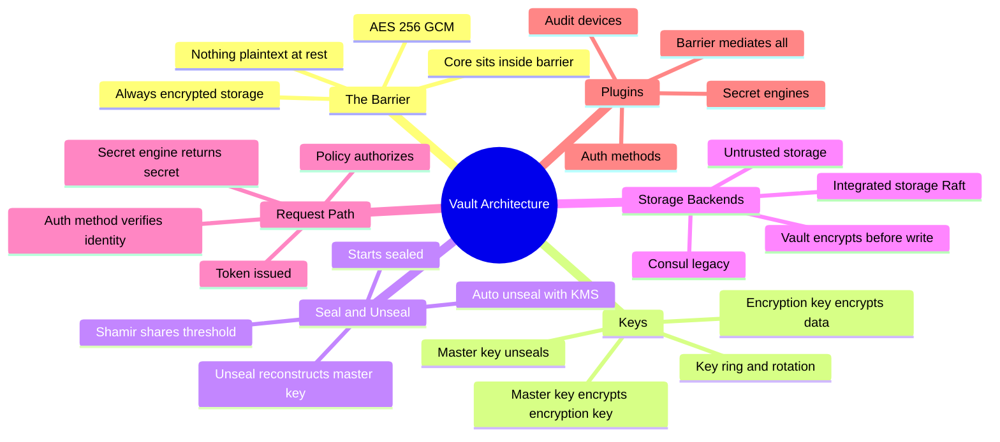
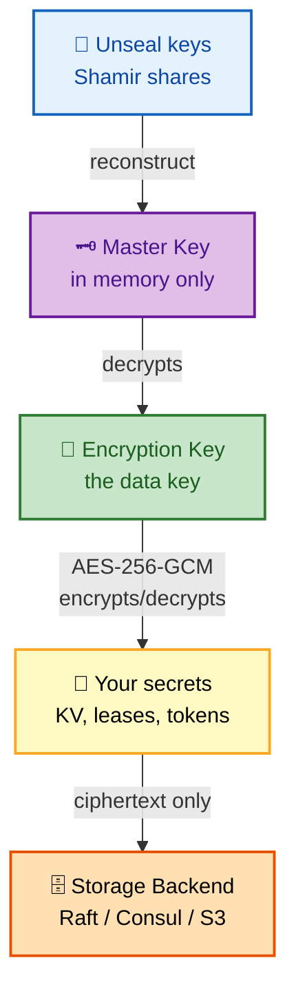
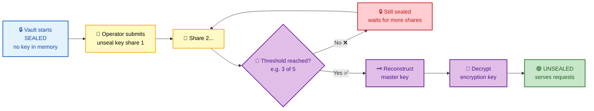
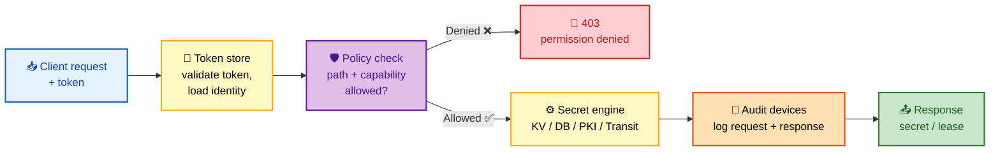
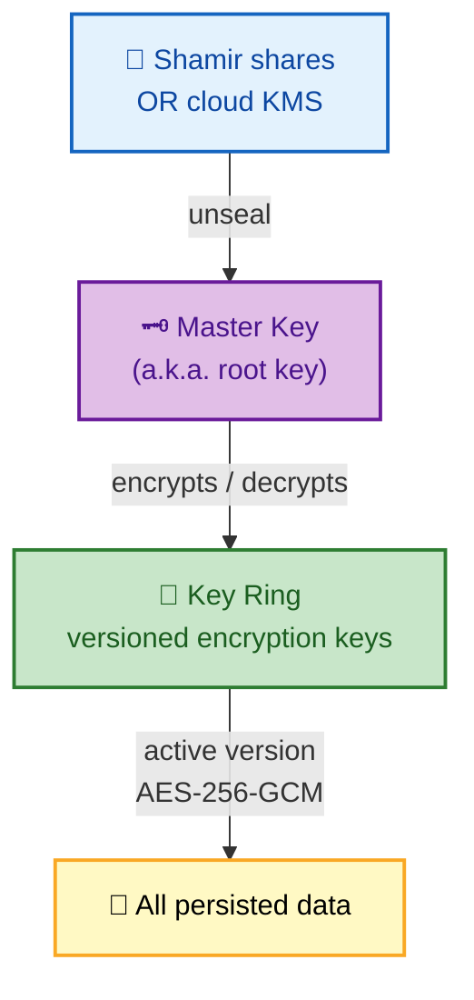

# SECTION 1: VAULT ARCHITECTURE

> **Scope:** What Vault *actually is* under the hood — the cryptographic **barrier** and always-encrypted storage, the **seal/unseal** process, **Shamir secret sharing**, the crucial distinction between the **master key** and the **encryption key**, storage backends, the end-to-end **request path**, and how secret engines & auth methods plug into the core.

---

## 🗺️ Visual Overview

**In one line:** Vault is a **barrier around an encrypted key-value store**: data is *always* encrypted at rest, the key that decrypts it lives *only in memory*, and that in-memory key is itself protected by a master key that is split into Shamir shares — so a stolen storage backend is useless without unsealing.

**Mind map — the architecture at a glance** (skim first, revisit last):



**The barrier & key hierarchy — why stolen storage is useless** (purple = master key, orange = storage, green = protected data key):



**The seal/unseal flow — Shamir threshold reconstruction** (blue = start, purple = key control, red = still sealed, green = unsealed):



**The request path — every API call runs this pipeline** (blue = in, yellow = process, purple = policy gate, green = out):



> 🧠 **Memory hooks (mnemonics):**
> - **Two keys, one job each:** *"Master unseals, Encryption encrypts."* The **master key** only exists to decrypt the **encryption key**; the encryption key does the actual data crypto. Master = doorman, Encryption = vault-door.
> - **Seal state:** Vault boots **sealed** — it knows *where* the data is but can't *read* it. "Knows the box, can't open it."
> - **Shamir = pizza slices:** the master key is a pizza cut into 5 slices; you need any 3 to reassemble it. No single slice reveals anything.
> - **Request pipeline:** *"Authenticate, Authorize, Access"* → auth method → policy → secret engine. "**AAA**."
> - **Storage is untrusted:** Vault assumes the backend is hostile — it encrypts *before* writing, so Raft/Consul/S3 only ever hold ciphertext.

---

## 1. The Barrier & Always-Encrypted Storage

> 🎯 **Interview weight: Very High** — "what is the Vault barrier?" is the single most revealing architecture question.

**In one line:** The **barrier** is the cryptographic boundary that guarantees *nothing* is written to storage in plaintext — every byte Vault persists is AES-256-GCM encrypted first, so the storage backend is treated as fully untrusted.

Vault's core runs **inside** the barrier. Think of it like a bank vault: the steel barrier is the only path in or out, and everything that crosses it is encrypted. The backend storage (Raft, Consul, S3, etc.) sits *outside* the barrier and only ever sees ciphertext.

**What this buys you:**
- A stolen disk, snapshot, or compromised storage node yields only encrypted blobs.
- Backups are safe by default — they're already encrypted.
- Vault can run on "untrusted" infrastructure (a shared Consul cluster, cloud object store) without leaking secrets.

| Layer | Trust level | Sees |
|---|---|---|
| Client | Authenticated | Plaintext response (over TLS) |
| Vault core | Trusted (inside barrier) | Plaintext in memory only |
| Barrier | The encryption boundary | Encrypts/decrypts in transit to storage |
| Storage backend | **Untrusted** | Ciphertext only |

> 🔍 **Under the hood:** The barrier uses **AES-256-GCM** (authenticated encryption), so it detects tampering, not just confidentiality. Data is encrypted with the **encryption key**, which is itself stored (encrypted by the master key) inside the barrier's keyring.

> ⚠️ **Common misconception:** Vault does *not* rely on storage-level encryption (like encrypted EBS). Even if the backend is plaintext, Vault's own barrier keeps secrets encrypted. Storage encryption is defense-in-depth, not the mechanism.

---

## 2. Master Key vs Encryption Key

> 🎯 **Interview weight: Very High** — confusing these two is the fastest way to reveal you've only used Vault, not understood it.

**In one line:** The **encryption key** encrypts your data; the **master key** encrypts the encryption key — this indirection means you can rotate or re-share the master key (via `rekey`) without re-encrypting terabytes of data.

**Why two keys?** If a single key both protected and encrypted everything, rotating it would require re-encrypting all stored secrets. Vault instead uses a small, constant-size master key to wrap a data-encryption key (part of a **keyring**). Rotating the master key only re-wraps one small key; rotating the encryption key adds a new key version to the ring while old data stays readable.



| Operation | What it rotates | Re-encrypts data? | Command |
|---|---|---|---|
| **Rekey** | Master key + Shamir shares | No (only re-wraps keyring) | `vault operator rekey` |
| **Rotate** | Adds new encryption key version | No (new writes use new key) | `vault operator rotate` |
| **Seal** | Nothing; discards master key from memory | No | `vault operator seal` |

> 💡 **Terminology note:** HashiCorp docs increasingly say **"root key"** for what was historically the **"master key"**, and **"unseal keys"** for the Shamir shares. In interviews, use "master/root key" for the wrapping key and "unseal keys" for the shares — and mention both names to show you're current.

> 🔍 **Rekey vs rotate:** *Rekey* changes the key that *unseals* Vault (and lets you change the Shamir threshold or holders). *Rotate* changes the key that *encrypts new data*. They solve different problems and are independent.

---

## 3. Seal & Unseal

> 🎯 **Interview weight: Very High** — go deep here; it's the topic interviewers probe hardest.

**In one line:** Vault starts **sealed** with no key in memory; unsealing reconstructs the master key (from Shamir shares or a cloud KMS), which decrypts the encryption key, after which Vault can read storage and serve requests.

**The sealed state:** When Vault starts (or crashes, or is manually sealed), the master key is *not* in memory. Vault can see the encrypted data in storage but cannot decrypt it. It refuses all requests except the unseal and status endpoints.

**Unsealing** is the process of reconstructing the master key and loading the encryption key into memory:
1. Operators submit unseal key shares one at a time.
2. Once the **threshold** number of shares arrive, Vault reconstructs the master key in memory.
3. The master key decrypts the encryption key (keyring).
4. Vault transitions to **unsealed** and begins serving.

**When does Vault re-seal?**
- Manual: `vault operator seal` (e.g., during a suspected breach — an emergency "lockdown").
- Automatic: process restart, host reboot, or crash — memory is wiped, so the key is gone.

```bash
vault operator init                # first-time only: generates unseal keys + root token
vault operator unseal              # prompts for one share; repeat until threshold met
vault status                       # shows Sealed: true/false, threshold, progress N/T
vault operator seal                # emergency: drop master key from memory, re-seal
```

Example `vault operator init` output (redacted) shows the shares and root token — **captured once, never again**:
```
Unseal Key 1: 4jh...==      # Shamir share 1 of 5
Unseal Key 2: 9kd...==      # give each share to a different trusted holder
...
Initial Root Token: hvs.ABC...   # bootstrap superuser token — revoke after setup
Vault initialized with 5 key shares and a key threshold of 3.
```

> ⚠️ **The unseal keys are *not* passwords for data.** They only reconstruct the master key. A holder with one share can do nothing alone — which is the entire point (no single person can unseal or exfiltrate).

> 💡 **Why seal-on-restart is a *feature*:** it means a rebooted or stolen node cannot auto-serve secrets. The trade-off is operational pain, which is exactly why **auto-unseal** (Section 5) exists for production.

---

## 4. Shamir Secret Sharing

> 🎯 **Interview weight: High** — be ready to explain the *math intuition*, not just "split into shares."

**In one line:** Shamir's Secret Sharing splits the master key into *N* shares such that any *K* of them (the threshold) can reconstruct it, but *K−1* shares reveal **zero** information — enforcing multi-person control over unsealing.

**The intuition (no heavy math needed):** The secret is encoded as the constant term of a random degree-`(K−1)` polynomial. Each share is a point on that curve. You need `K` points to uniquely fit the polynomial and recover the constant; with `K−1` points, infinitely many polynomials fit, so the secret is information-theoretically hidden.

| Parameter | Meaning | Example |
|---|---|---|
| `N` (`key-shares`) | Total shares generated | 5 |
| `K` (`key-threshold`) | Shares required to unseal | 3 |
| Security property | `K−1` shares leak nothing | 2 shares → no info |

```bash
# Change the sharing scheme at init time:
vault operator init -key-shares=5 -key-threshold=3
# 5 trusted holders; any 3 must cooperate to unseal.
```

> 🔍 **Under the hood:** The split key is the *master/root key*. With **auto-unseal**, Shamir is bypassed for the master key (a KMS holds it), but Vault still generates **recovery keys** using the same Shamir scheme for privileged operations like `rekey` and generating a root token.

> 💡 **Choosing N/K:** Common production is 5 shares / 3 threshold — survives losing 2 holders while still needing a quorum. Never set threshold to 1 (single point of compromise) and avoid N=K (losing one share locks you out forever).

---

## 5. Storage Backends

> 🎯 **Interview weight: High** — know *integrated storage (Raft)* vs *Consul*, and why storage is untrusted.

**In one line:** The storage backend is where Vault persists its (always-encrypted) state; modern deployments use **integrated storage (Raft)** — a self-contained, replicated store with no external dependency — while older setups used Consul.

**Integrated Storage (Raft)** is now the recommended backend:
- Runs *inside* the Vault process — no separate cluster to operate.
- Uses the **Raft** consensus protocol for HA and replication across Vault nodes.
- Data lives on each node's local disk (encrypted); snapshots are a single command.

| Backend | HA | External dependency | Notes |
|---|---|---|---|
| **Integrated Storage (Raft)** | ✅ Built-in | None | Recommended default; self-contained |
| **Consul** | ✅ | Requires Consul cluster | Legacy; extra operational surface |
| **S3 / GCS / Azure Blob** | ❌ (no HA lock) | Cloud object store | Simple, but no native HA |
| **In-memory** | ❌ | None | Dev/test only — data lost on restart |

> 🔍 **Under the hood:** Regardless of backend, Vault encrypts every value with the barrier *before* handing it to storage. The backend never sees a decryption key. This is why you can back up Raft snapshots or replicate Consul data without leaking secrets.

> ⚠️ **HA needs a backend that supports locking/consensus.** Raft and Consul do; a plain S3 bucket does not, so single-node object-store setups can't do leader election.

```bash
vault operator raft list-peers            # show Raft cluster members + leader
vault operator raft snapshot save bkp.snap  # point-in-time encrypted backup
vault operator raft snapshot restore bkp.snap
```

---

## 6. The Request Path (End to End)

> 🎯 **Interview weight: Very High** — being able to trace a request through auth → policy → engine is the "do you get it" test.

**In one line:** Every Vault API call flows through the same pipeline — **authenticate** (prove identity, get a token), **authorize** (policy check on path + capability), **access** (secret engine serves the secret), and **audit** (log request and response) — and any denial stops it at the policy gate.

**Step by step:**
1. **Login / auth:** The client authenticates via an auth method (AppRole, Kubernetes, etc.). Vault verifies the credential and returns a **token** bound to policies.
2. **Request with token:** The client calls an API path (`secret/data/app`) presenting the token in the `X-Vault-Token` header.
3. **Token validation:** Vault's **token store** verifies the token is valid, unexpired, and loads its attached policies and identity.
4. **Policy evaluation:** Vault checks whether any attached policy grants the required **capability** (`read`, `create`, etc.) on the requested **path**. No match → `403 permission denied`.
5. **Secret engine:** The mount for that path (KV, database, PKI, Transit) handles the operation and produces the response — possibly issuing a **lease** for dynamic secrets.
6. **Audit:** Every request and response (with sensitive values HMAC'd) is written to all enabled audit devices *before* the response returns.

> 🔍 **Under the hood — the barrier mediates all of it:** auth methods, secret engines, and the token store all read/write through the barrier, so their state is encrypted at rest too. Nothing in this pipeline touches plaintext storage.

> 💡 **Interview framing:** When asked "how does Vault decide if I can read a secret?", answer in this exact order: *token → policy → path+capability → engine → audit*. It shows you understand authorization is a **path-based capability check**, not role membership.

```bash
vault login -method=approle role_id=... secret_id=...   # step 1: get a token
export VAULT_TOKEN=hvs.CAES...                          # step 2: present it
vault kv get secret/app                                  # steps 3-6 run server-side
vault token lookup                                       # inspect your token's policies + ttl
```

---

## 7. Secret Engines & Auth Methods (Overview)

> 🎯 **Interview weight: Medium** — a map of the pluggable surface; details live in Sections 2 & 3.

**In one line:** Vault is a thin secure core surrounded by **pluggable backends** — *auth methods* verify identity at the front, *secret engines* produce secrets at the back, and *audit devices* record everything — all mounted at paths and mediated by the barrier.

| Plugin type | Role | Examples | Mounted at |
|---|---|---|---|
| **Auth methods** | Verify identity → issue token | AppRole, Kubernetes, JWT/OIDC, AWS/Azure/GCP | `auth/<name>/` |
| **Secret engines** | Store or generate secrets | KV, database, PKI, Transit, AWS | `<name>/` (e.g. `secret/`, `pki/`) |
| **Audit devices** | Record requests/responses | file, syslog, socket | n/a (log sinks) |

> 🔍 **Under the hood:** Everything is a **mount** at a path. Enabling the database engine at `database/` or Kubernetes auth at `auth/kubernetes/` just creates a routed mount. This uniform path model is why policies (Section 4) are entirely **path-based**.

```bash
vault secrets enable -path=secret kv-v2        # mount KV v2 at secret/
vault secrets enable database                   # mount dynamic DB engine at database/
vault auth enable approle                        # mount AppRole auth at auth/approle/
vault secrets list                               # see all mounted engines
vault auth list                                  # see all enabled auth methods
```

---

## Interview Questions & Answers

**Q1. What is the Vault barrier and why does it matter?**
**Answer:** The barrier is the cryptographic boundary guaranteeing that *nothing* is persisted to storage in plaintext — Vault encrypts every value with AES-256-GCM before writing. **Internals:** the core runs inside the barrier; the storage backend (Raft/Consul/S3) sits outside and only ever holds ciphertext, so it's treated as untrusted. **Follow-up ("so is encrypted EBS enough?"):** No — storage-level encryption is defense-in-depth; the barrier is the actual mechanism and works even on plaintext storage.

**Q2. Explain the difference between the master key and the encryption key.**
**Answer:** The **encryption key** encrypts your data; the **master (root) key** encrypts the encryption key. **Internals:** this indirection lets you rekey the master key (change Shamir shares/threshold) or rotate the encryption key without re-encrypting all stored data — you only re-wrap one small key or add a key version. **Follow-up ("what's rekey vs rotate?"):** rekey changes the *unsealing* key; rotate changes the key used to *encrypt new writes*.

**Q3. Walk me through seal and unseal.**
**Answer:** Vault starts sealed — the master key isn't in memory, so it can't decrypt storage. Operators submit unseal key shares; once the threshold is met, Vault reconstructs the master key, decrypts the encryption key, and becomes unsealed. **Internals:** the master key only ever exists in memory post-unseal; a restart wipes it, re-sealing Vault. **Follow-up ("why does restart re-seal?"):** memory is cleared, so the key is gone by design — a stolen or rebooted node can't auto-serve secrets. Production solves the operational pain with auto-unseal.

**Q4. How does Shamir Secret Sharing protect the master key?**
**Answer:** The master key is split into N shares where any K reconstruct it, but K−1 shares reveal *nothing* — enforcing multi-person control. **Internals:** shares are points on a random degree-(K−1) polynomial whose constant term is the secret; K points uniquely fit the curve, fewer leave it information-theoretically hidden. **Follow-up ("what about auto-unseal?"):** the KMS holds the master key, so Shamir isn't used to unseal — but Vault still generates Shamir **recovery keys** for privileged ops like rekey and root-token generation.

**Q5. Trace a `vault kv get secret/app` request end to end.**
**Answer:** Token validated by the token store → policy check for `read` capability on `secret/data/app` → if allowed, the KV engine returns the value → audit devices log it → response returns. **Internals:** authorization is a path + capability match, not role membership; all of this reads/writes through the barrier so it's encrypted at rest. **Follow-up ("what if no policy matches?"):** default-deny → `403 permission denied` at the policy gate, before the engine is ever reached.

**Q6. Why is the storage backend considered untrusted, and what does that enable?**
**Answer:** Because Vault encrypts data with the barrier *before* storing it, the backend only holds ciphertext — so a compromised or stolen backend leaks nothing. **Internals:** the backend never possesses a decryption key. **Follow-up ("so backups are safe?"):** yes — Raft snapshots/Consul data are already encrypted, though you still protect them and need unseal capability to restore into a usable Vault.

---

## Troubleshooting Scenarios

- **`vault status` shows `Sealed: true` after a restart:** expected — memory was wiped. Re-run `vault operator unseal` with threshold shares, or configure auto-unseal (Section 5) so restarts recover automatically.
- **Unseal progress stuck at `2/3`:** you've submitted 2 of 3 required shares; submit another *distinct* valid share. Re-submitting the same share does not advance progress.
- **All requests return `Vault is sealed`:** the node is sealed; check `vault status`, unseal it, and for clusters confirm you unsealed the *active* node (each node seals independently unless auto-unseal is used).
- **Restored a Raft snapshot but Vault won't serve:** a restored snapshot still needs the matching unseal/recovery keys; you cannot read a snapshot from one cluster with a different master key.
- **Worried storage node was stolen:** with the barrier, the thief only has ciphertext. Rotate credentials as hygiene, but secrets remain encrypted without the master key.

---

## Documentation Links

- [Vault Architecture Overview](https://developer.hashicorp.com/vault/docs/internals/architecture)
- [Seal/Unseal](https://developer.hashicorp.com/vault/docs/concepts/seal)
- [Security Model](https://developer.hashicorp.com/vault/docs/internals/security)
- [Key Rotation & Rekey](https://developer.hashicorp.com/vault/docs/concepts/seal#rekeying-vault)
- [Integrated Storage (Raft)](https://developer.hashicorp.com/vault/docs/configuration/storage/raft)
- [Shamir's Secret Sharing (concept)](https://developer.hashicorp.com/vault/docs/concepts/seal#shamir-seal)

---

**[← Back: Index](README.md)** | **[Next: Auth Methods →](02-AUTH-METHODS.md)**
