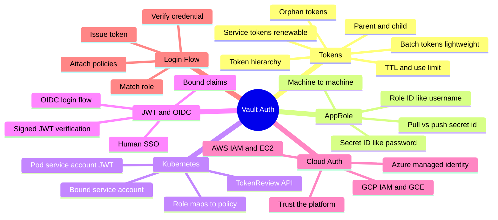
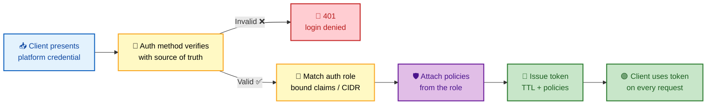
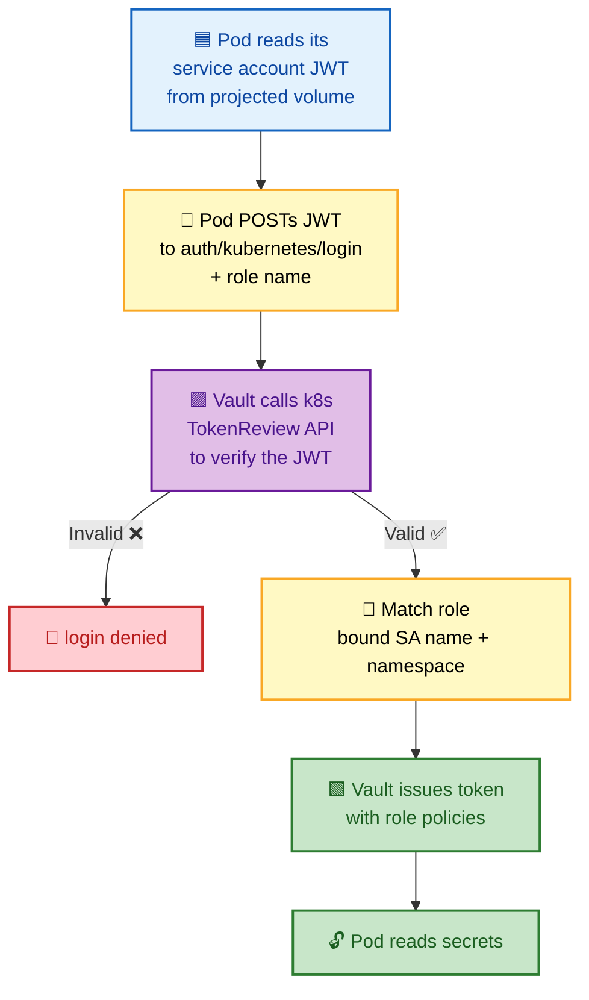
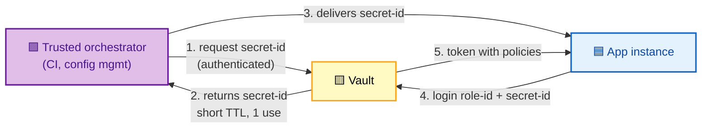

# SECTION 2: AUTH METHODS

> **Scope:** How callers *prove identity* and receive a token — **tokens** (service vs batch, hierarchy/orphan), **AppRole** for machines, **Kubernetes auth** for pods, **JWT/OIDC** for humans and CI, and **cloud auth** (AWS/Azure/GCP) using platform identity — plus the full **login → token issuance** flow.

---

## 🗺️ Visual Overview

**In one line:** Auth methods are the *front door* — each one verifies a different kind of trusted credential (a Kubernetes service-account JWT, an AWS instance identity, an AppRole ID+secret) and, on success, hands back a **token** bound to policies that gate every later request.

**Mind map — auth methods at a glance** (skim first, revisit last):



**The universal login flow — credential to token** (blue = client, yellow = verify, purple = policy binding, green = token out):



**Kubernetes auth — how a pod logs in without a stored secret** (blue = pod, yellow = Vault, purple = k8s API, green = token):



> 🧠 **Memory hooks (mnemonics):**
> - **AppRole = username + password for machines:** **Role ID** = username (not secret), **Secret ID** = password (secret, short-lived). "Role who, Secret proof."
> - **Service vs Batch token:** **S**ervice = **S**tateful (renewable, persisted, can have children); **B**atch = **B**arebones (lightweight, not persisted, for high-volume ephemeral workloads). "Service is heavy, Batch is cheap."
> - **Orphan token:** an orphan has **no parent**, so revoking someone else's token won't cascade-kill it. "Orphans survive the family purge."
> - **Cloud auth = trust the platform:** you don't store a secret; Vault trusts AWS/Azure/GCP to attest *"this really is instance X."*
> - **Kubernetes auth = the pod's own SA JWT is the credential** — verified via the cluster's TokenReview API, so no secret is ever baked into the image.

---

## 1. Tokens: Service vs Batch

> 🎯 **Interview weight: High** — the service-vs-batch distinction is a favorite depth check.

**In one line:** A **token** is the credential every request carries; **service tokens** are full-featured (persisted, renewable, revocable, can have child tokens) while **batch tokens** are lightweight, encrypted blobs that aren't written to storage — ideal for huge, short-lived workloads.

Tokens are the core auth primitive — *all* other auth methods ultimately produce a token. You can also create tokens directly (the `token` auth method is always mounted).

| Property | Service token | Batch token |
|---|---|---|
| Stored in Vault | ✅ Persisted | ❌ Not persisted (self-contained) |
| Renewable | ✅ Yes | ❌ No |
| Can create child tokens | ✅ Yes | ❌ No |
| Can be root/orphan | ✅ Yes | Limited |
| Revocation | Individually revocable | Revoke only via parent lease |
| Overhead | Higher (storage write per token) | Very low (no write) |
| Best for | Humans, long-lived apps | High-volume, ephemeral (e.g., serverless, CI fan-out) |

> 🔍 **Under the hood:** A service token is a reference (`hvs.<random>`) that indexes state in the token store. A batch token is an *encrypted blob* containing its own policies/TTL — Vault decrypts and validates it per request without a storage lookup, which is why it scales but can't be renewed or individually revoked.

> 💡 **Why batch tokens exist:** persisting one storage entry per token becomes a bottleneck at scale (think thousands of short-lived pods/functions). Batch tokens trade renewability for near-zero write overhead.

```bash
vault token create -policy=app -ttl=1h                 # service token (default)
vault token create -type=batch -policy=app -ttl=5m     # batch token, lightweight
vault token lookup <token>                              # inspect ttl, policies, type
vault token renew <token>                               # only works for service tokens
```

---

## 2. Token Hierarchy & Orphan Tokens

> 🎯 **Interview weight: High** — the revocation-cascade behavior is a classic "gotcha" question.

**In one line:** Tokens form a **parent–child tree**; revoking a parent **cascades** and revokes all its descendants — unless a token is an **orphan** (no parent), which survives independently.

**The tree:** When a token creates another token, the new one is a **child**. Children inherit a lifespan bounded by the parent, and revoking the parent revokes the whole subtree. This makes cleanup atomic: kill the root of a session and everything it spawned dies.

**Orphan tokens** have no parent, so:
- They are *not* revoked when some other token is revoked.
- Their TTL is independent.
- They're used for long-running services that must outlive whoever created them.

| Concept | Behavior |
|---|---|
| Child token | Revoked when parent is revoked (cascade) |
| Orphan token | No parent; independent lifecycle |
| Root token | Special orphan with `root` policy, no TTL |
| `use_limit` | Token self-revokes after N uses |

> ⚠️ **Gotcha:** If a service creates worker tokens as *children* and then its own token is revoked (or expires), all workers die instantly. For long-lived background services, create **orphan** tokens (`vault token create -orphan`) so they aren't collateral damage.

> 💡 **Auth methods often issue orphan tokens by default** (e.g., AppRole, Kubernetes), because a pod's token shouldn't die just because an admin revoked an unrelated token.

```bash
vault token create -orphan -policy=worker      # no parent; survives parent revocation
vault token create -use-limit=3 -policy=app      # auto-revokes after 3 uses
vault token revoke <parent-token>                # cascades to all children
vault token revoke -mode=orphan <token>          # revoke token but orphan its children
```

---

## 3. AppRole (Machine Auth)

> 🎯 **Interview weight: Very High** — the default answer for "how do apps authenticate to Vault?"

**In one line:** AppRole authenticates *machines* using a **Role ID** (like a username, not secret) plus a **Secret ID** (like a password, short-lived and often single-use) — decoupling the "who" from the "proof" so each can be delivered through a different, safer channel.

**Why two parts?** The **Role ID** is relatively static and can be baked into config. The **Secret ID** is sensitive and should be delivered separately, just-in-time, ideally with a short TTL and a use limit. An attacker needs *both*, delivered via *different* paths — mitigating the "secret zero" problem.

**Pull vs Push Secret ID:**
- **Pull mode (recommended):** a trusted orchestrator asks Vault to *generate* a Secret ID and hands it to the app. Vault controls TTL/use-count.
- **Push mode:** you supply your own Secret ID value. Less common; you own its entropy and rotation.



| AppRole field | Analogy | Sensitivity |
|---|---|---|
| **Role ID** | Username | Low (can be in config) |
| **Secret ID** | Password | High (short TTL, use-limited) |

> 🔍 **Under the hood:** The Secret ID's TTL, number of uses, and CIDR binding are enforced by Vault. A common hardening is `secret_id_num_uses=1` + short `secret_id_ttl`, so a leaked Secret ID is useless moments later.

> ⚠️ **The "secret zero" problem:** AppRole doesn't fully eliminate it — you still must deliver the Secret ID securely. On Kubernetes, prefer **Kubernetes auth** (no delivered secret at all); AppRole shines for VMs/non-k8s workloads where a trusted delivery channel exists.

```bash
vault auth enable approle
vault write auth/approle/role/myapp \
    token_policies="app" token_ttl=1h token_max_ttl=4h \
    secret_id_ttl=10m secret_id_num_uses=1          # harden the secret-id
vault read auth/approle/role/myapp/role-id           # fetch (non-secret) role-id
vault write -f auth/approle/role/myapp/secret-id     # generate a short-lived secret-id
vault write auth/approle/login role_id=... secret_id=...   # login -> token
```

---

## 4. Kubernetes Auth

> 🎯 **Interview weight: Very High** — the canonical "how do pods get secrets?" answer.

**In one line:** Kubernetes auth lets a pod authenticate using its own **service-account JWT** — Vault verifies that token against the cluster's **TokenReview API**, then issues a Vault token whose policies are bound to the service account's name and namespace, so no secret is ever stored in the image.

**The flow (see diagram above):**
1. The pod has a projected **service-account token** (a signed JWT) mounted at `/var/run/secrets/...`.
2. The pod sends that JWT plus a **role** name to `auth/kubernetes/login`.
3. Vault calls the Kubernetes **TokenReview API** to confirm the JWT is valid and identifies the SA.
4. Vault matches the configured role's **bound service account names/namespaces**, attaches the role's policies, and returns a Vault token.

| Config | Purpose |
|---|---|
| `bound_service_account_names` | Which SAs may use this role |
| `bound_service_account_namespaces` | Which namespaces are allowed |
| `token_policies` | Policies granted on success |
| `token_reviewer_jwt` | SA Vault uses to call TokenReview |

> 🔍 **Under the hood:** The trust anchor is the Kubernetes API server itself. Vault doesn't hold a per-pod secret — it delegates verification to the cluster. This is why the credential is the pod's *identity*, not a shared password.

> 💡 **AppRole vs Kubernetes auth:** On Kubernetes, prefer **Kubernetes auth** — there's no "secret zero" to deliver, since the SA JWT is already present and platform-managed. Use AppRole for workloads *outside* Kubernetes.

> ⚠️ **Short-lived projected tokens:** modern clusters use bound, expiring SA tokens. Ensure the role's `token_reviewer_jwt`/issuer config matches, or logins fail after the projected token rotates.

```bash
vault auth enable kubernetes
vault write auth/kubernetes/config \
    kubernetes_host="https://$KUBERNETES_PORT_443_TCP_ADDR:443"
vault write auth/kubernetes/role/myapp \
    bound_service_account_names=myapp \
    bound_service_account_namespaces=prod \
    token_policies=app token_ttl=1h
# From inside the pod:
vault write auth/kubernetes/login role=myapp \
    jwt=@/var/run/secrets/kubernetes.io/serviceaccount/token
```

---

## 5. JWT / OIDC

> 🎯 **Interview weight: Medium-High** — know when to pick JWT vs OIDC, and bound claims.

**In one line:** **JWT auth** validates a pre-obtained signed token against a trusted key/issuer (great for CI systems like GitHub Actions), while **OIDC auth** runs the interactive browser login flow against an identity provider (great for humans doing SSO) — both map **claims** to Vault roles and policies.

| Mode | Who provides the token | Best for |
|---|---|---|
| **JWT** | Client already has a signed JWT | CI/CD (GitHub OIDC, GitLab), service-to-service |
| **OIDC** | Vault redirects to IdP login page | Human SSO (Okta, Azure AD, Google) |

**Bound claims** are the authorization filter: a role can require, e.g., `sub` = a specific GitHub repo, or `groups` contains `platform-admins`. Only tokens whose claims match get the role's policies.

> 🔍 **Under the hood:** For JWT, Vault verifies the signature using the IdP's public keys (fetched via JWKS) and checks issuer/audience/expiry. For OIDC, Vault completes the authorization-code exchange, then reads claims from the resulting ID token. Both then apply `bound_claims` and map claims to policies.

> 💡 **Keyless CI:** GitHub Actions can present a short-lived OIDC token; Vault's JWT auth with `bound_claims` on the repo/branch lets pipelines authenticate with *no stored Vault secret at all* — the modern best practice.

```bash
vault auth enable jwt
vault write auth/jwt/config \
    oidc_discovery_url="https://token.actions.githubusercontent.com"
vault write auth/jwt/role/ci \
    role_type=jwt user_claim=sub \
    bound_claims='{"repository":"org/repo"}' \
    token_policies=deploy token_ttl=15m
```

---

## 6. Cloud Auth (AWS / Azure / GCP)

> 🎯 **Interview weight: Medium-High** — the "no secret zero" story for cloud workloads.

**In one line:** Cloud auth methods let a workload authenticate using its **platform identity** — an AWS IAM role/instance identity, an Azure managed identity, or a GCP service account — so Vault trusts the cloud provider's attestation instead of a stored secret.

| Provider | What Vault trusts | Typical credential |
|---|---|---|
| **AWS** | IAM (signed `sts:GetCallerIdentity`) or EC2 instance identity doc | IAM role / instance profile |
| **Azure** | Azure AD managed identity token (verified with Azure) | Managed identity |
| **GCP** | Signed JWT from GCE metadata or IAM service account | GCE instance / SA |

**AWS has two sub-modes:**
- **`iam`:** the client signs an `sts:GetCallerIdentity` request; Vault replays it to STS to confirm which IAM principal is calling. Recommended.
- **`ec2`:** uses the cryptographically signed EC2 instance identity document. Ties auth to a specific instance.

> 🔍 **Under the hood:** The common theme is *attestation by the platform*. Vault never holds the workload's secret — it asks the cloud provider "is this really principal X?" and binds the resulting identity to a role/policies. This eliminates the delivered-secret problem entirely on cloud infrastructure.

> 💡 **Choosing between them:** Use cloud auth when the workload already has a platform identity (EC2 instance role, AKS managed identity, GKE SA). Fall back to AppRole only when no such identity exists.

```bash
vault auth enable aws
vault write auth/aws/role/myapp \
    auth_type=iam \
    bound_iam_principal_arn="arn:aws:iam::123456789012:role/myapp" \
    token_policies=app token_ttl=1h
vault login -method=aws role=myapp         # signs STS request, exchanges for token
```

---

## Interview Questions & Answers

**Q1. Service tokens vs batch tokens — when would you use each?**
**Answer:** Service tokens are persisted, renewable, revocable, and can have children — use them for humans and long-lived apps. Batch tokens are lightweight, self-contained encrypted blobs that aren't stored — use them for high-volume, short-lived workloads where per-token storage writes would bottleneck. **Internals:** a service token indexes state in the token store; a batch token carries its own policies/TTL and is validated by decryption with no storage lookup. **Follow-up ("can you renew a batch token?"):** No — no renew and no individual revocation; it expires at TTL or dies with its parent lease.

**Q2. Explain token hierarchy and orphan tokens.**
**Answer:** Tokens form a parent–child tree; revoking a parent cascades and revokes all descendants. An orphan has no parent, so it survives independent of other revocations. **Internals:** children inherit a bounded lifespan; orphans get an independent TTL. **Follow-up ("why do auth methods issue orphan tokens?"):** so a pod's token isn't collaterally killed when an unrelated parent token is revoked — its lifecycle should be independent.

**Q3. How does AppRole authentication work and what problem do Role ID + Secret ID solve?**
**Answer:** Role ID is a non-secret identifier (username-like); Secret ID is a sensitive, usually short-lived, use-limited credential (password-like). Splitting them lets you deliver identity and proof through different channels, so an attacker needs both. **Internals:** Vault enforces Secret ID TTL, use count, and CIDR binding; pull mode has a trusted orchestrator generate the Secret ID just-in-time. **Follow-up ("does it solve secret zero?"):** it mitigates but doesn't eliminate it — you still must deliver the Secret ID securely; on Kubernetes prefer Kubernetes auth.

**Q4. How does Kubernetes auth avoid baking a secret into the image?**
**Answer:** The pod's own service-account JWT *is* the credential; Vault verifies it via the cluster's TokenReview API and issues a token bound to the SA's name/namespace. **Internals:** the trust anchor is the Kubernetes API server, not a shared password, so nothing secret ships in the image. **Follow-up ("what if the projected token rotates?"):** it's short-lived by design; each login uses the current token, and Vault's reviewer/issuer config must match the cluster.

**Q5. A team says "we'll store a long-lived Vault token in our app config." What's wrong and what do you propose?**
**Answer:** A static long-lived token is a high-value, hard-to-rotate secret zero. Instead, use a platform-native auth method — Kubernetes auth for pods, cloud auth (IAM/managed identity) for VMs, AppRole with short-lived Secret IDs otherwise — so the app authenticates with an identity, not a stored secret. **Internals:** these methods delegate verification to the platform/IdP and issue short-TTL tokens. **Follow-up ("how do they keep working?"):** a Vault Agent (Section 5) auto-authenticates and renews, so the app never handles a long-lived credential.

**Q6. How can a CI pipeline authenticate to Vault without any stored Vault secret?**
**Answer:** Use JWT auth with the CI provider's OIDC token (e.g., GitHub Actions), and restrict with `bound_claims` on repo/branch. The pipeline presents a short-lived signed JWT; Vault verifies the signature via JWKS and issues a scoped token. **Internals:** Vault checks issuer/audience/expiry and matches bound claims to a role. **Follow-up ("OIDC vs JWT mode?"):** JWT mode validates an already-issued token (machines/CI); OIDC mode runs the interactive browser flow (human SSO).

---

## Troubleshooting Scenarios

- **AppRole login fails with `invalid secret id`:** the Secret ID expired or hit its use limit — generate a fresh one; check `secret_id_ttl`/`secret_id_num_uses` and any CIDR binding.
- **Kubernetes login returns `permission denied`:** the pod's SA name/namespace isn't in the role's `bound_service_account_*`, or Vault's `kubernetes_host`/reviewer JWT is misconfigured; verify TokenReview succeeds.
- **Token works then suddenly stops:** it hit `token_max_ttl` or its parent was revoked; for services that must outlive their creator, issue an **orphan** token or use Vault Agent auto-auth.
- **Batch token can't be renewed:** expected — batch tokens are non-renewable; switch to a service token or shorten the workflow.
- **Cloud (AWS) login denied:** the calling IAM principal ARN doesn't match `bound_iam_principal_arn`, or STS isn't reachable/allowed from Vault; confirm the signed identity and network path.
- **JWT/OIDC login denied despite valid token:** `bound_claims` don't match (wrong repo/branch/group) or the issuer/JWKS URL is wrong; decode the JWT and compare claims.

---

## Documentation Links

- [Auth Methods Overview](https://developer.hashicorp.com/vault/docs/auth)
- [Tokens (service vs batch)](https://developer.hashicorp.com/vault/docs/concepts/tokens)
- [AppRole Auth](https://developer.hashicorp.com/vault/docs/auth/approle)
- [Kubernetes Auth](https://developer.hashicorp.com/vault/docs/auth/kubernetes)
- [JWT/OIDC Auth](https://developer.hashicorp.com/vault/docs/auth/jwt)
- [AWS Auth](https://developer.hashicorp.com/vault/docs/auth/aws)
- [Azure Auth](https://developer.hashicorp.com/vault/docs/auth/azure) · [GCP Auth](https://developer.hashicorp.com/vault/docs/auth/gcp)

---

**[← Back: Architecture](01-ARCHITECTURE.md)** | **[Next: Secrets Engines →](03-SECRETS-ENGINES.md)**
