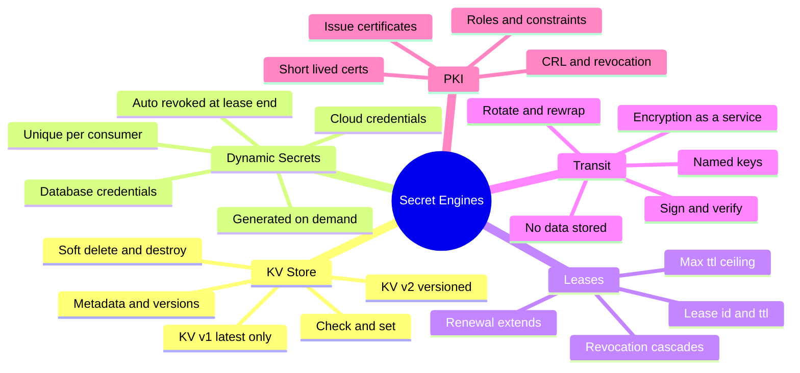
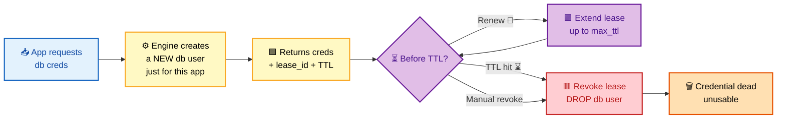

# SECTION 3: SECRETS ENGINES

> **Scope:** What Vault actually returns — **KV v1 vs v2** (and versioning), **dynamic secrets** (database & cloud) that are generated just-in-time, **leases** with renewal & revocation, **Transit** (encryption-as-a-service), and **PKI** (on-demand certificate issuance).

---

## 🗺️ Visual Overview

**In one line:** Secret engines are the *back end* of the request path — some **store** secrets you give them (KV), others **generate** short-lived credentials on demand (database, cloud, PKI), and Transit never stores data at all but performs crypto on your behalf; the unifying concept for generated secrets is the **lease**.

**Mind map — secrets engines at a glance** (skim first, revisit last):



**Dynamic secret lease lifecycle — the killer feature** (blue = request, yellow = active, purple = renew, red = revoke, green = valid):



**Transit — encryption without ever storing the plaintext** (blue = in, yellow = Vault key, green = ciphertext):

```mermaid
flowchart LR
    P["📥 App sends<br/>plaintext (base64)"] --> K["🔑 Transit named key<br/>encrypts in memory"]
    K --> C["🟩 Returns ciphertext<br/>vault:v1:...."]
    C -.->|"app stores ciphertext<br/>in its own DB"| DB[("🗄️ App database")]
    DB -.->|"later: send ciphertext"| K2["🔑 Same key<br/>decrypts"]
    K2 --> O["📤 Plaintext back"]

    class P start
    class K,K2 proc
    class C good
    class DB store
    class O good
    classDef start fill:#e3f2fd,stroke:#1565c0,color:#0d47a1,stroke-width:2px;
    classDef proc  fill:#fff9c4,stroke:#f9a825,color:#000,stroke-width:2px;
    classDef good  fill:#c8e6c9,stroke:#2e7d32,color:#1b5e20,stroke-width:2px;
    classDef store fill:#ffe0b2,stroke:#e65100,color:#000,stroke-width:2px;
```



> 🧠 **Memory hooks (mnemonics):**
> - **Static vs dynamic:** *Static = you put it in, Vault hands it back* (KV). *Dynamic = Vault makes a brand-new one per consumer and destroys it later* (DB/cloud/PKI). "Static stored, Dynamic minted."
> - **KV v2 = Git for secrets:** versions, history, soft-delete (recoverable) vs destroy (gone), and check-and-set to prevent clobbering. "v1 latest, v2 layered."
> - **Lease = a leash:** every dynamic secret is on a leash (lease_id + TTL). Let go (revoke) and it's yanked back (credential deleted). Renew to lengthen the leash — but never past `max_ttl`.
> - **Transit = crypto-as-a-service:** Vault holds the key, does the math, and **stores nothing** of yours. "You bring data, Vault brings the key."
> - **PKI = a vending machine for certs:** short-lived certificates minted on demand, so you rotate by expiry instead of by revocation.

---

## 1. KV v1 vs v2 & Versioning

> 🎯 **Interview weight: High** — the v1/v2 API and versioning differences trip people up constantly.

**In one line:** KV is the **static** secrets store; **v1** keeps only the latest value at a path, while **v2** adds versioning (history), soft-delete vs destroy, metadata, and check-and-set — at the cost of a different, `data/`-prefixed API path.

| Feature | KV v1 | KV v2 |
|---|---|---|
| Versioned history | ❌ Latest only | ✅ Configurable version count |
| Soft delete (recoverable) | ❌ | ✅ `kv delete` (marks deleted) |
| Destroy (permanent) | Overwrite only | ✅ `kv destroy` |
| Metadata | ❌ | ✅ Per-key metadata + per-version |
| Check-and-Set (CAS) | ❌ | ✅ Prevents blind overwrite |
| API path | `secret/foo` | `secret/data/foo` (data) + `secret/metadata/foo` |

> ⚠️ **The #1 KV v2 gotcha — the `data/` path:** the CLI hides it (`vault kv get secret/foo`), but the *raw API* and *policies* must use `secret/data/foo` for reads/writes and `secret/metadata/foo` for version management. Writing a policy against `secret/foo` on a v2 mount silently grants nothing.

> 🔍 **Under the hood:** KV v2 stores each write as a new **version** under `data/`, and tracks lifecycle in `metadata/`. **Soft delete** marks a version deleted (recoverable via `undelete`); **destroy** removes the underlying data irreversibly; **CAS** requires you to pass the expected current version so concurrent writers can't clobber each other.

```bash
vault secrets enable -version=2 -path=secret kv         # enable KV v2
vault kv put secret/app user=admin pass=s3cr3t           # writes version 1
vault kv put secret/app user=admin pass=n3w              # writes version 2
vault kv get -version=1 secret/app                       # read an old version
vault kv delete secret/app                               # soft delete (recoverable)
vault kv undelete -versions=2 secret/app                 # restore
vault kv destroy -versions=1 secret/app                  # permanent
vault kv put -cas=2 secret/app pass=x                    # only write if current ver == 2
```

Policy for a KV v2 path (note the `data/` and `metadata/` split):
```hcl
path "secret/data/app"      { capabilities = ["read"] }          # read the secret value
path "secret/metadata/app"  { capabilities = ["list","read"] }   # see versions/metadata
```

---

## 2. Dynamic Secrets (Database & Cloud)

> 🎯 **Interview weight: Very High** — this is *the* Vault differentiator; go deep.

**In one line:** Dynamic secrets are credentials Vault **generates on demand, unique per consumer, and automatically revokes** when the lease ends — so there's no shared, long-lived password, the blast radius of a leak is tiny, and rotation is continuous and automatic.

**How the database engine works:**
1. You configure the engine with an **admin connection** to the database and a **role** containing the SQL to create a user.
2. When an app reads `database/creds/<role>`, Vault runs that SQL to create a **brand-new DB user** with a random password, scoped to that role's grants.
3. Vault returns the credentials plus a **lease** (Section 3).
4. At lease expiry (or on revocation), Vault runs the **revocation SQL** to `DROP` that user — the credential dies.

**Why it's transformative:**
- No credential is ever *shared* — each app/instance gets its own.
- Leaked creds are short-lived and individually revocable.
- Rotation is automatic: every new request is a fresh user.
- Full attribution — you can trace which lease (which app) did what in the DB.

| Static secret problem | Dynamic secret answer |
|---|---|
| One shared password everywhere | Unique credential per consumer |
| Manual, risky rotation | Auto-expiry + auto-revoke |
| Wide blast radius on leak | Tiny, short-lived, revocable |
| No attribution | Each lease maps to a consumer |

> 🔍 **Under the hood:** The admin/root DB credential Vault uses to create users is itself protected inside the barrier and can be rotated with `vault write -f database/rotate-root/<name>` so *humans never know it*. Cloud engines (AWS/Azure/GCP) work the same way but call the cloud IAM API to mint short-lived access keys/tokens.

> ⚠️ **Capacity gotcha:** each active lease is a real DB user. Thousands of concurrent leases mean thousands of users — size TTLs so leases expire promptly and don't exhaust DB connection/user limits.

```bash
vault secrets enable database
vault write database/config/mydb \
    plugin_name=postgresql-database-plugin \
    connection_url="postgresql://{{username}}:{{password}}@db:5432/app" \
    allowed_roles="readonly" username="vault_admin" password="..."
vault write database/roles/readonly \
    db_name=mydb \
    creation_statements="CREATE ROLE \"{{name}}\" WITH LOGIN PASSWORD '{{password}}' VALID UNTIL '{{expiration}}'; GRANT SELECT ON ALL TABLES IN SCHEMA public TO \"{{name}}\";" \
    default_ttl=1h max_ttl=24h
vault read database/creds/readonly        # -> unique username/password + lease_id
vault write -f database/rotate-root/mydb   # rotate the admin password Vault uses
```

---

## 3. Leases: Renewal & Revocation

> 🎯 **Interview weight: Very High** — the lease is the beating heart of dynamic secrets.

**In one line:** Every dynamic secret (and service token) carries a **lease** — a `lease_id` plus a TTL — that Vault tracks so it can **renew** (extend up to `max_ttl`), **revoke** (immediately invalidate and clean up the backing credential), and expire automatically, giving Vault active lifecycle control over every credential it issues.

**Lease mechanics:**
- **`lease_id`** uniquely identifies the issued secret so it can be renewed/revoked.
- **`ttl`** is how long it's valid; **`max_ttl`** is the hard ceiling renewal can't exceed.
- **Renewal** (`vault lease renew`) resets the TTL clock — up to `max_ttl` — keeping a credential alive for a long-running app without making it permanent.
- **Revocation** (`vault lease revoke`) invalidates it *now* and runs the engine's cleanup (e.g., `DROP USER`).

| Operation | Effect | Command |
|---|---|---|
| Renew | Extend TTL (bounded by max_ttl) | `vault lease renew <lease_id>` |
| Revoke one | Kill a single lease + backing cred | `vault lease revoke <lease_id>` |
| Revoke by prefix | Kill all leases under a path | `vault lease revoke -prefix database/creds/readonly` |
| Revoke all (emergency) | Mass revocation | `vault lease revoke -prefix -force <mount>` |

> 💡 **Emergency containment:** during a breach you can revoke *all* leases under a mount/prefix in one command — every dynamic credential that engine issued is invalidated at once. This is a headline reason security teams adopt Vault.

> 🔍 **Under the hood:** the **expiration manager** persists leases (encrypted) and wakes to revoke them at TTL. Renewals are rejected past `max_ttl`, forcing the app to obtain a *fresh* credential — which is exactly the rotation you want. Revocation can cascade: revoking a token revokes the leases of secrets it obtained.

```bash
vault lease renew database/creds/readonly/abc123     # extend (up to max_ttl)
vault lease revoke database/creds/readonly/abc123    # revoke this one credential now
vault lease revoke -prefix database/creds/readonly   # revoke ALL creds from this role
```

---

## 4. Transit — Encryption as a Service

> 🎯 **Interview weight: High** — the "Vault doesn't store my data" engine surprises people.

**In one line:** Transit lets apps **encrypt, decrypt, sign, and verify** data using keys Vault manages — but Vault **never stores the data itself**; you send plaintext, get ciphertext back, and store that ciphertext in your *own* database, keeping the key material entirely inside Vault.

**Why it's powerful:**
- Developers never handle raw key material — no keys in app config or code.
- Key **rotation** is a single command; old ciphertext stays decryptable (versioned keys), new writes use the new version.
- **Rewrap** upgrades existing ciphertext to the latest key version without exposing plaintext.
- Centralized crypto policy, audit, and access control.

| Operation | Purpose |
|---|---|
| `encrypt` / `decrypt` | Protect field-level data (e.g., SSNs) |
| `sign` / `verify` | Data integrity / authenticity |
| `rotate` | New key version; old data still decryptable |
| `rewrap` | Re-encrypt ciphertext to newest key version |
| `datakey` | Generate a data key for envelope encryption |

> 🔍 **Under the hood:** ciphertext is returned as `vault:v1:<base64>` where `v1` is the key version — so decrypt always knows which version to use, and rotation never breaks old data. The key never leaves Vault; all crypto happens server-side inside the barrier.

> 💡 **Classic use case:** application-layer encryption of sensitive columns. The app stores `vault:v1:...` in its DB; even a full DB dump is useless without Vault access. Rotate keys centrally without touching the app.

```bash
vault secrets enable transit
vault write -f transit/keys/orders                       # create a named key
vault write transit/encrypt/orders plaintext=$(base64 <<< "4111-1111")   # -> vault:v1:...
vault write transit/decrypt/orders ciphertext="vault:v1:..."             # -> base64 plaintext
vault write -f transit/keys/orders/rotate                # new key version (v2)
vault write transit/rewrap/orders ciphertext="vault:v1:..."   # upgrade to v2, no plaintext exposure
```

---

## 5. PKI — Certificate Issuance

> 🎯 **Interview weight: Medium-High** — short-lived certs & the "rotate by expiry" philosophy.

**In one line:** The PKI engine turns Vault into a **certificate authority** that issues **short-lived** X.509 certificates on demand — so services get TLS certs in seconds, and you *rotate by letting them expire* rather than by managing revocation lists.

**How it works:**
1. Configure a **CA** (import one, or generate a root/intermediate in Vault).
2. Define a **role** constraining what certs may be issued (allowed domains, max TTL, key type).
3. Apps request a cert from `pki/issue/<role>`; Vault returns the cert + private key + CA chain, with a lease/TTL.
4. Certs are short-lived (hours/days), so expiry *is* the rotation mechanism.

| Concept | Purpose |
|---|---|
| Root/Intermediate CA | The trust anchor(s) |
| Role | Constrains issuance (domains, TTL, key usage) |
| `issue` | Mint a cert + key on demand |
| Short TTL | Rotate by expiry; minimize CRL reliance |
| CRL / OCSP | Revoke the rare long-lived cert early |

> 💡 **Why short-lived beats revocation:** CRLs are operationally painful and often ignored by clients. If a cert only lives 24 hours, a leaked key is useless tomorrow — so minimizing TTL is stronger than relying on revocation checking.

> ⚠️ **Guard the role, not just the CA:** a permissive role (`allow_any_name=true`) lets callers mint certs for *any* domain. Constrain `allowed_domains` and `max_ttl` tightly — the role is your real authorization boundary.

```bash
vault secrets enable pki
vault secrets tune -max-lease-ttl=8760h pki
vault write pki/root/generate/internal common_name="example.com" ttl=8760h
vault write pki/roles/web \
    allowed_domains="example.com" allow_subdomains=true max_ttl=72h
vault write pki/issue/web common_name="api.example.com" ttl=24h   # -> cert + key + chain
```

---

## Interview Questions & Answers

**Q1. Static vs dynamic secrets — what's the real difference and why do dynamic secrets matter?**
**Answer:** Static (KV) secrets are values you store and Vault returns as-is; dynamic secrets are generated *per consumer on demand* and auto-revoked at lease end. Dynamic matters because there's no shared long-lived password — leaks are short-lived, individually revocable, continuously rotated, and attributable. **Internals:** the database engine runs creation SQL to mint a unique user and revocation SQL to drop it at TTL. **Follow-up ("downside?"):** each lease is a real backing user/credential, so TTLs must be sized to avoid exhausting DB user/connection limits.

**Q2. What is KV v2 versioning, and what's the `data/` path gotcha?**
**Answer:** KV v2 keeps version history with soft-delete (recoverable), destroy (permanent), metadata, and check-and-set. The gotcha: the API and *policies* use `secret/data/<path>` for values and `secret/metadata/<path>` for versions, even though the CLI hides it. **Internals:** each write is a new version under `data/`; lifecycle is tracked under `metadata/`. **Follow-up ("why did my policy grant nothing?"):** it targeted `secret/<path>` instead of `secret/data/<path>` on a v2 mount.

**Q3. Explain the lease lifecycle for a dynamic secret.**
**Answer:** On issuance Vault returns a `lease_id` + TTL; the app can renew to extend up to `max_ttl`; at TTL or on revocation Vault runs cleanup (e.g., DROP USER) and the credential dies. **Internals:** the expiration manager persists leases encrypted and revokes on schedule; renewals past max_ttl are refused, forcing a fresh credential. **Follow-up ("how do you contain a breach fast?"):** `vault lease revoke -prefix` invalidates every credential an engine issued in one command.

**Q4. How does Transit differ from KV, and when would you use it?**
**Answer:** KV stores secrets; Transit performs crypto (encrypt/decrypt/sign/verify) and stores *nothing* of yours — you keep the ciphertext. Use it for application-layer encryption of sensitive fields so key material never leaves Vault. **Internals:** ciphertext is tagged with a key version (`vault:v1:...`), so rotation adds a version while old data stays decryptable; `rewrap` upgrades ciphertext without exposing plaintext. **Follow-up ("a DB dump leaks — is data exposed?"):** no — it's `vault:v1:...` ciphertext, useless without Vault access.

**Q5. Why issue short-lived certificates with the PKI engine instead of relying on revocation?**
**Answer:** Short-lived certs make expiry the rotation mechanism, so a leaked key becomes useless within hours — far more reliable than CRL/OCSP, which clients often don't check. **Internals:** a role constrains allowed domains/TTL; `pki/issue` mints cert+key on demand with a lease. **Follow-up ("what actually enforces who can get certs?"):** the role's constraints (`allowed_domains`, `max_ttl`) plus the policy on the issue path — not the CA alone.

**Q6. How does Vault rotate the database admin credential so humans never see it?**
**Answer:** `vault write -f database/rotate-root/<name>` makes Vault change the admin password to a value only Vault knows, removing the human-known bootstrap credential. **Internals:** the new admin secret is stored inside the barrier and used to run creation/revocation SQL. **Follow-up ("what if you lose it?"):** you can't recover it — you'd reconfigure with a new admin account; that irreversibility is the point (no human-held admin secret).

---

## Troubleshooting Scenarios

- **Policy grants no access to a KV v2 secret:** the policy path omits `data/`; use `secret/data/<path>` for values and `secret/metadata/<path>` for version ops.
- **Dynamic DB creds fail to create:** the engine's admin user lacks privilege to `CREATE ROLE`/`GRANT`, the connection URL is wrong, or the DB hit its max-users limit; check `default_ttl`/`max_ttl` so leases expire.
- **App keeps getting `permission denied` after hours of uptime:** its dynamic credential hit `max_ttl` and can't be renewed; the app must request a fresh lease (use Vault Agent to automate).
- **Transit decrypt fails with `invalid ciphertext`:** the key was deleted or the ciphertext version no longer exists; ensure the key isn't deleted and use `rewrap` after rotation if needed.
- **PKI role lets callers mint any domain:** `allow_any_name`/loose `allowed_domains`; tighten the role and `max_ttl`.
- **Too many DB connections after adopting dynamic secrets:** leases are living too long; shorten TTLs and revoke stale leases by prefix.

---

## Documentation Links

- [Secrets Engines Overview](https://developer.hashicorp.com/vault/docs/secrets)
- [KV v2](https://developer.hashicorp.com/vault/docs/secrets/kv/kv-v2)
- [Database Secrets Engine](https://developer.hashicorp.com/vault/docs/secrets/databases)
- [Leases, Renewal & Revocation](https://developer.hashicorp.com/vault/docs/concepts/lease)
- [Transit Secrets Engine](https://developer.hashicorp.com/vault/docs/secrets/transit)
- [PKI Secrets Engine](https://developer.hashicorp.com/vault/docs/secrets/pki)

---

**[← Back: Auth Methods](02-AUTH-METHODS.md)** | **[Next: Policies & Access →](04-POLICIES-ACCESS.md)**
