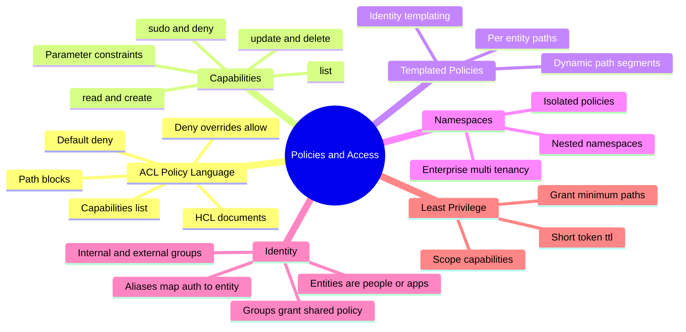
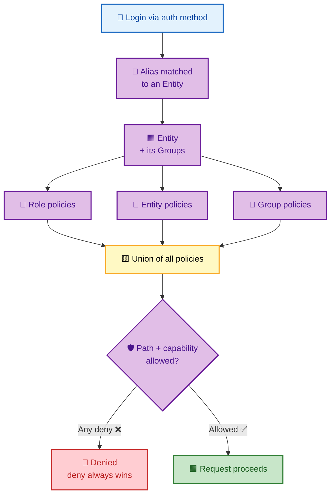
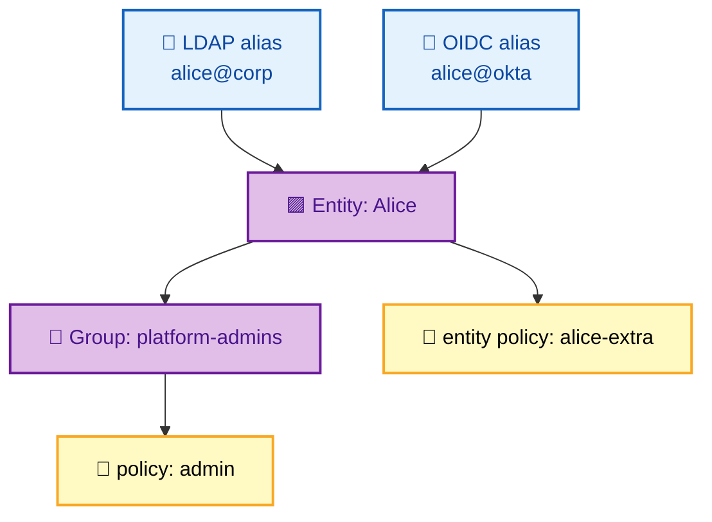

# SECTION 4: POLICIES & ACCESS

> **Scope:** The authorization layer — the **ACL policy language**, **path-based capabilities**, **templated policies**, **namespaces** (Enterprise multi-tenancy), the **identity** system (entities & groups), and how to design for **least privilege**.

---

## 🗺️ Visual Overview

**In one line:** Vault authorization is **path-based and default-deny** — policies are HCL documents that grant **capabilities** (read, create, update, delete, list) on **paths**, are attached to tokens via auth roles, and combine with **identity** (entities & groups) so a caller's effective permission is the *union* of all their policies.

**Mind map — policies & access at a glance** (skim first, revisit last):



**How a token's effective permissions are assembled** (blue = login, purple = identity, yellow = policies, green = decision):



> 🧠 **Memory hooks (mnemonics):**
> - **Default deny, deny wins:** nothing is allowed unless a policy grants it, and an explicit `deny` **always** overrides any allow. "Silence = no; No = no."
> - **Capabilities map to HTTP verbs:** `read`=GET, `create`=POST, `update`=PUT, `delete`=DELETE, `list`=LIST. "CRUD + L."
> - **Policies attach to tokens, not users:** a token carries the *union* of its policies. "You are what your token grants."
> - **Entity = the real identity behind many logins:** one person with an LDAP alias *and* an AppRole alias is one **entity** — policies on the entity apply no matter how they logged in.
> - **`sudo` ≠ root:** some sensitive paths require the special `sudo` capability *in addition to* the normal one; root has everything, sudo is per-path elevation.

---

## 1. The ACL Policy Language

> 🎯 **Interview weight: Very High** — writing and reading policies is table-stakes for any Vault role.

**In one line:** A policy is an **HCL** document of `path "..." { capabilities = [...] }` blocks; Vault is **default-deny**, so a token can do *only* what its attached policies explicitly permit — and an explicit `deny` capability beats every allow.

**Anatomy of a policy:**
```hcl
# Read-only access to one app's KV v2 secret
path "secret/data/app/*" {
  capabilities = ["read", "list"]     # allowed verbs on this path glob
}

# Explicitly forbid a sensitive subpath (deny always wins)
path "secret/data/app/admin" {
  capabilities = ["deny"]
}

# Allow issuing DB creds, but nothing else under database/
path "database/creds/readonly" {
  capabilities = ["read"]
}
```

| Capability | Maps to | Meaning |
|---|---|---|
| `read` | GET | Read a secret/config |
| `create` | POST | Create where none exists |
| `update` | POST/PUT | Write/modify |
| `delete` | DELETE | Remove |
| `list` | LIST | Enumerate keys (not values) |
| `sudo` | — | Required for certain root-protected paths |
| `deny` | — | Explicitly forbid (overrides all allows) |

> ⚠️ **`list` ≠ `read`:** `list` lets you see key *names*, not their values. A policy with only `read` can't enumerate; only `list` can. Many "I can't see my secrets" tickets are a missing `list`.

> 🔍 **Under the hood:** On each request Vault gathers all policies attached to the token (from the auth role, the entity, and its groups), then evaluates the requested path+capability against them. Path matching supports the `*` glob (trailing) and `+` (single segment wildcard). If any matching rule says `deny`, the request fails regardless of other allows.

```bash
vault policy write app-read app-read.hcl     # upload a policy from file
vault policy read app-read                    # show a policy
vault policy list                             # list all policies
vault token capabilities <token> secret/data/app/db   # what can this token do on a path?
```

---

## 2. Path-Based Capabilities & Parameter Constraints

> 🎯 **Interview weight: High** — the glob rules and parameter constraints show real depth.

**In one line:** Because *everything in Vault is a path*, authorization reduces to matching a request's path against policy globs and checking the capability — and you can go finer-grained by constraining **allowed/denied parameters** on writes.

**Path matching rules:**
- Exact match: `secret/data/app` matches only that path.
- Glob (`*`): `secret/data/app/*` matches anything under `app/` (trailing only).
- Segment wildcard (`+`): `secret/data/+/config` matches one segment in that position.
- **Most specific match wins** for conflicting priorities, but an explicit `deny` anywhere still wins overall.

**Parameter constraints** tighten writes:
```hcl
path "database/roles/*" {
  capabilities = ["create", "update"]
  allowed_parameters  = { "default_ttl" = [] }    # may only set default_ttl
  denied_parameters   = { "max_ttl" = [] }        # may NOT set max_ttl
}
```

| Constraint | Effect |
|---|---|
| `allowed_parameters` | Whitelist of settable params (empty list = any value) |
| `denied_parameters` | Blacklist of params that must not be set |
| `required_parameters` | Params that must be present |
| `min_wrapping_ttl` / `max_wrapping_ttl` | Bound response-wrapping TTLs |

> 💡 **Interview nuance:** parameter constraints let you grant "can create DB roles but cannot raise max_ttl" — authorization at the *field* level, not just the path. Few candidates know this; mentioning it signals depth.

---

## 3. Templated Policies

> 🎯 **Interview weight: Medium-High** — how one policy scales to thousands of identities.

**In one line:** Templated policies embed **identity metadata** (like the entity ID or a group name) directly into paths using `{{identity.entity.id}}`-style templating, so a *single* policy grants each caller access to *their own* isolated path without writing one policy per user.

**Example — per-entity private secret space:**
```hcl
# Each entity can only touch secrets under its own ID
path "secret/data/users/{{identity.entity.id}}/*" {
  capabilities = ["create", "read", "update", "delete", "list"]
}

# Group-scoped shared space
path "secret/data/teams/{{identity.groups.names.platform.id}}/*" {
  capabilities = ["read", "list"]
}
```

| Template variable | Resolves to |
|---|---|
| `identity.entity.id` | The caller's entity ID |
| `identity.entity.name` | Entity name |
| `identity.entity.metadata.<key>` | Custom entity metadata |
| `identity.groups.names.<name>.id` | A group's ID by name |

> 🔍 **Under the hood:** templating is resolved *per request* against the token's identity. One policy document therefore expands to a different effective path for every caller — massively reducing policy sprawl and the risk of copy-paste mistakes.

> 💡 **Classic use case:** multi-tenant self-service — every developer gets a private `secret/data/users/<their-id>/*` sandbox from one shared policy, with zero per-user policy management.

---

## 4. Namespaces (Enterprise Multi-Tenancy)

> 🎯 **Interview weight: Medium** — know the concept and the isolation guarantee (Enterprise feature).

**In one line:** Namespaces (Vault **Enterprise**) carve one Vault cluster into isolated tenants, each with its *own* policies, auth methods, secret engines, tokens, and identity — so teams self-manage without seeing each other, enabling secure multi-tenancy on shared infrastructure.

| Property | Behavior |
|---|---|
| Isolation | Each namespace has independent mounts, policies, tokens |
| Nesting | Namespaces can nest (`team-a/sub/`) |
| Delegation | Admins manage their namespace without global root |
| Path prefix | API calls target `X-Vault-Namespace` or path prefix |

> 🔍 **Under the hood:** a namespace is a logical prefix over the whole API surface. A token in `team-a/` can't reach `team-b/` paths; policies are scoped to the namespace they're written in. This lets a platform team hand each product team a "mini-Vault" without separate clusters.

> ⚠️ **Enterprise-only:** namespaces are not in Vault Community/OSS. If asked to multi-tenant on OSS, you isolate via careful path design + policies + separate auth mounts, but without the hard isolation namespaces provide.

```bash
vault namespace create team-a                 # (Enterprise) create a namespace
VAULT_NAMESPACE=team-a vault secrets enable -path=kv kv-v2   # scoped to team-a
vault namespace list
```

---

## 5. Identity: Entities & Groups

> 🎯 **Interview weight: High** — entities/aliases unify multiple logins into one identity.

**In one line:** The identity system models the *real* actor behind many logins — an **entity** is a person or app, **aliases** map each auth-method login (LDAP, AppRole, OIDC) to that single entity, and **groups** grant shared policies — so permissions follow the identity no matter how they authenticate.

**The model:**
- **Entity:** one logical identity (e.g., "Alice" or "payments-service").
- **Alias:** a link from an auth method's login (Alice's LDAP account, Alice's OIDC account) to the entity. Multiple aliases → one entity.
- **Group:** a collection of entities (or other groups) that share policies.
  - **Internal groups:** membership managed in Vault.
  - **External groups:** membership driven by an auth method's group claim (e.g., an OIDC `groups` claim or LDAP group).



| Concept | Purpose |
|---|---|
| Entity | The canonical identity (person/app) |
| Alias | Maps one auth login → entity (many-to-one) |
| Internal group | Vault-managed membership + shared policy |
| External group | Membership from auth method group claim |

> 💡 **Why it matters:** without entities, Alice logging in via LDAP vs OIDC would be two unrelated identities with duplicated policy. With entities, both aliases resolve to "Alice," so policies and audit attribution are unified. External groups let you drive access from your IdP's groups — change group membership in Okta, and Vault access follows.

```bash
vault write identity/entity name="alice" policies="alice-extra"
vault write identity/entity-alias name="alice@corp" \
    canonical_id=<entity_id> mount_accessor=<ldap_accessor>
vault write identity/group name="platform-admins" \
    policies="admin" member_entity_ids=<entity_id>
```

---

## 6. Designing for Least Privilege

> 🎯 **Interview weight: High** — the design-philosophy question that separates operators from architects.

**In one line:** Least privilege in Vault means granting the **narrowest paths**, the **minimum capabilities**, and the **shortest token TTLs** that still let a workload function — so a compromised token exposes as little as possible for as short a time as possible.

**Practical rules:**
- Scope policies to **specific paths**, never `secret/*` or `*`.
- Grant only the capabilities needed (`read` for a consumer, not `create`/`delete`).
- Prefer **dynamic secrets** (Section 3) so credentials are short-lived by construction.
- Set tight `token_ttl`/`token_max_ttl` on auth roles.
- Use **separate policies per app/role**; compose with groups, don't over-grant.
- Reserve the **root token** for break-glass only — revoke it after setup.

| Anti-pattern | Least-privilege fix |
|---|---|
| `path "*" { capabilities=["read"] }` | Scope to exact mount/path the app needs |
| One shared policy for all apps | One policy per role, composed via groups |
| Long-lived tokens in config | Short TTL + Vault Agent auto-renew |
| Keeping the root token around | Revoke it; use targeted admin policies |

> ⚠️ **Root token hygiene:** the initial root token has *every* permission. Use it to configure auth/policies, then **revoke it** (`vault token revoke`). Regenerate on demand with unseal/recovery keys only when needed (Section 6).

> 💡 **Interview closer:** tie least privilege to the barrier and leases — Vault's whole design (encrypt everything, mint short-lived credentials, path-scoped policies) *is* least privilege by default; your job is to not undermine it with broad globs and long TTLs.

---

## Interview Questions & Answers

**Q1. How does Vault authorization work — RBAC, ABAC, or something else?**
**Answer:** It's **path-based ACLs with default-deny**: policies grant capabilities on paths, attach to tokens, and the effective permission is the union of all attached policies — with any explicit `deny` overriding allows. **Internals:** on each request Vault matches the path+capability against policies from the auth role, entity, and groups. **Follow-up ("how do you get ABAC-like behavior?"):** templated policies inject identity metadata into paths, and parameter constraints restrict field values — attribute-driven without a separate ABAC engine.

**Q2. What's the difference between `read` and `list` capabilities?**
**Answer:** `read` retrieves a secret's value at a known path; `list` enumerates key *names* under a path but not their values. **Internals:** they map to GET vs LIST operations; UIs and "browse" features need `list`, direct fetches need `read`. **Follow-up ("user says they can't see secrets in the UI"):** they likely have `read` but not `list`, so they can fetch a known path but can't browse.

**Q3. Explain entities, aliases, and groups.**
**Answer:** An entity is the canonical identity of a person/app; aliases map each auth-method login to that entity (many-to-one); groups bundle entities to share policies. **Internals:** logging in via LDAP or OIDC resolves the alias to one entity, so policies and audit attribution unify across methods; external groups derive membership from an IdP claim. **Follow-up ("why not just attach policies per login?"):** you'd duplicate policy and fragment identity — entities give one actor, one policy set, one audit trail.

**Q4. What are templated policies and why are they useful?**
**Answer:** Policies that embed identity metadata (e.g., `{{identity.entity.id}}`) into paths, so one policy grants each caller access to *their own* isolated path. **Internals:** templating resolves per request against the token's identity, expanding to a per-caller effective path. **Follow-up ("use case?"):** multi-tenant self-service — every user gets a private sandbox from a single shared policy, eliminating per-user policy management.

**Q5. How do you design least-privilege access for a new service?**
**Answer:** Grant only the exact paths it reads, only the capabilities it needs, prefer dynamic secrets, and set short token TTLs via its auth role — composing policies with groups rather than broadening globs. **Internals:** default-deny means you add exactly what's required; short TTLs + dynamic secrets shrink the time-and-blast-radius of any leak. **Follow-up ("what about the root token?"):** revoke it after bootstrap; regenerate via unseal/recovery keys only for break-glass.

**Q6. Two policies conflict — one allows, one denies a path. What happens?**
**Answer:** **Deny wins.** An explicit `deny` capability overrides any allow, regardless of path specificity. **Internals:** Vault unions all policies but treats deny as absolute, so you can carve exceptions into a broad grant. **Follow-up ("how to allow everything under app/ except one subpath?"):** grant `secret/data/app/*` read, then `deny` on `secret/data/app/secret-admin`.

---

## Troubleshooting Scenarios

- **`permission denied` on a KV v2 read:** policy targets `secret/<path>` instead of `secret/data/<path>`; fix the path prefix.
- **User can fetch a secret but can't browse it:** missing `list` capability on the parent path; add `list`.
- **A new grant "isn't working":** an explicit `deny` in another attached policy is overriding it; audit all policies on the token with `vault token capabilities`.
- **Policy with identity template resolves to the wrong path:** the token has no entity (e.g., a raw token without identity), so `{{identity.entity.id}}` is empty; ensure login goes through an auth method that creates an alias/entity.
- **Team can see another team's secrets:** on OSS you lack namespace isolation — separate mounts + scoped policies; on Enterprise, use namespaces.
- **Can't perform a root-protected operation:** the path requires the `sudo` capability in addition to the normal one; add `sudo`.

---

## Documentation Links

- [Policies Concepts](https://developer.hashicorp.com/vault/docs/concepts/policies)
- [ACL Policy Syntax](https://developer.hashicorp.com/vault/docs/concepts/policies#policy-syntax)
- [Templated Policies (identity)](https://developer.hashicorp.com/vault/docs/concepts/policies#templated-policies)
- [Identity: Entities & Groups](https://developer.hashicorp.com/vault/docs/concepts/identity)
- [Namespaces (Enterprise)](https://developer.hashicorp.com/vault/docs/enterprise/namespaces)
- [Policy `capabilities` reference](https://developer.hashicorp.com/vault/docs/concepts/policies#capabilities)

---

**[← Back: Secrets Engines](03-SECRETS-ENGINES.md)** | **[Next: Production →](05-PRODUCTION.md)**
