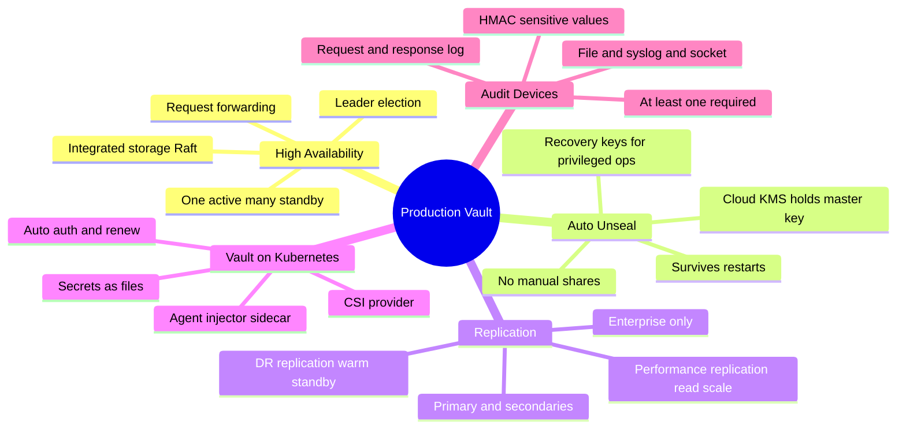
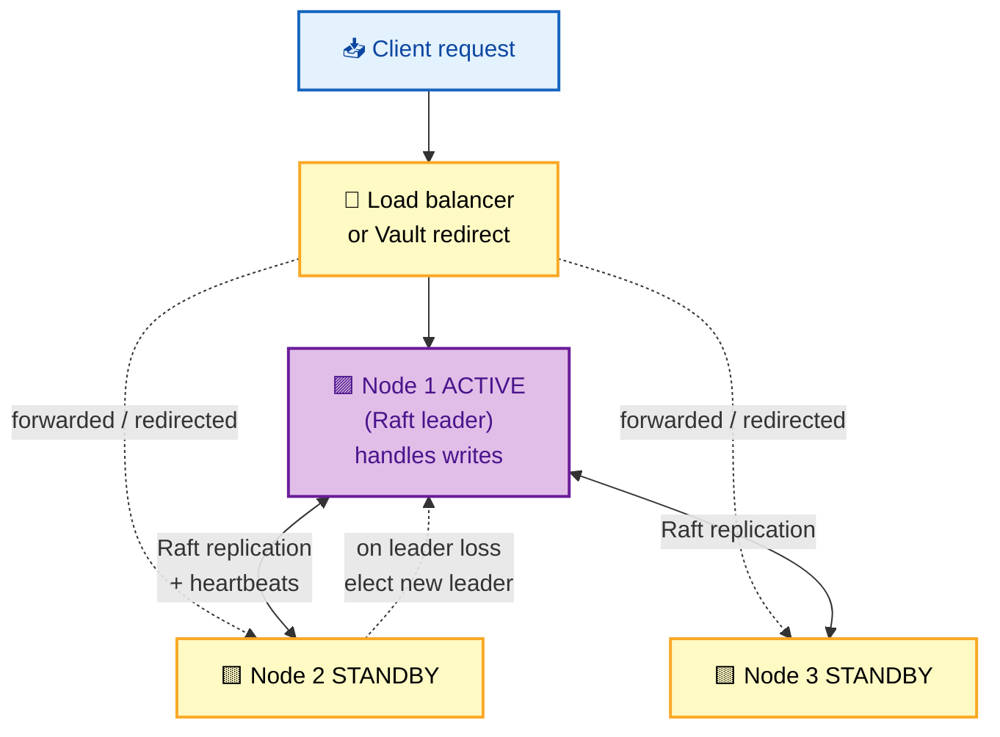
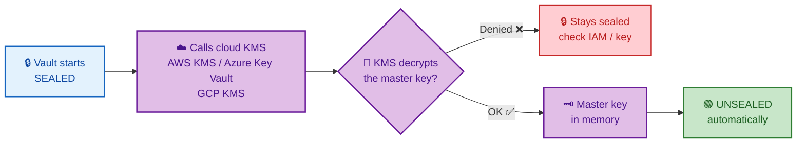

# SECTION 5: PRODUCTION

> **Scope:** Running Vault for real — **HA with integrated storage (Raft)**, **auto-unseal** with cloud KMS, **DR & performance replication** (Enterprise), **Vault on Kubernetes** (Agent Injector & CSI provider), and **audit devices**.

---

## 🗺️ Visual Overview

**In one line:** Production Vault means **no single point of failure** (Raft HA), **no human unseal on every restart** (auto-unseal via KMS), **survivable disasters and low-latency reads** (replication), **seamless secret delivery to pods** (injector/CSI), and **tamper-evident audit** — turning a single sealed process into a resilient secrets platform.

**Mind map — production Vault at a glance** (skim first, revisit last):



**Raft HA — active/standby with request forwarding** (purple = leader, yellow = standby, green = serving):



**Auto-unseal — KMS reconstructs the master key at startup** (blue = start, purple = KMS, green = unsealed):



> 🧠 **Memory hooks (mnemonics):**
> - **Raft = one active, rest standby:** only the **leader** serves writes; standbys forward/redirect to it. "One writes, many wait."
> - **Auto-unseal swaps *who holds* the master key:** a cloud KMS, not humans. Shamir shares become **recovery keys** (for rekey/root-gen), not unseal keys. "KMS unseals, humans recover."
> - **DR vs Performance replication:** **DR = Disaster Recovery** (warm standby, no reads, promote on failure); **Perf = read scaling** (secondaries serve reads locally). "DR for survival, Perf for speed."
> - **Injector vs CSI:** **Injector** = sidecar writes secrets to a shared *file/volume*; **CSI** = mounts secrets as a *volume* via the CSI driver. Both avoid secrets in env/image.
> - **Audit is mandatory-by-design:** if *all* audit devices fail to log, Vault **blocks the request** — it would rather deny than lose the audit trail. "No log, no go."

---

## 1. High Availability with Integrated Storage (Raft)

> 🎯 **Interview weight: Very High** — the default HA story; know active/standby and leader election.

**In one line:** Vault HA uses **integrated storage (Raft)**: a cluster of nodes replicates state via the Raft consensus protocol, elects one **active** (leader) node that serves all requests, and keeps the rest as **standbys** that take over automatically if the leader fails.

**How it works:**
- 3 or 5 nodes form a Raft cluster (odd count for quorum).
- One node is **active** (leader); it handles all reads/writes.
- **Standby** nodes replicate the Raft log and forward/redirect client requests to the active node.
- On leader loss, the remaining nodes hold a Raft **election**; a new leader is chosen once a quorum agrees, and service resumes.

| Concept | Meaning |
|---|---|
| Active node | The single leader serving requests |
| Standby node | Replicates state; forwards to active; election candidate |
| Quorum | Majority needed to elect a leader / commit (e.g., 2 of 3) |
| Request forwarding | Standby forwards to active over cluster port |
| Client redirect | Standby returns active's address to redirect the client |

> 🔍 **Under the hood:** Vault is **active/standby, not active/active** for writes — only the leader mutates state, which keeps consistency simple. Standbys aren't load-balanced read replicas (that's *performance replication*, Section 3). Quorum math matters: a 3-node cluster tolerates 1 failure; 5 nodes tolerate 2.

> ⚠️ **Each node seals independently** (unless auto-unseal). After a rolling restart without auto-unseal, you may need to unseal multiple nodes. This operational pain is the main reason production pairs Raft with auto-unseal.

```bash
vault operator raft list-peers            # show members + who is leader (voter/non-voter)
vault operator raft join https://active:8200    # add a node to the cluster
vault status                              # HA Mode: active | standby, HA Enabled: true
vault operator step-down                  # force the active node to relinquish leadership
```

---

## 2. Auto-Unseal with Cloud KMS

> 🎯 **Interview weight: Very High** — the trade-off vs Shamir is a favorite discussion.

**In one line:** Auto-unseal delegates protection of the **master key** to a cloud KMS (AWS KMS, Azure Key Vault, GCP KMS, or an HSM); at startup Vault asks the KMS to decrypt the master key, so it unseals **automatically** without humans assembling Shamir shares — essential for auto-scaling and self-healing.

**What changes vs Shamir:**
- The master key is **encrypted by the KMS**, not split into shares.
- On boot, Vault calls the KMS `Decrypt` to recover the master key — no manual step.
- Shamir shares are replaced by **recovery keys** (same threshold scheme) used only for *privileged* operations (rekey, generating a root token).

| Aspect | Shamir (manual) | Auto-unseal (KMS) |
|---|---|---|
| Unseal on restart | Humans submit shares | Automatic via KMS |
| Master key protection | Split across holders | Encrypted by KMS/HSM |
| Fits autoscaling | ❌ Painful | ✅ Yes |
| Trust dependency | The share holders | The cloud KMS/IAM |
| Break-glass keys | Unseal keys | Recovery keys |

> 💡 **Why it's non-negotiable in the cloud:** autoscaling groups and Kubernetes restart Vault pods routinely. Requiring humans to unseal each restart is impossible at scale, so auto-unseal is the norm; you accept a dependency on the KMS in exchange.

> ⚠️ **New dependency & failure mode:** if the KMS is unreachable or IAM denies `Decrypt`, Vault **can't unseal**. Secure the KMS key, its access policy, and understand that KMS availability is now in Vault's critical path.

```hcl
# vault config (HCL): AWS KMS auto-unseal stanza
seal "awskms" {
  region     = "us-east-1"
  kms_key_id = "arn:aws:kms:us-east-1:111122223333:key/abcd-..."
}
```
```bash
vault operator unseal -migrate    # migrate an existing Shamir cluster to auto-unseal
vault operator generate-root      # uses RECOVERY keys under auto-unseal
```

---

## 3. DR & Performance Replication (Enterprise)

> 🎯 **Interview weight: Medium-High** — know the *two distinct* replication types and their purpose.

**In one line:** Vault **Enterprise** offers two replication modes — **Disaster Recovery (DR)** keeps a warm standby cluster that serves *nothing* until promoted (for surviving a region outage), and **Performance** replication creates secondaries that serve reads locally (for low-latency, multi-region scale).

| Mode | Serves client traffic? | Purpose | On failover |
|---|---|---|---|
| **DR replication** | ❌ No (warm standby) | Survive a full cluster/region loss | Promote secondary to primary |
| **Performance replication** | ✅ Reads locally | Low-latency reads across regions; scale | Secondaries keep serving reads |

**Key differences:**
- **DR secondary** is a full mirror (including tokens/leases) but rejects requests until promoted — it's an insurance policy.
- **Performance secondary** handles reads and local auth in its region, forwarding writes to the primary — it scales read-heavy, geo-distributed workloads. Some state (like local leases) is region-local.

> 🔍 **Under the hood:** both replicate the encrypted store from a **primary**. DR optimizes for *recovery point/time objectives* (RPO/RTO); performance optimizes for *latency and throughput*. They can be combined (a performance secondary can itself have a DR secondary).

> ⚠️ **Enterprise-only:** replication is not in Community/OSS. For OSS multi-region, you rely on Raft within a region plus external DR (snapshots), accepting higher RTO.

```bash
vault write -f sys/replication/dr/primary/enable
vault write sys/replication/dr/primary/secondary-token id=dr-secondary
vault write -f sys/replication/performance/primary/enable
vault read sys/replication/status        # inspect replication state/lag
```

---

## 4. Vault on Kubernetes (Agent Injector & CSI)

> 🎯 **Interview weight: Very High** — how secrets reach pods without env vars or baked images.

**In one line:** On Kubernetes, secrets reach pods without touching the image or env by either the **Agent Injector** (a mutating webhook that adds a Vault Agent *sidecar* which authenticates and writes secrets to a shared in-memory file) or the **Secrets Store CSI driver** (which mounts Vault secrets as a volume) — both use Kubernetes auth (Section 2) under the hood.

**Agent Injector (sidecar pattern):**
- A **mutating admission webhook** watches for pods with `vault.hashicorp.com/agent-inject` annotations.
- It injects an **init container** + **sidecar** running **Vault Agent**.
- The Agent uses **Kubernetes auth** to log in, fetches the secrets, and renders them to a shared `emptyDir` (memory) volume as files.
- The app reads secrets from those files; the Agent **auto-renews** and re-renders on change.

**CSI provider (volume pattern):**
- The **Secrets Store CSI driver** + Vault provider mounts secrets as a volume at pod start.
- Secrets appear as files under the mount path; supports sync to Kubernetes Secrets if desired.

| Approach | Mechanism | Secret appears as | Best when |
|---|---|---|---|
| **Agent Injector** | Sidecar Vault Agent + annotations | Files in shared memory volume | Templating, auto-renew, no app changes |
| **CSI provider** | CSI volume mount | Files at mount path | Standard CSI tooling, simpler sidecar-free |
| **Vault Agent (standalone)** | Agent as a sidecar/daemon | Files / env via template | Non-annotation control |

```yaml
# Pod annotations for the Agent Injector
metadata:
  annotations:
    vault.hashicorp.com/agent-inject: "true"
    vault.hashicorp.com/role: "myapp"                       # Kubernetes auth role
    vault.hashicorp.com/agent-inject-secret-db: "database/creds/readonly"
    vault.hashicorp.com/agent-inject-template-db: |
      {{- with secret "database/creds/readonly" -}}
      username={{ .Data.username }}
      password={{ .Data.password }}
      {{- end -}}
```

> 💡 **Why files, not env vars:** environment variables leak (child processes, crash dumps, `/proc`), can't be updated without restart, and aren't renewable. File-based delivery from a memory volume is updatable, renewable, and less leaky.

> ⚠️ **The sidecar needs the pod's service account** bound to a Vault Kubernetes-auth role (Section 2). Misconfigured `bound_service_account_*` is the most common "injector not working" cause.

---

## 5. Audit Devices

> 🎯 **Interview weight: High** — the "no log, no go" behavior and HMAC'd values.

**In one line:** Audit devices are Vault's **tamper-evident log** of every request and response; sensitive values are **HMAC'd** (not plaintext), at least one device should always be enabled, and — critically — if *all* enabled audit devices fail to write, Vault **refuses the request** rather than serving unaudited.

**How it works:**
- Enable one or more devices: **file**, **syslog**, or **socket**.
- Each request *and* response is logged as JSON, with secret values replaced by a salted **HMAC-SHA256** so logs are useful for correlation but don't leak secrets.
- Multiple devices can run; Vault logs to all of them.

| Device | Sink | Use |
|---|---|---|
| `file` | Local/NFS file | Simple, ship via agent |
| `syslog` | Syslog daemon | Central logging |
| `socket` | TCP/UDP/Unix socket | Stream to a collector |

> ⚠️ **Fail-closed behavior:** if Vault can't write to *any* enabled audit device, it **blocks the operation**. This is deliberate — losing the audit trail is treated as worse than denying service. Run at least two devices (e.g., file + syslog) so one sink failing doesn't halt Vault.

> 🔍 **Under the hood — why HMAC not plaintext:** you can still tell *whether two entries reference the same secret value* (same HMAC) for investigation, without the log itself exposing the secret. The salt is unique per Vault so HMACs aren't comparable across clusters.

```bash
vault audit enable file file_path=/vault/logs/audit.log
vault audit enable syslog tag="vault" facility="AUTH"     # second device for resilience
vault audit list -detailed                                # show enabled devices
vault audit disable file/                                 # remove a device
```

---

## Interview Questions & Answers

**Q1. How does Vault achieve high availability with integrated storage?**
**Answer:** A Raft cluster of (odd-numbered) nodes replicates state and elects one **active** leader that serves all requests; **standbys** replicate the log and forward/redirect to the leader, and on leader loss a Raft election promotes a new one once quorum agrees. **Internals:** it's active/standby (only the leader writes), so consistency is simple; a 3-node cluster tolerates 1 failure. **Follow-up ("are standbys read replicas?"):** no — that's *performance replication*; standbys don't serve reads independently.

**Q2. What is auto-unseal and what does it trade away?**
**Answer:** Auto-unseal has a cloud KMS/HSM protect the master key so Vault unseals automatically on restart instead of humans submitting Shamir shares — essential for autoscaling. **Internals:** the master key is encrypted by the KMS; Shamir shares become *recovery keys* for privileged ops only. **Follow-up ("what's the risk?"):** a new hard dependency — if the KMS is unreachable or IAM denies Decrypt, Vault can't unseal, putting KMS availability in the critical path.

**Q3. DR replication vs performance replication — when do you use each?**
**Answer:** DR replication is a warm standby that serves *no* traffic until promoted — use it to survive a region/cluster loss. Performance replication creates secondaries that serve reads locally — use it for low-latency, multi-region read scaling. **Internals:** both mirror the encrypted store from a primary; DR optimizes RPO/RTO, performance optimizes latency/throughput; writes always go to the primary. **Follow-up ("OSS option?"):** replication is Enterprise-only; on OSS you use Raft plus snapshot-based DR with higher RTO.

**Q4. How do secrets get into a Kubernetes pod with Vault?**
**Answer:** Via the **Agent Injector** (a mutating webhook adds a Vault Agent sidecar that uses Kubernetes auth, fetches secrets, and writes them as files to a shared memory volume with auto-renew) or the **Secrets Store CSI driver** (mounts secrets as a volume). Both avoid env vars and baked-in secrets. **Internals:** the sidecar authenticates with the pod's service-account JWT against a Vault Kubernetes-auth role. **Follow-up ("why files not env vars?"):** files are renewable and updatable and leak less than env vars, which appear in `/proc`, crash dumps, and child processes.

**Q5. Why does Vault block requests when audit logging fails?**
**Answer:** It's fail-closed by design — losing the audit trail is considered worse than denying service, so if *all* enabled audit devices can't write, Vault refuses the operation. **Internals:** each request/response is logged with sensitive values HMAC'd, not plaintext. **Follow-up ("how do you avoid an outage from this?"):** run at least two audit devices (e.g., file + syslog) so a single failing sink doesn't halt Vault.

**Q6. Why pair Raft HA with auto-unseal in production?**
**Answer:** Each Raft node seals independently on restart; without auto-unseal, rolling restarts or autoscaling would require humans to unseal every node — infeasible. Auto-unseal lets nodes self-recover and rejoin automatically. **Internals:** a restarted node calls the KMS to unseal, then rejoins the Raft cluster and catches up via the log. **Follow-up ("what still needs humans?"):** privileged ops like rekey and root-token generation, which use the recovery keys.

---

## Troubleshooting Scenarios

- **After a rolling restart, some nodes are sealed:** no auto-unseal configured; unseal each node or migrate to KMS auto-unseal (`vault operator unseal -migrate`).
- **Vault won't unseal after enabling auto-unseal:** the KMS is unreachable or IAM denies `Decrypt`; verify the key ARN, region, and the node's IAM role/permissions.
- **Raft cluster lost quorum:** too many nodes down (e.g., 2 of 3); restore from a Raft snapshot or bring nodes back to regain majority — writes are blocked until quorum returns.
- **Injector not delivering secrets to a pod:** the pod's service account isn't bound in the Vault Kubernetes-auth role, the annotation `role` is wrong, or the KV path is wrong; check Agent sidecar logs.
- **Requests intermittently fail with audit errors:** an audit sink (full disk / unreachable syslog) is failing and Vault is fail-closing; fix the sink or ensure a second device is healthy.
- **Performance secondary serves stale reads:** replication lag; check `sys/replication/status` and network between primary and secondary.

---

## Documentation Links

- [Integrated Storage (Raft) HA](https://developer.hashicorp.com/vault/docs/concepts/integrated-storage)
- [Auto-Unseal / Seal Configuration](https://developer.hashicorp.com/vault/docs/configuration/seal)
- [Replication (DR & Performance)](https://developer.hashicorp.com/vault/docs/enterprise/replication)
- [Vault Agent Injector for Kubernetes](https://developer.hashicorp.com/vault/docs/platform/k8s/injector)
- [Secrets Store CSI Provider](https://developer.hashicorp.com/vault/docs/platform/k8s/csi)
- [Audit Devices](https://developer.hashicorp.com/vault/docs/audit)

---

**[← Back: Policies & Access](04-POLICIES-ACCESS.md)** | **[Next: Troubleshooting →](06-TROUBLESHOOTING.md)**
