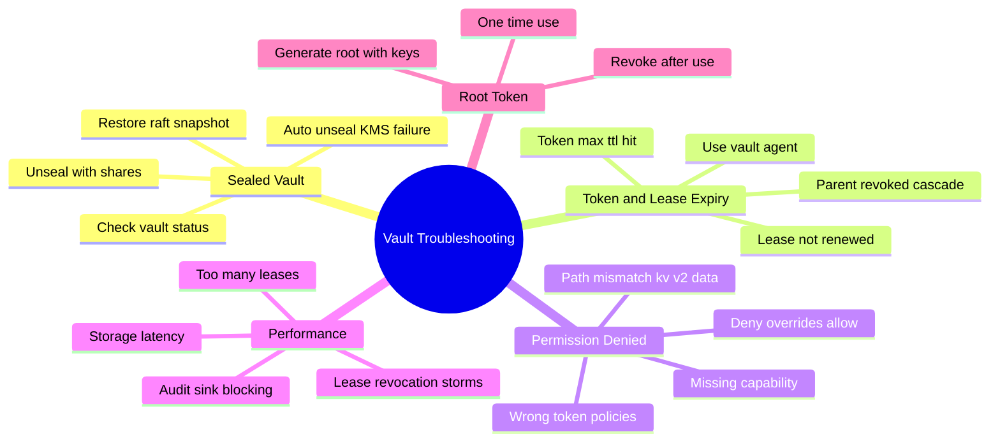
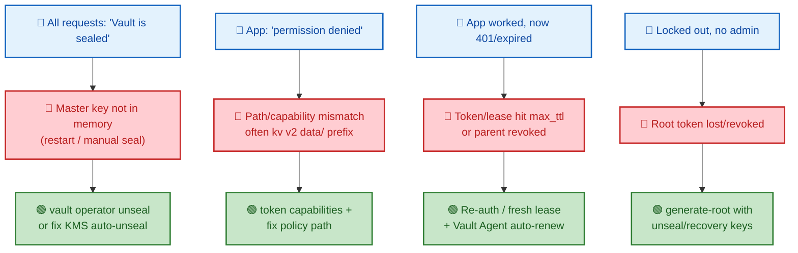

# SECTION 6: TROUBLESHOOTING

> **Scope:** Real recovery playbooks — recovering a **sealed vault**, diagnosing **token & lease expiry** issues, debugging **permission denied / policy** problems, addressing **performance**, and **generating a new root token** for break-glass.

---

## 🗺️ Visual Overview

**In one line:** Most Vault incidents fall into five buckets — it's **sealed** (no master key in memory), a **credential expired** (token/lease TTL), **authorization denied** (path/capability mismatch), it's **slow** (storage/lease/audit pressure), or you're **locked out** (need a new root token) — and each has a deterministic diagnosis path.

**Mind map — the troubleshooting surface** (skim first, revisit last):



**Incident triage — symptom to root cause to fix** (blue = symptom, red = root cause, green = fix):



> 🧠 **Memory hooks (mnemonics):**
> - **Sealed first:** before anything else, run `vault status` — if `Sealed: true`, nothing works until you unseal. "Status before stress."
> - **KV v2 `data/`:** 90% of "permission denied" on KV v2 is a policy missing the `data/` prefix. "Denied? Check the data path."
> - **Expired = re-auth, don't patch:** a maxed-out token/lease can't be renewed — get a *fresh* one. "Past max_ttl, past saving."
> - **Root gen = quorum ritual:** generating a root token needs unseal/recovery key holders + a one-time-password (OTP) dance. "It takes the village to make a root."
> - **Deny wins, always:** unexpected denial with a matching allow? Hunt for a `deny` in another attached policy.

---

## 1. Sealed Vault Recovery

> 🎯 **Interview weight: Very High** — the first thing to check in any Vault outage.

**In one line:** A sealed Vault refuses all requests because the master key isn't in memory; recover by **unsealing** — submit threshold Shamir shares (manual seal) or fix the **KMS/IAM** path (auto-unseal) — and for corrupted/lost state, **restore a Raft snapshot**.

**Diagnosis ladder:**

| Symptom | Likely cause | Fix |
|---|---|---|
| `vault status` → `Sealed: true` after restart | Memory wiped (no auto-unseal) | `vault operator unseal` ×threshold |
| Auto-unseal node stays sealed | KMS unreachable / IAM denies `Decrypt` | Fix KMS key access, region, node IAM |
| Sealed + `core: cluster listener` errors | Raft quorum/peer issues | Restore peers/quorum, then unseal |
| Data corrupted / node unrecoverable | Storage damage | `raft snapshot restore` from backup |

```bash
vault status                                   # Sealed? threshold? progress N/T?
vault operator unseal                          # submit one share; repeat to threshold
vault operator raft list-peers                 # confirm cluster membership/leader
vault operator raft snapshot restore bkp.snap  # restore state if corrupted
```

> ⚠️ **Auto-unseal outages are KMS problems, not Vault problems:** if a KMS-backed node won't unseal, the issue is almost always the KMS key policy, region, endpoint reachability, or the node's IAM role lacking `kms:Decrypt`. Check those before touching Vault.

> 💡 **Emergency seal is intentional:** if someone ran `vault operator seal` during an incident, that's a deliberate lockdown — confirm it's safe, then unseal. Don't automate around it blindly.

---

## 2. Token & Lease Expiry Issues

> 🎯 **Interview weight: High** — "it worked for an hour then broke" is a lease/token story.

**In one line:** Credentials that "suddenly stop working" almost always hit their **TTL/`max_ttl`** or had their **parent revoked** — you can't renew past `max_ttl`, so the fix is to obtain a *fresh* token/lease, ideally automatically via **Vault Agent**.

**Common patterns:**

| Symptom | Root cause | Fix |
|---|---|---|
| Token rejected after fixed time | Hit `token_max_ttl` | Re-authenticate for a new token |
| App loses DB access hourly | Dynamic lease hit `max_ttl` | Request fresh creds each cycle |
| Many tokens die at once | A shared parent was revoked (cascade) | Use **orphan** tokens for services |
| Renewal returns error | Renewing past `max_ttl` | Re-auth; renewal can't exceed the ceiling |

> 🔍 **Under the hood:** `ttl` is the current validity; `max_ttl` is the absolute ceiling renewals can't cross. When an app renews right up to `max_ttl`, the next renewal fails and it *must* get a new credential. This is the intended "force rotation" behavior — not a bug.

> 💡 **The durable fix is Vault Agent:** it auto-authenticates (via Kubernetes/AppRole/cloud auth), caches the token, and renews leases *before* expiry — so apps never handle expiry logic or hit a hard wall.

```bash
vault token lookup                 # display ttl, max_ttl (explicit_max_ttl), policies
vault token renew <token>          # extend a service token (fails past max_ttl)
vault lease renew <lease_id>       # extend a dynamic secret lease (bounded by max_ttl)
vault token create -orphan ...     # detach from parent so cascades don't kill it
```

---

## 3. Permission Denied / Policy Debugging

> 🎯 **Interview weight: Very High** — the single most common day-to-day Vault error.

**In one line:** `permission denied` means the token's policies don't grant the requested **capability** on the requested **path** — debug by checking the token's policies, confirming the exact path (watch the **KV v2 `data/` prefix**), and hunting for an explicit **`deny`**.

**Debugging checklist (in order):**
1. **What can this token actually do?** `vault token capabilities <token> <path>` reports the effective capabilities — the fastest answer.
2. **Right path?** On KV v2, values live at `secret/data/<path>`, not `secret/<path>`. A policy against the wrong prefix grants nothing.
3. **Right capability?** `read` vs `list` vs `update` — needing to *browse* requires `list`; needing to *write* requires `create`/`update`.
4. **Any `deny`?** An explicit `deny` in *any* attached policy overrides all allows.
5. **Right policies attached?** `vault token lookup` shows the token's policies; confirm the auth role/entity/group grant what you expect.

```bash
vault token capabilities <token> secret/data/app/db   # effective caps on that exact path
vault token lookup                                     # policies attached to current token
vault policy read <policy-name>                        # inspect the policy's path blocks
```

| Error clue | Usual cause |
|---|---|
| Denied on KV v2 read | Policy uses `secret/<p>` not `secret/data/<p>` |
| Can read but not browse | Missing `list` capability |
| Grant "ignored" | A `deny` elsewhere overrides it |
| Denied right after login | Auth role didn't attach the expected `token_policies` |
| Template path empty | Raw token with no entity; `{{identity.entity.id}}` unset |

> 💡 **Fastest triage:** `vault token capabilities` against the *exact failing path* answers "is it a policy problem or something else?" in one command — do this before reading policies by hand.

> ⚠️ **Enable `-log-level=debug` / check audit logs:** the audit log records the exact path and the token's policies for each denied request, which pinpoints the mismatch when `capabilities` isn't enough.

---

## 4. Performance Problems

> 🎯 **Interview weight: Medium-High** — tie slowness to storage, leases, or audit.

**In one line:** Vault slowness usually traces to **storage backend latency**, an **explosion of active leases/tokens** (each is persisted state), **audit sink blocking** (fail-closed writes), or **revocation storms** — diagnose with metrics and reduce lease/token churn with sensible TTLs.

| Symptom | Likely cause | Fix |
|---|---|---|
| Writes slow across the board | Storage (Raft disk/Consul) latency | Faster disks; check Raft I/O; reduce write volume |
| Latency scales with load over time | Too many active leases/tokens | Shorten TTLs; use batch tokens for ephemeral loads |
| Periodic stalls | Audit device blocking (slow syslog/full disk) | Fix/duplicate audit sinks (fail-closed design) |
| Spikes on mass expiry | Lease **revocation storm** (many DROP/cleanup ops) | Stagger TTLs; avoid huge synchronized lease sets |

> 🔍 **Under the hood:** every **service token** and **dynamic lease** is persisted, encrypted state the expiration manager must track and revoke. Millions of short-TTL service tokens turn into storage and revocation pressure — which is exactly why **batch tokens** (no persistence) exist for high-volume ephemeral workloads.

> 💡 **Watch telemetry:** `vault.expire.num_leases`, storage operation latencies, and audit log write times reveal which of the four buckets you're in. Tune TTLs and token types accordingly.

```bash
vault read sys/metrics -format=json            # pull telemetry (or scrape Prometheus)
vault list sys/leases/lookup/database/creds/readonly   # gauge active leases per mount
vault lease revoke -prefix sys/leases/revoke   # controlled cleanup of stale leases
```

---

## 5. Root Token Generation (Break-Glass)

> 🎯 **Interview weight: High** — the "we lost all admin access" recovery, and why it needs quorum.

**In one line:** When no root/admin token exists, you regenerate one with `vault operator generate-root`, which requires a **quorum of unseal (or recovery) key holders** plus a one-time password — a deliberately multi-person ritual so no single person can mint root access.

**The flow:**
1. **Initialize:** `generate-root -init` produces a **one-time password (OTP)** (or PGP setup) and a nonce.
2. **Provide shares:** each key holder submits an unseal/recovery key share with the nonce; progress advances as with unsealing.
3. **Threshold reached:** Vault outputs an **encoded root token**.
4. **Decode:** combine the encoded token with the OTP to reveal the new root token.
5. **Use briefly, then revoke:** perform the emergency admin task and `vault token revoke` the root token immediately.

```bash
vault operator generate-root -init         # get OTP + nonce
vault operator generate-root               # each holder submits a key share + nonce
vault operator generate-root \
    -decode=<encoded-token> -otp=<otp>     # reveal the new root token
vault token revoke <new-root-token>        # revoke after the break-glass task
```

| Step | Who | Safeguard |
|---|---|---|
| `-init` | Operator | Generates OTP + nonce |
| Submit shares | Key holders | Needs threshold (quorum) |
| Decode | Operator | OTP required to reveal token |
| Revoke | Operator | Root is break-glass only |

> ⚠️ **Under auto-unseal, use the *recovery* keys** (not unseal keys) for `generate-root` — auto-unseal replaces Shamir unseal keys with recovery keys for exactly these privileged operations.

> 💡 **Why the ritual:** root access can read/modify everything and bypass policies, so minting it is intentionally impossible for one person alone — it needs a quorum, mirroring the Shamir philosophy that secured unsealing in the first place.

---

## Interview Questions & Answers

**Q1. Vault is returning "Vault is sealed" for every request. Walk me through recovery.**
**Answer:** Run `vault status` to confirm `Sealed: true`, then unseal — submit threshold Shamir shares (`vault operator unseal`) for manual seal, or fix the KMS/IAM path for auto-unseal. If state is corrupted, restore a Raft snapshot. **Internals:** sealed means the master key isn't in memory (restart wiped it or someone sealed it), so Vault can see ciphertext but can't decrypt. **Follow-up ("auto-unseal node won't unseal?"):** it's a KMS problem — check key policy, region, reachability, and the node's `kms:Decrypt` IAM permission.

**Q2. An app worked for an hour then started getting 403/expired. Diagnose.**
**Answer:** Its token or dynamic lease hit `max_ttl` and can't be renewed, or a shared parent token was revoked and cascaded. The fix is to re-authenticate for a fresh credential, ideally via Vault Agent auto-auth/renew. **Internals:** `max_ttl` is an absolute ceiling renewals can't cross, forcing rotation. **Follow-up ("how to make it robust?"):** Vault Agent renews before expiry and re-auths as needed; for long-lived services use orphan tokens so cascades don't kill them.

**Q3. What's your step-by-step for debugging `permission denied`?**
**Answer:** (1) `vault token capabilities <token> <path>` to see effective caps; (2) verify the exact path — KV v2 uses `secret/data/<p>`; (3) confirm the capability (`read` vs `list` vs `update`); (4) check for an explicit `deny`; (5) confirm the auth role/entity/group attached the expected policies. **Internals:** authorization is a path+capability match with deny overriding allow. **Follow-up ("most common single cause?"):** the KV v2 `data/` prefix missing from the policy path.

**Q4. How do you generate a new root token and why is it deliberately hard?**
**Answer:** `vault operator generate-root` — init to get an OTP+nonce, have a quorum of unseal/recovery key holders submit shares, then decode the encoded token with the OTP; revoke it after use. It's hard on purpose so no single person can mint root, which bypasses all policy. **Internals:** it reuses the Shamir threshold, and under auto-unseal it requires *recovery* keys. **Follow-up ("why not keep the original root token?"):** root should be revoked after bootstrap (least privilege); you regenerate only for break-glass.

**Q5. Vault got slow under load. Where do you look?**
**Answer:** Storage latency (Raft disk/Consul), an explosion of active leases/tokens (persisted state), audit sink blocking (fail-closed writes), or a revocation storm at mass expiry. **Internals:** each service token and dynamic lease is tracked encrypted state; millions of them pressure storage and the expiration manager. **Follow-up ("fix for high-volume ephemeral workloads?"):** use batch tokens (not persisted) and shorter/staggered TTLs; monitor `vault.expire.num_leases` and storage latency.

**Q6. After enabling auto-unseal, privileged operations like rekey fail with your unseal keys. Why?**
**Answer:** Auto-unseal replaces Shamir *unseal* keys with *recovery* keys; privileged operations (rekey, generate-root) require the **recovery** keys, not the old unseal keys. **Internals:** the KMS now holds the master key, so recovery keys are the human quorum for sensitive ops. **Follow-up ("what if recovery keys are lost?"):** you can't perform those privileged ops — which is why recovery keys must be distributed and safeguarded like the original unseal keys.

---

## Troubleshooting Scenarios

- **`Sealed: true` after every restart:** no auto-unseal; unseal manually or migrate to KMS auto-unseal so nodes self-recover.
- **KMS auto-unseal node stuck sealed:** IAM lacks `kms:Decrypt`, wrong key ARN/region, or KMS endpoint unreachable — fix the KMS access path.
- **`permission denied` on a KV v2 secret that "should work":** policy path missing `data/`; use `secret/data/<path>`.
- **Can fetch a known secret but UI browse fails:** missing `list` capability on the parent path.
- **All of a service's workers died together:** they were child tokens of a revoked parent; switch to orphan tokens.
- **Renew keeps failing:** you're at `max_ttl` — re-authenticate for a fresh token/lease instead of renewing.
- **Latency climbs over hours then drops after restart:** lease/token accumulation; shorten TTLs, use batch tokens, and check `vault.expire.num_leases`.
- **Locked out with no admin token:** run `vault operator generate-root` with a quorum of recovery/unseal key holders; revoke the new root after use.

---

## Documentation Links

- [Seal/Unseal Concepts](https://developer.hashicorp.com/vault/docs/concepts/seal)
- [Generate Root Token](https://developer.hashicorp.com/vault/docs/commands/operator/generate-root)
- [Lease, Renew & Revoke](https://developer.hashicorp.com/vault/docs/concepts/lease)
- [Policies & Debugging Access](https://developer.hashicorp.com/vault/docs/concepts/policies)
- [Raft Snapshot Backup/Restore](https://developer.hashicorp.com/vault/docs/commands/operator/raft)
- [Vault Telemetry / Monitoring](https://developer.hashicorp.com/vault/docs/internals/telemetry)
- [Vault Agent](https://developer.hashicorp.com/vault/docs/agent-and-proxy/agent)

---

**[← Back: Production](05-PRODUCTION.md)** | **[Home: Index](README.md)**
