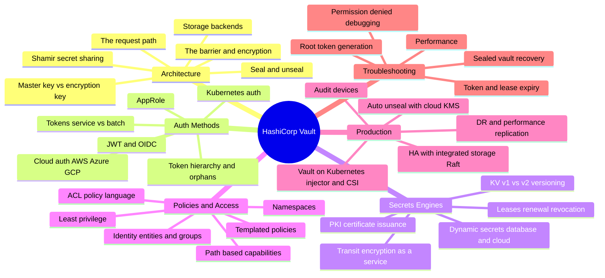

# HashiCorp Vault — Interview Preparation Guide

> **Target audience:** Senior DevOps Engineers, SREs, Platform & Security Engineers preparing for FAANG-level interviews.
>
> **Scope:** Vault taught from first principles — the **cryptographic barrier**, seal/unseal & Shamir secret sharing, the request path, auth methods (tokens/AppRole/Kubernetes/JWT-OIDC/cloud), secrets engines (KV, dynamic, Transit, PKI), leases & revocation, ACL policies & identity, and production topics (Raft HA, auto-unseal, replication, Vault on Kubernetes, audit). Every section is **interview-focused**: deep internals, trade-offs, failure modes, and probing Q&A — no filler.

---

## 🗺️ Visual Overview

**In one line:** Vault is a **barrier** — an always-encrypted storage boundary sealed by a master key that only exists in memory after unseal — wrapped by an **auth → policy → secret** request pipeline that issues short-lived, revocable credentials instead of storing long-lived ones.

---

## 📚 Master Table of Contents

| # | Section | File | Est. study time |
|---|---------|------|-----------------|
| 1 | **Architecture** — the barrier & always-encrypted storage, seal/unseal, Shamir shares, master key vs encryption key, storage backends, the request path, engines & auth overview | [01-ARCHITECTURE.md](01-ARCHITECTURE.md) | 3 h |
| 2 | **Auth Methods** — tokens (service vs batch), token hierarchy/orphan, AppRole, Kubernetes auth, JWT/OIDC, cloud auth (AWS/Azure/GCP), login → token issuance | [02-AUTH-METHODS.md](02-AUTH-METHODS.md) | 2.5 h |
| 3 | **Secrets Engines** — KV v1 vs v2 & versioning, dynamic secrets (database/cloud), leases & renewal/revocation, Transit (EaaS), PKI/certificate issuance | [03-SECRETS-ENGINES.md](03-SECRETS-ENGINES.md) | 3 h |
| 4 | **Policies & Access** — ACL policy language, path-based capabilities, templated policies, namespaces, identity (entities & groups), least privilege | [04-POLICIES-ACCESS.md](04-POLICIES-ACCESS.md) | 2 h |
| 5 | **Production** — HA with integrated storage/Raft, auto-unseal with cloud KMS, DR & performance replication, Vault on Kubernetes (injector & CSI), audit devices | [05-PRODUCTION.md](05-PRODUCTION.md) | 2.5 h |
| 6 | **Troubleshooting** — sealed vault recovery, token/lease expiry, permission denied/policy debugging, performance, root token generation | [06-TROUBLESHOOTING.md](06-TROUBLESHOOTING.md) | 2 h |

---

## 🧭 Suggested Study Order

1. **Start with [Architecture](01-ARCHITECTURE.md)** — the highest-leverage section. Until you can explain the barrier, seal/unseal, Shamir, and the request path, nothing else clicks. Spend the most time here.
2. **Then [Auth Methods](02-AUTH-METHODS.md)** — how a caller *proves identity* and receives a token; the front half of every request.
3. **Then [Secrets Engines](03-SECRETS-ENGINES.md)** — what Vault actually returns: static KV, dynamic just-in-time credentials, Transit, and PKI. Leases live here.
4. **Then [Policies & Access](04-POLICIES-ACCESS.md)** — the authorization layer that ties auth to secrets; ACLs, identity, and namespaces.
5. **Then [Production](05-PRODUCTION.md)** — Raft HA, auto-unseal, replication, Kubernetes integration, and audit — the operational reality.
6. **Finish with [Troubleshooting](06-TROUBLESHOOTING.md)** — recovery playbooks that tie everything together; best reviewed last and revisited right before interviews.

> 💡 **How to use each section:** Every file opens with a **Visual Overview** (mind map + colorful diagrams + memory hooks) — skim it first and revisit it last. Topics carry an **Interview weight** marker and an **In one line** summary, with real annotated `vault` commands and policy snippets. Each closes with **Interview Questions & Answers** (crisp answer → internals → follow-up), **Troubleshooting Scenarios**, and **Documentation Links**.

---

**[Next: Architecture →](01-ARCHITECTURE.md)**
